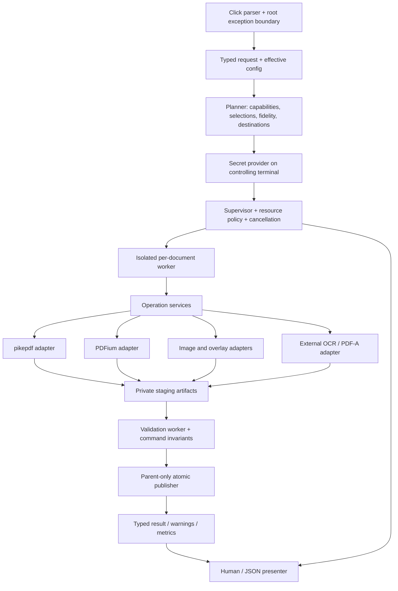

# PDF Tools CLI — Master Implementation Plan

Planning baseline: 2026-09-12. Status: **design approved for handoff, implementation not started**. This status means the requested planning artifact is complete, not that a maintainer has approved publishing, licensing, or any release. All implementation tasks below start as TODO.

This document is authoritative for the first implementation. Proposed commands are contracts, not claims about software that already exists. P0/P1/P2/P3/P4 mean foundation/MVP/core expansion/advanced/experimental. Release gates, backend limitations, and shared command contracts are normative. Examples assume the relevant milestone has shipped.

## 1. Executive Summary

Build a local, automation-friendly PDF toolkit in **Python 3.12+**, using **Click**, **pikepdf/libqpdf** for document structure, **pypdfium2/PDFium** for rendering and basic text, and **Pillow** for raster encoding. Use **uv**, **Hatchling**, **Ruff**, **mypy**, **pytest**, and **Hypothesis**. Keep OCR in a separately installed **OCRmyPDF** executable integration. Do not require Ghostscript, Poppler, Java, or ImageMagick for the default installation.

Use product name **PDF Tools CLI**, executable and proposed PyPI distribution **`pdftoolscli`**, and Python import package `pdftoolscli`. Do not install a generic `pdf` alias. Name availability is provisional until registry and trademark checks immediately before publication.

Ship an 18-command MVP focused on inspection, structural validation, safe page operations, lossless optimization, encryption, text extraction, metadata reading, diagnostics, and completions. The full staged tree has **46 leaf commands**. Lossy compression, OCR, form editing, annotation flattening, and PDF/A are gated by explicit fidelity and packaging tests. The product is more than a backend wrapper because it owns stable semantics, preservation policy, transactions, resource controls, diagnostics, and compatibility tests.

The first coding task is **ARCH-001**, repository foundation. Do not start by implementing merge. Resolve the native-wheel and preservation spikes before promising release support.

## 2. Product Vision

A user should install once, discover related operations through concise help, and confidently use the same syntax interactively and in CI. A successful invocation produces a verified artifact or a typed result. It does not silently discard encryption, overwrite a source, or call a cloud service. Breadth follows reliability, not the reverse.

The five-year design target is a maintainable family of operations with a small set of common policies. Adding a command must not duplicate password handling, range parsing, output publication, or subprocess management. Familiar verbs and noun groups remain discoverable even if the implementation eventually exceeds 100 commands.

## 3. Goals

- Correct, deterministic page selection and explicit fidelity trade-offs.
- Stable CLI syntax, exit status, JSON v1, and predictable stdout/stderr ownership.
- Native Windows, macOS, and Linux core functionality with tested artifacts.
- Input preservation, atomic single-file publication, bounded workers, cancellation, and auditable batch outcomes.
- Honest reporting of unsupported features, partial inspection, recovery, and archival limitations.
- Small install and startup costs relative to available PDF ecosystems, measured before setting performance claims.
- Offline processing; no telemetry, online update checks, or automatic dependency installation.

## 4. Non-Goals

No GUI, browser frontend, cloud service, collaboration, PDF authoring studio, general document SDK, arbitrary content editing, password cracking, signature creation, signature trust validation, secure redaction, malware certification, or guaranteed Acrobat equivalence. No Office/HTML-to-PDF browser engine, AI document interpretation, table reconstruction, plugin execution ecosystem, or daemon in v1. No promise of preservation of accessibility tags after arbitrary page assembly. No claim that compression always shrinks files, encryption permissions enforce DRM, or repair recovers missing content.

## 5. Existing Repository Assessment

Inspected `/Users/macmarc/Documents/pdftoolscli` directly, including hidden entries, file inventory, Git status/history, and applicable ancestor instructions. `ls -la` showed only `.` and `..`; `rg --files --hidden` found no files. `git status` and `git log` both reported that this is not a Git repository. No applicable ancestor `AGENTS.md` was present. Instructions in unrelated sibling projects do not apply.

| Area requested | Observed state | Recommendation |
|---|---|---|
| Language/runtime/package manager | None | Choose Python/CPython and uv explicitly |
| Source/commands/CLI/architecture | None | Introduce src layout and separated services/adapters |
| Dependencies/build/packaging | None | pyproject + lock + wheel/sdist first |
| Unit/integration tests/fixtures | None | Establish fixtures and subprocess harness before feature implementation |
| Lint/format/type checking | None | Ruff + strict mypy |
| README/config/docs/license | None | Create in ARCH-001 and DOC-001; proposed MIT project license |
| CI/CD/releases/remotes/history | None | Initialize Git locally during implementation; repository owner/remote remains a publication decision |
| Existing debt | No code debt; all foundations absent | Track uncertainty as spikes and release gates |
| Preserve/refactor/replace | No existing implementation decisions | Preserve directory/product intent and this plan; nothing to refactor or delete |

Only `PLAN.md` is created in this planning session. No dependencies, production source, fixtures, Git initialization, or release setup are performed.

## 6. Target Users & Use Cases

| User | Typical workflow | Required quality |
|---|---|---|
| Terminal user | Merge receipts; extract chapter; rotate scan | Helpful errors, safe outputs, examples |
| Developer | Inspect JSON; pipe PDF through an operation | Stable schemas, no stdout contamination |
| Operations team | Process a directory overnight | Resource limits, per-file outcomes, fail-fast control |
| Researcher/archivist | Text/OCR, image extraction, metadata | Provenance, explicit text-layer limits, validation |
| Print/document specialist | Boxes, stamps, assembly | Defined coordinate system and fidelity tests |

## 7. Product Principles

One grammar for pages; one publication service; one secret provider; one JSON envelope. Use the strongest applicable precondition instead of hoping a backend preserves a feature. Report warnings as structured codes. Refuse unsupported combinations before publishing anything. Keep page-content transformation distinct from appearance-only rendering. Prefer explicit output paths and explicit feature loss to prompts and magic defaults. Never substitute a different engine silently.

## 8. Naming & Executable Strategy

`pdf` is too generic for a unique installer-owned command. `pdftools` is already a Python command/package with overlapping functions; the existing maintainer's [PyPI listing](https://pypi.org/project/pdftools/) documents this. `pdftool`, `pdfly`, and similar short names also occupy a crowded ecosystem. A targeted public search did not establish a definitive collision for `pdftoolscli`; absence from search is not proof of availability.

Default to `pdftoolscli`; avoid creating aliases in a user's shell configuration. Completion and documentation use this full name. A user may create their own `pdf` alias. Before REL-002, check normalized PyPI names, GitHub organization/repository, Homebrew formulae, winget/Scoop IDs, command names on supported systems, and trademarks. If unavailable, select a unique owner-qualified distribution and resolve executable naming before the first public preview. Do not rename internal modules mid-implementation solely to chase a shorter brand.

## 9. Complete Feature Matrix

| Capability | Priority | Contract / limit |
|---|---|---|
| Shared CLI, I/O, JSON, safety, secrets, isolation, fixtures | P0 | Prerequisite for all operations |
| Merge/concatenate explicit files | P1 | Ordered inputs; whole documents |
| Split every N or explicit ranges | P1 | Transactional new output directory |
| Extract/remove/reorder/reverse/rotate pages | P1 | Physical page indices; validated before writes |
| Inspect/metadata show/validate/doctor/completion | P1 | Partial locked inspection; structural validation only |
| Lossless optimize | P1 | Recompression/unused streams/object streams; no image quality loss |
| Encrypt/decrypt | P1 | AES-256 output; preserve encryption elsewhere |
| Plain text extraction | P1 | Existing text layer; no OCR |
| Binary pipes/JSON/status/errors/basic limits | P1 | Seekable temporary spool; no true PDF streaming promise |
| Assembly from multiple selected ranges/insert/interleave | P2 | Per-input selection and explicit document policy |
| Duplicate/crop/resize/boxes | P2 | Cropping is not redaction; geometry defined below |
| Render PNG/JPEG/WebP/TIFF; images to PDF; rasterize | P2 | Render versus extract distinction; codecs probed |
| Image listing/extraction/decoded conversion | P2 | Original codestream when meaningful; masks separate |
| Search/regex/case/count/page matches | P2 | Bounded regex; text results with page references |
| Metadata edit/remove/sanitize, XMP | P2 | Info/XMP consistency; no full privacy guarantee |
| Text/image/PDF stamp and background watermark | P2 | One stamp command with explicit layer |
| Number/header/footer templates, Roman numerals | P2 | One number command shares stamp layout engine |
| Attachments list/extract/add/remove | P2 | Never execute; safe generated names |
| Annotations list/remove | P2 | Widgets require forms workflow |
| Batch recursive/globs/concurrency/dry-run/reports | P2 | Per-item transactions; no global rollback promise |
| Lossy image compression | P3 | Constrained safe subset, report skipped images |
| OCR/searchable layer/languages/deskew/rotation/sidecar | P3 | External OCRmyPDF; selected pages and force mode gated |
| Forms list/fill/flatten | P3 | Supported AcroForm subset; XFA/signatures rejected |
| Annotation flatten | P3 | Valid appearance streams required |
| Repair/normalization/recoverable xref rewrite | P3 | Recovery report; missing bytes cannot be invented |
| Linearization | P2 | Optimize flag; checked separately; size may increase |
| Conservative duplicate image-stream elimination | P3 | Full dictionary equality plus bytes; not arbitrary graph dedup |
| Font optimization | P4 | No default resubsetting/removal beyond unreachable resources |
| Booklet imposition | P4 | Explicit sheet layout; blank padding; print proof required |
| PDF/A-2b conversion + veraPDF validation | P4 | Experimental; no compliance label without validation |
| PDF to HTML/SVG | Deferred, not exposed | Fidelity and accessibility unclear; no dependable default adapter |
| Text to PDF | Deferred, not exposed | Font/layout/shaping are a separate authoring product |
| Arbitrary image replacement | Deferred, not exposed | Shared resources, masks, colorspaces make occurrence edits risky |
| Resume checkpoints | P4 design reservation | Batch manifests aid reruns; no resume command in current tree |

Presets are not separate commands. Experimental features are excluded from the default stable command registry until their gates pass.

## 10. CLI Design Principles

Syntax: `pdftoolscli [GLOBAL OPTIONS] COMMAND [COMMAND OPTIONS] [ARGUMENTS]`. Global options must precede the command; command help demonstrates this consistently. Options are kebab-case; long options do not accept abbreviations. `--` ends option parsing. File names beginning with `-` can be prefixed with `./` or placed after `--`.

Global: `--help`, `--version`, `--json`, `--quiet/-q`, `--verbose/-v` (single level), `--debug`, `--color auto|always|never`, `--no-color` (alias for never), `--config PATH`, `--no-config`. Help/version are available without loading PDF engines. JSON and quiet conflict; verbose and quiet conflict; debug changes diagnostics, not data routing. `NO_COLOR` is respected unless explicit CLI color overrides it. No blanket `--yes` or `--force`: they would obscure different safety conditions.

Leaf options supplied by shared Click decorators are listed in leaf help, not accepted everywhere: output, overwrite, dry-run, password source, page selection, resource limits, and preservation policy. `--jobs` belongs to batch/OCR/render; no misleading global threads flag. `--output/-o` belongs to artifact and text writers. No raw `--password VALUE` option.

Help for a group lists concise categories and a getting-started example. Each leaf includes purpose, usage, positional descriptions, typed defaults, examples, output and fidelity notes, relevant exit codes, and optional dependency instructions. Do not show all 46 leaves in root help. Missing group subcommand prints group help with exit 2; bare root shows help with exit 0. Unknown command returns 2 plus a suggestion; no execution of suggested command.

## 11. Complete Command Tree

Numbers in parentheses are priorities, not syntax. There are **46 leaves** including two P4 experiments, excluding help/version flags and group nodes.

```text
pdftoolscli
├── inspect (P1)
├── validate (P1; PDF/A validation extension P4)
├── doctor (P1)
├── completion (P1)
├── merge (P1)
├── assemble (P2)
├── insert (P2)
├── interleave (P2)
├── split (P1)
├── pages
│   ├── extract (P1)
│   ├── remove (P1)
│   ├── reorder (P1)
│   ├── reverse (P1)
│   ├── rotate (P1)
│   ├── duplicate (P2)
│   ├── crop (P2)
│   ├── resize (P2)
│   ├── boxes (P2)
│   └── booklet (P4)
├── optimize (P1; linearization P2)
├── compress (P3)
├── render (P2)
├── convert
│   ├── images (P2)
│   ├── rasterize (P2)
│   └── pdfa (P4)
├── text
│   ├── extract (P1)
│   └── search (P2)
├── ocr (P3)
├── images
│   ├── list (P2)
│   └── extract (P2)
├── metadata
│   ├── show (P1)
│   ├── set (P2)
│   ├── remove (P2)
│   └── sanitize (P2)
├── encrypt (P1)
├── decrypt (P1)
├── stamp (P2)
├── number (P2)
├── forms
│   ├── list (P3)
│   ├── fill (P3)
│   └── flatten (P3)
├── annotations
│   ├── list (P2)
│   ├── remove (P2)
│   └── flatten (P3)
├── attachments
│   ├── list (P2)
│   ├── extract (P2)
│   ├── add (P2)
│   └── remove (P2)
└── repair (P3)
```

## 12. Command Specifications

### 12.1 Normative shared contracts

Every leaf below inherits the following contracts by its declared class. These are part of each command specification; implementations must expand relevant options into help. Options not inherited or explicitly listed are rejected, not ignored.

- **R (read PDF):** one positional `INPUT` (PDF path or `-`); password-source family; `--timeout SECONDS` (300 default, 0 explicitly unlimited); `--memory-limit MiB` (1024 default, 0 explicitly unlimited); human result to stdout or JSON v1. Never modifies input. Locked-file exception only for inspect. Common failures: I/O 3, authentication 4, invalid/unsupported PDF 5, missing backend 6, limits 7. Non-PDF magic is error even if named `.pdf`.
- **W (write PDF):** R plus required `-o OUTPUT` (path or `-`), `--overwrite`, `--dry-run`, `--encryption preserve|remove` (preserve default), `--allow-signature-invalidation`, and applicable fidelity policy. Never supports input=output, even with overwrite. No in-place mode through v1. Common additional failures: option/range 2, conflict/safety 8, write/validation 3/5. New artifacts use the publication rules in §18. Encryption create/decrypt override this option as specified. Dry-run performs preflight with no output/temp artifacts beyond required input spooling, and returns a plan.
- **D (directory artifacts):** R plus required `--output-dir DIR`, optional `--name-template TEMPLATE`, `--dry-run`; output root must not exist. No overwrite/merge-into-existing-directory in v1. Stage sibling directory and rename at commit. Single image stdout exceptions are explicit below. Common failures additionally include unsafe name, duplicate name, existing root (8).
- **B (batch extension, P2):** W/R/D leaves explicitly marked B accept `INPUT...` paths, directories, or repeated `--glob PATTERN`, `--recursive`, `--input-root ROOT`, `--jobs N`, `--fail-fast`, `--dry-run`, `--report PATH`. W uses `--output-dir` instead of `-o` for multiple inputs; D uses per-input subdirectories. No stdin in batch. R JSON returns an ordered items array. §29 defines naming and failures. Single input syntax remains valid. Each item inherits single-command password/output rules; no worker prompts.
- **P (selection):** optional `--pages RANGE` defaults to `all`; selection context sorts unique pages in original order. Commands specifying positional `RANGE` instead are explicit sequence/permutation contexts from §13.

All W commands reopen staged output, check expected structure and encryption, and only then publish. All reads and writes sanitize terminal control sequences in human output. Neither quiet nor JSON hides actionable failures. All common failures, source preservation, signed/encrypted behavior, malformed input, and naming tests apply to every command below.

**Document fidelity policy:** full-document identity-order edits preserve catalog features where backend-supported. Page topology edits (merge, assembly, split, extract, remove, reorder, reverse, duplicate, insert, interleave, booklet) preflight forms, tags, layers, signatures, outlines, links, and page labels. P1 supports ordinary PDFs with ordinary annotations, bookmarks and labels: remap direct/local destinations to the first surviving occurrence, discard references to removed pages with a warning, preserve URI links without visiting them. Resolve named destinations before remapping. Reject tagged documents, XFA, interactive widgets, and optional-content groups in topology-changing operations until dedicated fixture-backed support exists; there is no silent discard fallback. P2 adds explicit `--drop-structure` for tags only, stripping the catalog tree and dangling marked-content linkage without claiming accessibility. Form-preserving assembly stays gated to P3. No general `--allow-loss` bypass. Any actual digital signature causes writes to fail unless `--allow-signature-invalidation`; then remove invalid signature values/claims and report invalidation, not a newly signed document. Read-only rendering/text does not require this flag.

New multi-source documents default to no document-level metadata, attachments, or outlines from inputs, and report omissions detected. `--document-policy none|first` on merge/assemble/interleave chooses this default versus importing first-input metadata/attachments and remappable outlines. Page annotations follow the page mapping. Insert preserves the base document's policy; imported document-level data is not implicitly added. Single-source selections retain metadata and remapped outlines, but omit document attachments by default with warning; P2 adds `--keep-attachments`. These decisions must appear in dry-run/result fidelity arrays.

### 12.2 Inspection and discovery

**C01 `inspect` — P1, R/B, pikepdf (PDFium only for later optional detail).** Syntax `inspect INPUT [--detail basic|all] [--section NAME ...]`; default basic: file size, version, pages, encryption/lock, metadata summary, warnings. Sections: pages, metadata, security, fonts, images, attachments, forms, annotations, outlines, structure. `all` requests every supported section; section cannot combine with non-default detail. Page records include Media/Crop/Trim/Bleed/Art boxes, inherited rotation, physical dimensions, labels; resource records include object-generation identity and page usage. Structure includes object count, linearization, suspected recovery, and xref revision evidence (unknown when unavailable, not guessed from EOF token counting). Does not decode all streams by default. Locked input returns `status=partial`, `locked=true`, unavailable sections and exit 4 while still emitting a report. Example: `pdftoolscli --json inspect report.pdf --detail all`. Fail on requested unsupported section with 6; detected suspicious structure is warning, not a malware verdict.

**C02 `validate` — P1, R/B, pikepdf/qpdf checks; P4 veraPDF.** `validate INPUT [--strict] [--profile structure|pdfa-2b]`. Default structure checks syntax/streams plus separate linearization check if declared linearized; open with recovery disabled first and report recovery need. `--strict` converts warnings to validation failure 5. In JSON return `{valid, profile, checks, diagnostics, coverage}`; unknown/uncheckable filters remain diagnostics, not a false clean bill. Example: `pdftoolscli validate suspect.pdf --strict`. No rewrite. PDF/A profile requires separately installed veraPDF and returns its version/profile in coverage; missing validator 6, nonconformance 5. Validation is neither signature trust verification nor full visual conformance.

**C03 `doctor` — P1, no document input, stdlib/registry.** `doctor [--check CAPABILITY ...] [--paths]`. List application/Python/platform, backend versions, codecs, optional executable compatibility, OCR languages on explicit OCR check, limits enforcement level. Without checks, missing optional tools are informational with exit 0; broken required dependencies or requested missing capability exit 6. No automatic install/network calls. Executable discovery uses trusted policy in §22. Redact home paths unless `--paths`. Example: `pdftoolscli doctor --check render --check ocr`.

**C04 `completion` — P1, no document, Click.** `completion SHELL`, SHELL one of bash,zsh,fish,powershell; script stdout, no file changes. `--json` rejected because output is executable shell source; quiet allowed. Example: `pdftoolscli completion zsh > ./_pdftoolscli`. Unknown shell 2. Installation instructions source a saved script; never edit profiles automatically. Completion must not import PDF engines, inspect PDFs, run external tools, or suggest secrets.

### 12.3 Assembly and pages

**C05 `merge` — P1, W with `INPUT...` (at least two), pikepdf.** `merge INPUT... -o OUTPUT [--document-policy none|first]`. Concatenate whole PDFs in exact argument order, including repeated inputs intentionally. No implicit sorting or recursive directory intake; shell expansion order is user-controlled. New encryption policy for all multi-source W commands: if any input encrypted, require `--encryption remove` explicitly or refuse 8; recommend piping to encrypt for a protected merged artifact. Per-source passwords via §28. Example: `pdftoolscli merge cover.pdf chapter.pdf -o book.pdf`. Fail preflight on any inaccessible source or unsupported catalog feature; no partial merged output.

**C06 `assemble` — P2, W without positional INPUT, pikepdf.** `assemble --source PATH RANGE [--source PATH RANGE ...] -o OUTPUT [--document-policy none|first]`. Repeated two-value option avoids parsing colons out of Windows paths. Sequence ranges may repeat pages. At least one source and one resulting page. Example: `pdftoolscli assemble --source a.pdf '1-3' --source b.pdf 'last,1' -o packet.pdf`. Error identifies source ordinal and bad term. Retain sources only while needed; no string-based shell plan.

**C07 `insert` — P2, W with positional `BASE INSERT`, pikepdf.** `insert BASE INSERT --after PAGE -o OUTPUT [--pages RANGE]`. PAGE is `0` (before first), positive base index, or `last`; insert selected sequence from INSERT once; P applies to inserted input only. Example: `pdftoolscli insert book.pdf cover.pdf --after 0 -o covered.pdf`. Base page count determines anchor; out-of-range 2. Encrypted base retains encryption only if inserted input is unencrypted or known compatible and explicit output preservation capability passes; otherwise require explicit remove. Base metadata/outlines retained and shifted.

**C08 `interleave` — P2, W with `INPUT...` at least two, pikepdf.** `interleave INPUT... -o OUTPUT [--remainder append|error] [--reverse-even-inputs] [--document-policy none|first]`. Round robin one page per source. Default append continues nonempty sources in order. Reverse-even-inputs reverses 2nd,4th,... source before interleaving for duplex scans. Example: `pdftoolscli interleave fronts.pdf backs.pdf --reverse-even-inputs -o scan.pdf`. Unequal lengths with error policy fails before output.

**C09 `split` — P1, D, pikepdf.** `split INPUT --output-dir DIR [--every N | --ranges GROUPS]`; default every=1. GROUPS is semicolon-separated nonempty range expressions; each group's sequence defines one output PDF, so overlap is intentional duplication. No unlabeled positional ranges. Default names `{stem}-part-{index:04d}.pdf`. Example: `pdftoolscli split book.pdf --ranges '1-5;6-last' --output-dir chapters`. Last every-N part may be short; no output for an empty selection. Reject nonpositive N, too many artifacts, unsupported features, and existing destination. No D/B extension in initial design: split one source per invocation.

**C10 `pages extract` — P1, W, pikepdf.** `pages extract INPUT RANGE -o OUTPUT`. Range is a sequence: `3,1,3` copies pages in that order; odd/even are ascending. Example: `pdftoolscli pages extract book.pdf '1-5,9,last' -o sample.pdf`. Duplicates intentional; empty/out-of-bounds error 2.

**C11 `pages remove` — P1, W, pikepdf.** `pages remove INPUT RANGE -o OUTPUT`. Selection removes unique resolved pages; survivors retain order. Example: `pdftoolscli pages remove scan.pdf 'even' -o fronts.pdf`. Removing all pages fails 2. Warn once about duplicate selection terms but do not perform repeated removal.

**C12 `pages reorder` — P1, W, pikepdf.** `pages reorder INPUT ORDER -o OUTPUT`. ORDER must be a permutation of every original page exactly once. Example for a 4-page file: `pdftoolscli pages reorder four.pdf '4,1-3' -o fixed.pdf`. Missing/duplicated pages error 2 with hint to extract for arbitrary sequences; no implicit append.

**C13 `pages reverse` — P1, W, pikepdf.** `pages reverse INPUT -o OUTPUT`. Reverse entire physical page order. Example: `pdftoolscli pages reverse scan.pdf -o reversed.pdf`. Single page succeeds with no-op info; still obey signature and output policies.

**C14 `pages rotate` — P1, W/P/B, pikepdf.** `pages rotate INPUT ANGLE -o OUTPUT [--pages RANGE] [--absolute]`. ANGLE integral multiple of 90; positive clockwise in displayed orientation; normalize modulo 360. Default adds to inherited `/Rotate`; absolute sets it. Example: `pdftoolscli pages rotate scan.pdf 90 --pages even -o upright.pdf`. Leave content/boxes unchanged; invalid rotation in source fails unless normalized by repair. Nonmultiple or nonfinite angle 2.

**C15 `pages duplicate` — P2, W, pikepdf.** `pages duplicate INPUT RANGE --after PAGE [--copies N] -o OUTPUT`; defaults copies=1, anchor resolves in original document with same 0/last rules as insert. Duplicate selected sequence as a block N times; clones must have independent page dictionaries. Example: `pdftoolscli pages duplicate form.pdf 1 --after last --copies 2 -o three.pdf`. Shared content may remain shared; future edits must copy-on-write. Forms reject until duplication semantics are tested.

**C16 `pages crop` — P2, W/P/B, pikepdf.** `pages crop INPUT --margins LEFT,TOP,RIGHT,BOTTOM -o OUTPUT [--pages RANGE]`. Lengths require pt/mm/in; commas are separators, decimal dot; origin is displayed CropBox top-left. Nonnegative margins inset current effective CropBox after rotation mapping; MediaBox unchanged. Example: `pdftoolscli pages crop report.pdf --margins 10mm,10mm,10mm,10mm -o cropped.pdf`. Reject empty box or invalid inherited boxes. Hidden content remains in the file; help/result explicitly says not redaction.

**C17 `pages resize` — P2, W/P/B, pikepdf.** `pages resize INPUT --size A4|Letter|WIDTHxHEIGHT -o OUTPUT [--fit none|contain] [--anchor POSITION] [--pages RANGE]`; default none and center. Explicit dimensions include units on both axes. None changes canvas and translates content; contain scales uniformly to fit without clipping. Update all page boxes consistently and transform annotation rectangles/destinations; refuse widgets/unsupported appearance transforms. Example: `pdftoolscli pages resize slides.pdf --size A4 --fit contain -o a4.pdf`. Reject nonpositive dimensions; no stretch or font substitution.

**C18 `pages boxes` — P2, W/P, pikepdf.** `pages boxes INPUT --set BOX=LLX,LLY,URX,URY [--set ...] -o OUTPUT [--pages RANGE]`. BOX media,crop,trim,bleed,art; each coordinate has pt/mm/in. Raw unrotated PDF coordinates, unlike crop/stamp display space; help shows this distinction. Validate ordering and effective containment (crop within media; trim/art/bleed within crop under project policy). Example: `pdftoolscli pages boxes input.pdf --set 'crop=0pt,0pt,595pt,842pt' -o boxed.pdf`. Repeated same box or inconsistent containment 2. Reading boxes belongs to inspect, not an overloaded write command.

**C19 `pages booklet` — P4 experimental, W, pikepdf composition.** `pages booklet INPUT --sheet A4|Letter|WIDTHxHEIGHT -o OUTPUT [--binding left|right] [--signature-pages N]`. Pad blanks to multiple of 4; default one signature for whole document, N if supplied positive multiple of 4. Emit two-up imposed sides, no printer control; geometry/duplex flip instructions in report. Example: `pdftoolscli pages booklet draft.pdf --sheet A4 -o imposed.pdf`. Reject forms/tags, unsupported boxes and overflow. Requires `PDFTOOLSCLI_EXPERIMENTAL=1`; physical fold/duplex proof gate before release.

### 12.4 Optimization and conversion

**C20 `optimize` — P1, W/B, pikepdf.** `optimize INPUT -o OUTPUT [--object-streams preserve|generate|disable] [--linearize] [--keep-larger]`; preserve default; generate raises minimum PDF version to 1.5 if needed and reports it. Recompress eligible Flate streams, remove unreachable objects and provably unused resources, preserve image codestreams and font programs. P2 linearize forces a valid fast-web-view output and may increase size. Without linearize/explicit representation changes, if candidate is not smaller, publish a byte-copy of original with `changed=false`; keep-larger publishes candidate. Example: `pdftoolscli optimize report.pdf -o optimized.pdf`. Compare bytes and report original/output/delta and transformations. Explicit remove-encryption or object-stream change must not be undone by the keep-original rule. No lossless shrinking guarantee.

**C21 `compress` — P3, W/B, pikepdf + Pillow.** `compress INPUT -o OUTPUT --preset screen|ebook|printer|prepress|archive|custom [--dpi N] [--quality N] [--require-all-images] [--keep-larger]`. Preset required to acknowledge trade-off. Screen=96 DPI/JPEG 70; ebook=150/80; printer=300/90; prepress=no downsampling/no lossy recompression; archive=same lossless policy as optimize, not PDF/A. Custom requires dpi and/or quality. Explicit options override preset fields and effective policy is always reported. DPI integer 36..2400, quality 1..95. Only 8-bit DeviceRGB/DeviceGray image XObjects without masks, unusual Decode, ICC, spot color, or unsupported filters are initially eligible. Inspect every use of a shared image, including nested form matrices; preserve enough resolution for highest-demand placement, or skip if transform is uncertain. Do not upscale; downsample only above 1.25× target. Preserve bilevel/JBIG2, text, vectors, fonts, links, annotations. Hash full eligible dictionaries + bytes before dedup. Report eligible/changed/skipped counts and reasons; require-all-images fails if any candidate unsupported. Example: `pdftoolscli compress scan.pdf --preset ebook -o smaller.pdf`. No rasterize/Ghostscript fallback. If not smaller and no mandated transform, copy original unless keep-larger; no guarantee of target size.

**C22 `render` — P2, D/P/B, PDFium + Pillow.** `render INPUT --output-dir DIR [--to png|jpeg|webp|tiff] [--dpi N] [--quality N] [--background COLOR|transparent] [--colorspace rgb|gray] [--pages RANGE] [--jobs N]`; defaults png,150,white,rgb,1. Quality defaults 85 for JPEG/WebP, unsupported for PNG/TIFF. TIFF per page uses lossless deflate; no multi-page TIFF initial support. Transparent only PNG/WebP with alpha; JPEG/TIFF transparent rejected. DPI 36..2400 plus pixel budget. CropBox and rotation determine displayed page; annotations rendered, form JavaScript never executed. Default `{stem}-page-{page:04d}.{ext}` uses original physical page index. Exactly one selected page can instead use `-o FILE|-`; mutual exclusion with output-dir, no B for stdout. Example: `pdftoolscli render report.pdf --pages 1-3 --to png --dpi 200 --output-dir previews`. Missing codec 6, unsupported colorspace 2. Does not extract original image assets.

**C23 `convert images` — P2, W with positional `IMAGE...`, img2pdf + Pillow preflight.** `convert images IMAGE... -o OUTPUT [--size auto|A4|Letter|WIDTHxHEIGHT] [--dpi N] [--fit contain] [--background COLOR] [--all-frames]`. PNG/JPEG/WebP/TIFF accepted after sniffing; explicitly ordered; default auto sizes from valid density metadata, fallback 150 DPI warning. EXIF orientation applied; auto image size matches oriented pixels/density. JPEG codestream passthrough where valid; transparency preserved if supported by the chosen path, otherwise explicit background required. Multi-frame input rejected unless all-frames; expands frames consecutively. Example: `pdftoolscli convert images front.jpg back.jpg -o scan.pdf`. No stdin images/mixed PDF input in v1. Reject unsupported dimensions/mode/bombs; never silently flatten alpha or recompress originals. New PDF unencrypted; encrypt separately.

**C24 `convert rasterize` — P2, W/P/B, PDFium + Pillow + img2pdf.** `convert rasterize INPUT -o OUTPUT [--pages RANGE] [--dpi N] [--colorspace rgb|gray]`; defaults 150/rgb. Produces image-only PDF of selected pages in source order, preserving physical displayed page size. Drops text, forms, tags, links, layers, annotations as interactivity (visible annotation appearance is painted), signatures and embedded attachments. Command name/help/result explicitly communicates this; signatures still require shared acknowledgment. Example: `pdftoolscli convert rasterize presentation.pdf --dpi 150 -o flat.pdf`. Preserve source encryption via explicit pikepdf encryption-copy stage; fail if not feasible. No OCR implicitly. Validate rendered size and page count, not semantic equivalence.

**C25 `convert pdfa` — P4 experimental, W, external Ghostscript + veraPDF.** `convert pdfa INPUT -o OUTPUT --profile pdfa-2b --icc-profile FILE`. Fixed profile only; ICC must be local, supported and licensed. Require unencrypted input or explicit `--encryption remove`, no signatures without acknowledgment, and supported preservation preflight. Generate candidate in private temp, invoke veraPDF, publish only on conformance pass. Example: `pdftoolscli convert pdfa input.pdf --profile pdfa-2b --icc-profile sRGB.icc -o archive.pdf`. Missing engine/validator 6, conversion/nonconformance 5; include validator report reference. Requires experimental flag and licensing review of optional integration. No fabricated PDF/A metadata as substitute for compliance; cannot claim semantic/accessibility equivalence.

### 12.5 Text, OCR, and embedded images

**C26 `text extract` — P1, R/P/B with `-o TEXT|-` optional default stdout, PDFium.** `text extract INPUT [--pages RANGE] [--mode plain|layout] [-o OUTPUT] [--require-text] [--overwrite]`. Plain implemented P1; layout P2 optional pdfminer.six adapter is an explicit choice, not fallback. UTF-8, LF, form-feed between pages; empty pages retained as separators; all-empty succeeds with `W_NO_TEXT` unless require-text, then 5. Layout is heuristic spatial ordering, not recreation of author intent. JSON stdout contains per-page `{page,text,has_text}` when no file output; with file output contains path/encoding/page counts, never duplicates large text. Example: `pdftoolscli text extract report.pdf --pages 2-last -o report.txt`. No OCR call; malformed font maps produce diagnostics rather than invented words. Text writes obey atomic/output conflict rules.

**C27 `text search` — P2, R/P/B, PDFium + isolated Python `re`.** `text search INPUT PATTERN [--regex] [--ignore-case] [--count] [--pages RANGE] [--max-matches N]`. Default literal, case-sensitive, nonoverlapping, page-local search on plain extracted text; no cross-page matches. Regex uses documented Python syntax/Unicode semantics in a killable worker with per-page 2-second matching budget. Count counts occurrences, not matching pages. Default max-matches=10000 for records; reaching limit returns truncated=true warning, count is lower bound; explicit 0 removes record cap subject to limits. Human results `path:page:offset: excerpt`; offsets are zero-based Unicode codepoint indices in extracted page string. JSON records page/start/end/snippet, count, truncated; no promise of glyph bounding boxes. Zero matches exit 1, invalid regex 2, match timeout 7. Example: `pdftoolscli --json text search invoices.pdf 'INV-[0-9]+' --regex --count`.

**C28 `ocr` — P3, W/P/B, external OCRmyPDF + Tesseract/language data.** `ocr INPUT -o OUTPUT [--language LANG ...] [--mode skip|force] [--deskew] [--rotate-pages] [--clean] [--sidecar PATH] [--pages RANGE] [--jobs N]`. Defaults eng, skip, jobs=1, ordinary PDF output (not implicit PDF/A). Repeated language options combine with OCRmyPDF language syntax internally. Skip preserves pages already containing text; force may rasterize vector/text selected pages and is explicit destructive-to-editability intent. Pages not selected must retain content; test exact backend behavior before enabling page selector. Clean requires separately installed unpaper and affects OCR recognition, not final image unless separately designed. Sidecar documents OCR-produced text only; existing text/skipped pages are not falsely described as complete transcript. Stage PDF + sidecar; file pair publication is not globally atomic; report committed paths if second publication fails. Example: `pdftoolscli ocr scan.pdf --language eng --language deu --deskew --sidecar scan.txt -o searchable.pdf`. Preflight language missing 6, no eligible pages reports no-op, OCR failure 5, deadline 7. Encrypted PDF decrypted in private workspace only with explicit `--encryption remove` or verified preserve/re-encrypt capability; initial OCR requires explicit remove. No password passed to external argv. Native Windows support is conditional on tested installation, not inferred from core support.

**C29 `images list` — P2, R/P/B, pikepdf.** `images list INPUT [--pages RANGE]`. Inventory page appearances and unique images: page, object/generation, resource path, width,height,bits,colorspace,filters,estimated encoded bytes, mask relation. Inline images use occurrence IDs `p0001-i0001`; indirect IDs `obj-12-0`; direct/inline enumeration bounded. Same image used on multiple pages has separate occurrence rows and a stable within-input asset ID. Example: `pdftoolscli --json images list catalog.pdf`. Unreadable filters don't prevent listing; unknown facts are null.

**C30 `images extract` — P2, D/P/B, pikepdf + Pillow when decoded.** `images extract INPUT --output-dir DIR [--pages RANGE] [--mode original|decoded] [--to png|jpeg|webp|tiff] [--quality N] [--asset ID ...]`. Original default exports supported self-contained original JPEG/JPX codestreams or lossless wrapper reconstruction for supported filters; explicitly labels reconstruction in manifest. Unsupported original representation fails that asset with a diagnostic; never silently calls rendering. Decoded mode default png; allows image-format conversion, quality for JPEG/WebP only, alpha rejected for incompatible targets unless explicit background option supplied. Masks saved separately with manifest relationships in original mode; decoded supported masks compose alpha. Filename `{stem}-{asset}.{ext}`, deduplicate same object by default; manifest lists occurrences/pages/source hash. Example: `pdftoolscli images extract catalog.pdf --mode original --output-dir assets`. No image found yields empty manifest success + warning; unsupported asset means item failure and no directory publication unless future partial-export option explicitly designed.

### 12.6 Metadata and encryption

**C31 `metadata show` — P1, R/B, pikepdf.** `metadata show INPUT [--source all|info|xmp] [--raw-xmp]`; default all. Human/JSON includes raw and normalized values plus discrepancies, not hidden preference resolution. Raw-xmp sends XML bytes as primary output and conflicts with JSON; absent XMP returns empty data with warning. Example: `pdftoolscli --json metadata show thesis.pdf`. Bad XML reported alongside readable Info; source-specific failure 5 if that source is requested alone.

**C32 `metadata set` — P2, W/B, pikepdf.** `metadata set INPUT --set KEY=VALUE [--set ...] [-o OUTPUT] [--xmp-file FILE] [--source both|info|xmp]`; W output remains required. Keys title,author,subject,keywords,creator,producer,creation-date,modification-date; defaults both; reject duplicates/unknown keys. `--xmp-file` mutually exclusive with set, replaces XMP packet after hardened XML validation; source must xmp or both. Dates require RFC3339 offset; map to PDF date syntax and retain precision. Multiple authors/keywords represented as JSON arrays in machine output; CLI value uses a single literal string unless `--set-json FILE` is later designed (not v1). Example: `pdftoolscli metadata set draft.pdf --set 'title=Annual Report' --set 'author=Finance Team' -o titled.pdf`. Do not automatically insert current time or tool author; producer follows explicit documented save policy.

**C33 `metadata remove` — P2, W/B, pikepdf.** `metadata remove INPUT (--key KEY ... | --all) [--source both|info|xmp] -o OUTPUT`. Default both; standard keys as set. Missing key no-op warning. Example: `pdftoolscli metadata remove report.pdf --key author --key creator -o shared.pdf`. All removes selected document metadata containers; custom XMP fields remain for key-specific removal. Disable backend automatic producer/date reinsertion; verify after save.

**C34 `metadata sanitize` — P2, W/B, pikepdf.** `metadata sanitize INPUT -o OUTPUT`. Removes Info and catalog XMP plus reachable page/image/object `/Metadata` streams, using bounded traversal; full rewrite eliminates prior incremental revisions in output. Example: `pdftoolscli metadata sanitize report.pdf -o clean-metadata.pdf`. Reports which scopes changed; annotations, attachment bytes, visible text, filenames, IDs required by encryption, and hidden content are outside scope. Not a secure anonymizer/redactor; help and JSON limits are explicit. Reject traversal limit instead of claiming completeness.

**C35 `encrypt` — P1, W with replacement encryption policy, pikepdf.** `encrypt INPUT -o OUTPUT [--user-password-file PATH|--user-password-env NAME|--user-password-stdin] [--owner-password-file PATH|--owner-password-env NAME] [--allow-empty-user] [--print full|low|none] [--modify all|annotate|form|none] [--copy allow|deny]`. Defaults AES-256 revision 6, print full, modify all, copy allow, encrypt metadata. Missing new passwords are securely prompted twice on controlling terminal; noninteractive invocation must provide both sources. Owner must be nonempty and different from user; empty user only with explicit flag and nonempty owner. Accessibility permission remains enabled and documented. Input unlocking uses independent password-source family. Example: `pdftoolscli encrypt report.pdf -o protected.pdf` (prompts). Reject raw argument secrets, unsupported permission combinations, unavailable terminal, empty owner, overlong password rather than truncating. No legacy weak output cipher switches; inspect can report legacy encryption.

**C36 `decrypt` — P1, W, pikepdf.** `decrypt INPUT -o OUTPUT [PASSWORD-SOURCE]`. Command itself is explicit authorization to write unencrypted PDF; no generic encryption option. Example: `pdftoolscli decrypt protected.pdf --password-file ./secret.txt -o readable.pdf`. Either valid PDF password accepted; permissions are advisory, not authentication authorization. Unencrypted input errors 2 with hint to copy instead; incorrect password 4. Never brute-force or recover forgotten passwords.

### 12.7 Stamps, forms, annotations, attachments, repair

**C37 `stamp` — P2, W/P/B, ReportLab + pikepdf (+ Pillow for image).** `stamp INPUT (--text TEXT|--image FILE|--pdf FILE) -o OUTPUT [--layer foreground|background] [--position POSITION] [--offset X,Y] [--opacity N] [--rotation DEG] [--scale N] [--font FILE] [--font-size PT] [--color COLOR] [--tile XSTEP,YSTEP] [--pages RANGE] [--source-page PAGE]`. Defaults foreground,center,0pt offsets,opacity .25,rotation 0,scale 1,font-size 36,color #808080; source-page only PDF default 1. POSITION center/top-left/top/top-right/left/right/bottom-left/bottom/bottom-right/custom. Displayed CropBox coordinates, origin top-left, +x right,+y down; built-ins inset 12pt; offset adjusts anchor; custom requires offset absolute from origin. Rotation clockwise around anchored stamp center after scaling; opacity 0..1, positive scale; color #RRGGBB only. Text fonts embed licensed TTF/OTF subset; initially reject scripts needing unsupported shaping or absent glyphs, never substitute silently. Tile steps positive lengths in displayed axes. Example: `pdftoolscli stamp report.pdf --text DRAFT --rotation -30 --position center --layer background -o draft.pdf`. PDF watermark source never executes actions; source must be unencrypted or separately unlocked via credential map. Reject unsupported fonts/colors/placement or assets; opacity no-op allowed and reported.

**C38 `number` — P2, W/P/B, shared stamp text layout.** `number INPUT -o OUTPUT [--format TEMPLATE] [--start N] [--style decimal|roman|ROMAN] [--header TEXT] [--footer TEXT] [--position POSITION] [--font FILE] [--font-size PT] [--color COLOR] [--pages RANGE] [--date YYYY-MM-DD]`. Defaults format `{page} / {pages}`,start=1,decimal,bottom,font-size=10. Template variables `{page}` displayed ordinal (`start + index in selection`), `{pages}` selected count, `{source_page}` physical source index, `{filename}` input basename, `{date}` explicit date required if referenced. No expression evaluation; `{{`/`}}` escape braces. Header top center/footer bottom center; format rendered at position; no auto collision avoidance, reject overlapping configured text boxes in preflight. Roman requires 1..3999; decimal accepts start=0. Example: `pdftoolscli number report.pdf --format 'Page {page} of {pages}' -o numbered.pdf`. No automatic metadata/page-label rewrite.

**C39 `forms list` — P3, R/B, pikepdf AcroForm adapter.** `forms list INPUT [--values]`. List canonical full field names/types/flags/options/widget pages; values omitted unless explicitly requested (even in JSON). Example: `pdftoolscli --json forms list application.pdf --values`. Return no-fields success; XFA recognized as unsupported with 5; cycles/ambiguous orphan fields diagnosed. Do not use render appearances as sole source of values.

**C40 `forms fill` — P3, W, pikepdf AcroForm adapter after capability spike.** `forms fill INPUT --data JSON_FILE -o OUTPUT`. Data v1 maps full field names to string/boolean/choice-array values under `fields`; checkbox/radio export names checked against available options; no JavaScript/calculation. Reconcile canonical field tree and widgets, regenerate appearance streams for supported text/checkbox/radio/choice fields. Unknown, read-only, signature, XFA, ambiguous names, unsupported fonts/appearance generation all fail 5/2 before publication. Example: `pdftoolscli forms fill application.pdf --data answers.json -o filled.pdf`. Remains interactive. Validate both field values and widget appearances using a second reader and renderer. No automatic pypdf fallback if native appearance support is inadequate; narrow supported fields or hold release.

**C41 `forms flatten` — P3, W, pikepdf AcroForm adapter.** `forms flatten INPUT -o OUTPUT`. Paint all supported current field appearances into page content, remove widget annotations and form field tree only after successful painting. Example: `pdftoolscli forms flatten filled.pdf -o final.pdf`. Missing/stale appearances, unsupported widget transforms or signatures fail; never flatten by merely making fields read-only. No partial field selector initially.

**C42 `annotations list` — P2, R/P/B, pikepdf.** `annotations list INPUT [--pages RANGE] [--include-content]`. IDs stable within input hash, page/subtype/rect/flags/author-present; bodies/author text only with include-content. Example: `pdftoolscli --json annotations list reviewed.pdf`. Unknown subtype is listed, not a parse failure; resource traversal bounded.

**C43 `annotations remove` — P2, W/P/B, pikepdf.** `annotations remove INPUT (--all|--type TYPE ...|--id ID ...) -o OUTPUT [--pages RANGE]`. Removes matching non-widget annotations and reconciles popup/reply links; all excludes widgets explicitly in help/result. Example: `pdftoolscli annotations remove review.pdf --type Text -o uncommented.pdf`. Unknown ID 2; dangling relationships repaired conservatively and reported. Does not erase related visible page content.

**C44 `annotations flatten` — P3, W, pikepdf.** `annotations flatten INPUT -o OUTPUT [--mode screen|print|all]`; screen default, whole document only. Flatten supported non-widget annotation appearance streams; forms must use forms flatten. Example: `pdftoolscli annotations flatten review.pdf --mode print -o printed.pdf`. Backend primitive may also flatten widgets; adapter must reject documents with widgets or safely restrict scope before invocation. Unsupported/missing appearances fail before modifying output; do not merely drop annotations.

**C45 `attachments list` — P2, R/B, pikepdf.** `attachments list INPUT`. List catalog name-tree and supported file-attachment annotation references, deduplicate stream IDs, display original name escaped, safe ID, size, MIME hint, relation. Example: `pdftoolscli --json attachments list packet.pdf`. MIME is untrusted label. No file opening/execution; malformed names tree diagnostic.

**C46 `attachments extract` — P2, D/B, pikepdf.** `attachments extract INPUT --output-dir DIR [--id ID ...]`. All by default. Generated basename `attachment-{index:04d}-{safe-name}` and JSON manifest mapping IDs/original names/size/SHA-256; never trust embedded paths. Example: `pdftoolscli attachments extract packet.pdf --output-dir attached`. Fail traversal/size/decompression/unknown IDs; output files nonexecutable. No attachments yields manifest + warning success.

**C47 `attachments add` — P2, W, pikepdf.** `attachments add INPUT FILE... -o OUTPUT [--description TEXT]`. Files regular local paths, basename display names; collisions with existing name require explicit `--replace-name NAME` and exactly one incoming file. Example: `pdftoolscli attachments add report.pdf data.csv -o packet.pdf`. Do not infer trusted MIME from content; no arbitrary associated-file archival claims. Empty file allowed, directory/symlink inputs rejected. PDF/A attachment rules outside stable support.

**C48 `attachments remove` — P2, W, pikepdf.** `attachments remove INPUT (--id ID ...|--all) -o OUTPUT`. Update names tree and file-attachment annotations referencing removed assets; garbage-collect unreachable streams. Example: `pdftoolscli attachments remove packet.pdf --all -o report.pdf`. Unknown IDs error 2; embedded assets in unsupported exotic structures are disclosed in scope, not claimed removed.

**C49 `repair` — P3, W, pikepdf/libqpdf.** `repair INPUT -o OUTPUT [--accept-warnings]`. Attempt recovery parse, rebuild recoverable xref/trailer/object references, full rewrite, reopen without recovery and run structural validation. Never silently rasterize. Example: `pdftoolscli repair damaged.pdf -o recovered.pdf`. Default refuses candidate still warning/failing validation; accept-warnings permits warning-only candidate with conspicuous `status=partial`, diagnostics and exit 5 despite committed artifact. Fatal structural errors never publish. Report recovered features and unknown/lost information; clean input normalizes with no-op/rewrite notice. Source is retained. No promise to repair missing streams, ciphertext without passwords, or restore signatures.

**Registry correction rule:** C01–C49 are the authoritative enumeration: **49 total leaves**, of which **18 P1**, **23 P2**, **6 P3**, **2 P4**. Any earlier count in this plan must be reconciled to these IDs before handoff; command IDs are never option IDs.

## 13. Page Range Grammar

```ebnf
range   = term, { ",", term } ;
term    = index | index, "-", index | "all" | "odd" | "even" ;
index   = positive_integer | "last" ;
positive_integer = nonzero_digit, { digit } ;
```

Indices are physical 1-based pages, never PDF page labels. `last` resolves after opening the corresponding source; case-sensitive keywords. Whitespace around terms/endpoints accepted; spaces inside a number rejected. Ranges include both endpoints; descending `5-2` resolves 5,4,3,2. `last-1` means descending last through page 1, **not last minus one**. No negative indices, steps, exclusion operator, zero, empty terms, arithmetic, wildcards, leading plus or leading zeros. `1-5,8,10-last`, `odd`, `even`, `last`, `2-last` are valid.

Parser returns AST with source spans without opening files. Resolver takes page count and context: sequence preserves order/duplicates; selection sorts unique indices; permutation requires exactly all pages once. Bounds errors never clamp. `all` on zero-page document resolves empty and read-only operations may report it; PDF artifact generation requires at least one page. Empty even selection on one page fails a mutating selected-page command before writes. Split first separates semicolon groups then runs exactly this parser. Ordinal anchors (insert/duplicate) are separately typed single index plus 0, not a second range grammar.

Limits: expression UTF-8 length 64 KiB, 4096 terms, at most 1,000,000 resolved output page references by default. Check cardinality before materialization; use iterators/intervals where useful. Range errors identify term, source, resolved index and actual page count. Property tests cover ascending/descending/duplicates/last and parse/format round-trip for canonical AST, not whitespace identity.

## 14. Input / Output Model

Inputs are local regular files or one `-`; no URL fetch, archive extraction, device nodes, named pipes except designated stdin, or password autodetection from filenames. Detect PDF/image types from signatures then backend parsing. Reject source/destination identity using canonical path plus file identity (device/inode or Windows file ID), case-insensitive comparisons where filesystem appropriate, hardlinks, and symlink/reparse checks.

Single PDF mutations require explicit output. `-o -` is binary stdout; no inference from redirected stdout. Batch uses output-dir. A new source-derived name uses final suffix stem (`a.b.pdf` → `a.b`). Multi-file templates support only `{stem}`, `{index:04d}`, `{page:04d}`, `{asset}`, `{ext}`, `{relparent}` where applicable; no arbitrary Python format expressions, attribute access, separators in stem/asset, or `..`. Filename collisions on case/Unicode-normalizing filesystems are detected preflight using a conservative NFC+casefold comparison; actual disk collisions checked at commit too. Output extension must match format (JPEG `.jpg`/`.jpeg` allowed); no guessing format from an inconsistent extension.

W outputs preserve encryption for single-source PDFs by explicitly configuring the adapter; library save defaults must never decide security policy. Derivative PDF copy operations must preserve via supported origin-document encryption settings or refuse. Non-PDF exports are inherently unencrypted; help/result say so when source is encrypted. No default PDF/A or signature validity claims survive rewriting. `inspect` distinguishes unavailable versus empty data.

## 15. Unix Pipeline Behavior

PDF parsers require random access. Spool stdin in a private disk-backed file with byte/time limits, then parse; do not describe this as streaming processing. Stage output to seekable file, validate, then copy binary chunks to stdout. Downstream failure can leave partial stream bytes; there is no rollback after bytes are sent. File destinations remain transactional.

```bash
cat input.pdf | pdftoolscli optimize - -o - > output.pdf
pdftoolscli pages extract book.pdf 1-10 -o - | pdftoolscli encrypt - -o protected.pdf
```

Never use shell redirection to the input path: the shell truncates before the CLI starts and the tool cannot prevent that. Include this exact caveat in piping docs. Binary stdout to a terminal is refused (8); no v1 override. `--json` conflicts with binary stdout, raw XMP, or completion scripts. Text extract JSON replaces plain text on stdout. A PDF input `-` conflicts with password-stdin or any other stdin consumer. At most one stdin slot per invocation; multi-source commands may use one `-` but cannot batch.

Normal progress is enabled only if both stdout and stderr are TTY, mode human, and CI is not set. Prompts use controlling terminal, never stdin data. Stdout contains primary data only; summaries/progress/warnings/errors go stderr for artifact writers. A broken output pipe maps to 141 without traceback, including Windows for application-owned pipes; interrupt maps 130. No automatic retry that might duplicate stdout bytes.

## 16. Human / Quiet / JSON Output

Human read commands write concise tables/text to stdout; artifact writers write only diagnostics to stderr. Quiet suppresses progress/success/warnings from human stderr but not errors or requested primary data; JSON cannot combine with quiet. JSON uses one UTF-8 document + LF on stdout, even for failures detected after root-option parsing. Raw text errors before detection of JSON are avoided by a custom root exception boundary that scans recognized global mode flags safely, without reparsing command semantics.

```json
{
  "schema_version": "1.0",
  "tool_version": "0.1.0",
  "command": "pages.extract",
  "status": "ok",
  "data": {
    "inputs": [{"id": "input-1", "path": "book.pdf"}],
    "outputs": [{"path": "sample.pdf", "media_type": "application/pdf", "bytes": 12400}],
    "page_count": 3,
    "changed": true,
    "fidelity": {"encryption": "unencrypted", "omissions": []}
  },
  "warnings": [],
  "errors": [],
  "metrics": {"elapsed_ms": 12}
}
```

Version shown is illustrative. Keys above mandatory; data null on fatal failure before a plan exists. Status enum ok/planned/partial/error. Warnings/errors arrays use §17 shape. Dry-run status planned, projected outputs with bytes=null, no claims of final size. Paths preserve supplied spelling when meaningful; generated paths are normalized lexical paths, no unnecessary absolute/home expansion. Dates RFC3339 or null with raw values separate; IDs/object generations explicitly typed. Integers beyond JavaScript safe range represented by decimal strings in schema-designated fields; page counts/byte sizes limited to safe integers by input limits. No NaN/Infinity, ANSI escapes or localized keys. Tool version and elapsed time are informational, not stable comparison values.

For batch: data `{items:[{index,input,status,data,warnings,errors}],summary:{planned,succeeded,failed,skipped,cancelled}}`, sorted input order. Large collections spill result fragments to private disk and assemble output incrementally; no unbounded list accumulation. Standard JSON may be incomplete after process kill/broken pipe; consumers must check exit and parse success. NDJSON/event output is deferred until a separate versioned schema is designed.

Command-specific typed records: inspect (§12), validate `{valid,profile,checks,coverage}`, text `{pages,mode,has_text}`, search `{matches,count,truncated}`, list commands `{items}`, mutation `{inputs,outputs,page_count,changed,fidelity}`, optimize/compress add `{bytes_before,bytes_after,bytes_saved,effective_policy,images}`, doctor `{environment,capabilities}`, OCR adds `{pages_ocr,pages_skipped,languages,sidecar_scope}`, repair adds `{recovery,validation}`. Define JSON Schema files for each; absent vs null rules documented. Arbitrary backend objects/log strings must not become schema keys.

## 17. Error Model & Exit Codes

| Exit | Meaning | Examples |
|---|---|---|
| 0 | Success, including planned dry-run | Warning-only normal operation |
| 1 | Negative query result | Search no matches |
| 2 | Usage/config/selection invalid | Range bounds, incompatible options |
| 3 | I/O failure | Missing file, access denied, disk full |
| 4 | Authentication needed/incorrect | Locked inspect partial |
| 5 | Invalid/unsupported document or failed validation | Corrupt PDF, unsupported form, repair partial output |
| 6 | Missing/incompatible dependency or capability | OCR language/tool, codec |
| 7 | Resource/time limit | Pixel limit, memory worker kill |
| 8 | Safety/output conflict | Existing output, same file, signature precondition |
| 9 | Batch item failures | Some/all items fail after execution begins |
| 10 | Unexpected internal error | Unhandled exception/native crash not identified as limit |
| 130 | User cancellation | Ctrl+C |
| 141 | Broken pipe | Consumer exits |

Batch planning/config/safety failures return their specific code with zero item execution. Once executing, any item failure returns 9 (even all failures); individual typed exits retained per item. Cancellation 130 takes precedence; broken pipe 141 takes precedence for failed output transmission. Pure no-match search batch returns 1 when all successful searches have zero matches, 0 when any match, 9 if any item error.

Human error:

```text
error [E_PAGE_BOUNDS]: page 42 does not exist
  input: document.pdf (17 pages)
  requested: 1-42
hint: run `pdftoolscli inspect document.pdf` to inspect page count
```

Error record `{code,category,message,input_id,page,details,hint,retryable}`; nullable fields explicit. Stable codes include E_PAGE_BOUNDS, E_PASSWORD_REQUIRED, E_PASSWORD_INVALID, E_OUTPUT_EXISTS, E_SAME_FILE, E_SIGNATURE_PRESENT, E_UNSUPPORTED_FEATURE, E_PDF_INVALID, E_DEPENDENCY_MISSING, E_RESOURCE_LIMIT, E_INTERNAL; backend messages stored only as sanitized diagnostic detail. Retryable is false except transient I/O explicitly recognized. Warnings use W_ prefix and same structure. Stack traces only with debug, to stderr; redact before formatting. Never parse upstream warning prose as a durable public code; unknown warning maps W_BACKEND_DIAGNOSTIC with backend identity.

## 18. Safety & Atomic Writes

1. Resolve inputs and policy, collect secrets, sniff/open safely, validate selections, plan all destination names; check no overlaps. Dry-run ends after this step.
2. Create private invocation work directory; stage file in destination filesystem with random name and exclusive create. File mode 0600 on POSIX; user-only ACL where possible on Windows. Do not use predictable names or shared readable temp files.
3. Worker writes only assigned staging paths; close every document/handle. Parent reopens candidate via isolated validation worker. Check PDF syntax, expected count/boxes/encryption and command invariants. Lossy/appearance operations also have fixture-based visual gates, not full runtime visual comparison by default.
4. Flush file buffers and fsync when supported. Default publication is **no-clobber**, not check-then-`os.replace`: use atomic hard-link publication then unlink temp for regular files where supported, or platform no-replace rename. If filesystem lacks an atomic no-clobber primitive, refuse safe publication with actionable I/O error; do not silently downgrade to racy overwrite.
5. With `--overwrite`, recheck destination identity and use atomic replacement on same filesystem. Refuse symlink/reparse destination and source identity regardless. Sync parent directory where supported; report weaker durability for network/unsupported filesystems. Closing Windows handles before rename is mandatory; bounded sharing-violation retry up to 2 seconds, no endless loop.
6. New directory outputs stage complete directory beside destination then no-replace rename. Atomicity is per directory only on supported local filesystems. Batch across existing parent trees is per item; no global transaction.

Overwrite never prompts: existing path fails unless explicit overwrite. There is no in-place mode; original stays available as rollback. Automatic `.bak` files are unnecessary for new outputs and can leak data; a future in-place design requires separate backup ADR. Overwrite of an unrelated destination is explicit and not backed up; help states this.

Use directory handles/no-follow operations where supported to reduce TOCTOU and parent substitution. Initial support assumes output parent is owned/trusted by invoking user; do not claim complete defense against a hostile co-tenant controlling ancestor directories. Shared writable output parents fail a security preflight when detectable. Open source handles and stat fingerprints protect against ordinary concurrent edits; recheck size/mtime/file identity before commit, fail E_INPUT_CHANGED if changed. Full snapshot mode would be stronger but is deferred.

First Ctrl+C stops queue, terminates workers, cleans private artifacts, emits cancellation summary; second interrupt kills immediately. Startup may scavenge only app-owned marked workspaces older than 24h with no live lock, ownership match, and no symlink following. Never recursively delete arbitrary temp entries or user-selected output directories. Crash recovery logs contain path IDs and transaction state, no document text or passwords. Secure erase on SSDs is not promised; private temp disk may contain decrypted content, and users can set encrypted-volume temp location.

## 19. PDF Backend Evaluation

Research used upstream project documentation and package/license records, accessed 2026-09-12. These are capability evidence, not benchmarks of this unbuilt project. Stable documentation can move; ARCH-002 must record exact tested versions and wheel hashes in the lock and ADR before implementation uses a particular API. Do not select a dependency by stars, download counts, or an unverified benchmark.

### 19.1 Ecosystem decision

Python is selected for access to mature qpdf bindings, PDFium binary wheels, image utilities, and the OCR ecosystem. Orchestration overhead is acceptable if expensive work stays native and heavy imports are lazy. CPython startup, packaging size, and lack of a universal single binary are real costs.

Go + pdfcpu is a credible alternative for a compact compiled CLI and broad manipulation, but would still need a renderer/OCR integration and a substantial new fidelity evaluation. [pdfcpu's upstream repository](https://github.com/pdfcpu/pdfcpu) documents its PDF tooling and Apache-2.0 licensing. Rust + clap/lopdf offers strong types and deployment advantages, but low-level PDF composition and native renderer integration would increase implementation scope; [lopdf's API](https://docs.rs/lopdf/latest/lopdf/) exposes the document/object model rather than a complete product stack. Java + PDFBox is mature and covers manipulation, rendering, extraction and forms, but a JVM/runtime image is a larger distribution decision; [PDFBox](https://pdfbox.apache.org/) and its [optional codec dependencies](https://pdfbox.apache.org/3.0/dependencies.html) show both strengths and packaging constraints. TypeScript + pdf-lib is attractive for familiar app teams but does not supply this whole repair/encryption/rendering stack; [pdf-lib's official site](https://pdf-lib.js.org/) describes its creation/modification role. No existing repository constrains language choice.

### 19.2 Editing, rendering, OCR, and specialized engines

pikepdf combines a Python object model with native qpdf processing. It is selected for structural transformation, encryption, metadata and attachments. Its [installation documentation](https://pikepdf.readthedocs.io/en/stable/installation.html) lists self-contained wheels on common platforms, with OS floors that must be tested rather than assumed. Its [main API](https://pikepdf.readthedocs.io/en/stable/api/main.html) documents save-time encryption preservation, lazy object lifetimes, syntax checks, page import and annotation functionality. The adapter must set encryption explicitly and distinguish syntax checks from full validity. Newer form/import helpers are useful but still require our own preservation corpus. [pikepdf wheel notices](https://github.com/pikepdf/pikepdf/blob/main/licenses-for-wheels.txt) and [qpdf's license](https://github.com/qpdf/qpdf/blob/main/LICENSE.txt) inform the redistribution bill of materials.

PDFium through pypdfium2 is selected for rendering and basic text extraction. Its [introduction](https://pypdfium2.readthedocs.io/en/stable/readme.html) documents wheels, non-V8 defaults and Apache/BSD wrapper licensing plus third-party binary notices. Its [thread-safety guidance](https://pypdfium2.readthedocs.io/en/stable/python_api.html#incompatibility-with-threading) prohibits simultaneous PDFium calls across threads; independent spawned processes are therefore mandatory for parallel rendering. This is not a sandbox, and output will differ from some other viewers.

PyMuPDF/MuPDF is broad and fast in many workflows but has AGPL/commercial terms; no benchmark advantage is assumed without testing. [Upstream PyMuPDF](https://github.com/pymupdf/PyMuPDF) documents the licensing. Do not bundle it by accident through another package. Ghostscript is an established interpreter/converter with [AGPL/commercial distribution](https://ghostscript.com/about/). Its [high-level device documentation](https://ghostscript.readthedocs.io/en/latest/VectorDevices.html) explains conversion behaviors that make it unsuitable as an invisible lossless optimizer. Reserve it for a deliberate optional PDF/A experiment, not default compression.

OCRmyPDF supplies searchable-layer orchestration and scan processing; [its installation guide](https://ocrmypdf.readthedocs.io/en/stable/installation.html) documents platform-specific tools and native Windows/WSL paths. Treat native Windows as a separately tested advanced capability, not unsupported by definition and not automatically supported. OCRmyPDF's own evolving raster/optimizer dependencies are version-probed instead of hardcoding that every version always needs the same Ghostscript path.

pypdf is a useful pure-Python alternative and independent test oracle. Its [forms documentation](https://pypdf.readthedocs.io/en/stable/user/forms.html) illustrates the difference between canonical fields, widgets and appearances. Do not add it as a second production writer merely to make a problematic fixture pass. pdfminer.six is an explicit optional layout-text engine; its [layout analysis](https://pdfminersix.readthedocs.io/en/latest/topic/converting_pdf_to_text.html) is heuristic. img2pdf is selected for preserving eligible image encodings when assembling PDFs; its [maintainer package documentation](https://pypi.org/project/img2pdf/) describes lossless image paths. Pillow handles decoding/encoding and bounds checks; follow its [security guidance](https://pillow.readthedocs.io/en/stable/handbook/security.html) while omitting sensitive document logs from our default diagnostics.

### 19.3 Capability spikes, not hidden guesses

Before P1: verify authenticated encryption-preserving save for selected/reordered pages; foreign page-copy lifetimes; bookmarks/name-tree remapping; rotated geometry; recovery-disabled parsing; diagnostic capture; worker crash containment; wheel installation on every core platform. Before P3: verify current pikepdf AcroForm generation support and limited font scripts, separate widget/non-widget flatten scope, OCR selected-page/sidecar behavior, and safe downsampling at all image placements. If a gate fails, reduce advertised capability or defer that leaf. Do not change backend silently.

## 20. Backend Decision Matrix

Ratings are engineering judgments, not measured comparisons. “Native” describes install/attack-surface impact. Active upstream documentation/release activity was observed for selected dependencies, but no five-year maintenance guarantee is possible.

| Candidate | Strength / maturity | Performance expectation | Native / cross-platform / installation | License and packaging impact | Limit / security / decision |
|---|---|---|---|---|---|
| pikepdf + libqpdf | Mature structural editing/recovery/encryption | Native hot path, random access | Common wheels; OS floor and architecture intersection required | pikepdf MPL-2.0, modern qpdf Apache-2.0; wheel third parties | No general renderer; native parser risk; **primary** |
| qpdf executable | Strong inspection/rewriting tool | Native | Extra executable/version to manage | Apache-2.0 modern releases | CI oracle/optional diagnostics; not required duplicate install |
| pypdfium2 + PDFium | Established rendering engine, raw/text helpers | Native page work | Bundled wheels; heavy ABI/native library | Apache-2.0/BSD-3-Clause wrapper; BSD-style PDFium + notices | Non-thread-safe; no semantic layout guarantee; **renderer/basic text** |
| pypdf | Long-lived pure Python transformations/forms/text | More Python CPU/memory cost; benchmark required | Easy Python install; crypto extras as needed | BSD-3-Clause; low binary cost | Test oracle only initially; second writer multiplies fidelity policies |
| PyMuPDF/MuPDF/mutool | Broad mature rendering/editing | Native, benchmark before claims | Wheels/executable, native | AGPL/commercial | Strong-copyleft distribution choice and parser surface; not selected |
| Poppler utilities | Mature raster/text diagnostics | Native | Linux/macOS straightforward, Windows packaging varies | GPL-family components; verify exact binary notices | CI differential renderer only; no runtime fallback |
| Ghostscript | Mature interpreter/PDF rewrite/PDF-A path | Native, may do significant reconstruction | Separate native installation | AGPL/commercial; separate legal/distribution gate | Fidelity/attack surface, no invisible compression fallback; optional P4 |
| OCRmyPDF + Tesseract | Purpose-built OCR workflow + mature recognition | CPU/memory heavy | External executable and language packs; platform-specific | OCRmyPDF MPL-2.0, Tesseract Apache-2.0, transitive tools vary | Optional P3, no auto-install; versioned capability probe |
| Pillow | Mature raster codec ecosystem | Native codecs, one-page buffers | Wheels on mainstream systems | MIT-CMU and bundled codec licenses; inspect wheel | Pixel bombs/native codecs; **image processing** |
| img2pdf | Focused lossless embedding | Avoids unnecessary raster recompression | Python package plus transitive Pillow/pikepdf | LGPL-3.0-or-later; source/notices needed for frozen distribution | **P2**, isolate unchanged library; release license gate |
| ReportLab | Mature PDF generation | Adequate for small overlays | Python package, optional native dependencies | BSD; font licenses separate | **P2 text overlays**, no arbitrary layout guarantee |
| pdfminer.six | Detailed text layout | Python CPU/memory; bounded worker | Optional Python extra | MIT (verify locked artifact) | **P2 layout extra**; no OCR; no automatic fallback |
| veraPDF | Specialized PDF/A conformance checks | External Java process | Separate Java/tool install | GPLv3+/MPLv2+ dual terms | **P4 validator**; use supported license route; no content equivalence proof |
| ImageMagick | Broad image manipulation | Native; broad delegate surface | Large optional stack | ImageMagick license + delegates | Not required; Pillow narrower and predictable |
| PDFBox + Java | Mature parser/forms/render/text | JVM overhead, strong ecosystem | JAR/runtime image, some optional codecs | Apache-2.0 core; codec licenses differ | Credible alternative, not a secondary production engine |
| pdfcpu + Go | Broad manipulation/CLI | Compiled; test large-document fidelity | Compact binary, native renderer still separate | Apache-2.0 | Language alternative, not chosen without existing Go investment |
| lopdf + Rust | Low-level manipulation/object access | Compiled; careful object-graph work needed | Compiled core, renderer/OCR separate | MIT (verify release) | Engineering burden for this scope; revisit if measured bottleneck warrants |
| pdf-lib + TypeScript | Creation/modification/forms | JS object memory overhead | Node runtime + other tools required | MIT | Repair/render/encryption needs exceed chosen core role |

Licensing facts for lesser candidates must be rechecked against the exact versions before adding them. The matrix is not authorization to redistribute every named package.

## 21. Recommended Technology Stack

| Layer | Decision | Introduction |
|---|---|---|
| Runtime | CPython >=3.12,<3.15 at initial release; conventional GIL builds | P0; test 3.12/3.13/3.14, remove upper bound when verified |
| Dependency workflow | uv, committed uv.lock, dependency groups | P0 |
| Build | Hatchling, PEP 517 wheel/sdist, console script | P0 |
| CLI | Click current stable line with required completion support, pinned in lock | P0 |
| Human UI | Rich used only behind presenter; plain fallback | P0 |
| Domain | frozen dataclasses, enums, typing.Protocol, stdlib pathlib/tomllib/json | P0 |
| Editing | pikepdf/libqpdf; use only spike-verified APIs | P0/P1 |
| Rendering/text | pypdfium2, explicit non-V8 build metadata | P1 basic text; P2 render |
| Raster | Pillow | P2 production; P0 test rendering |
| Embedding/overlay | img2pdf, ReportLab | P2 |
| Layout text | optional `[layout]` extra with pdfminer.six | P2 |
| App dirs | platformdirs | P0 |
| Memory observation | psutil (small justified portability dependency) | P0 resource supervisor |
| Windows limits | ctypes Job Object wrapper, no pywin32 unless justified by spike | P0 |
| Tests | pytest, Hypothesis, coverage, pypdf test oracle | P0 |
| Quality | Ruff formatting/lint; mypy strict; import-boundary tests | P0 |
| Docs | MkDocs with plain maintained theme; schema/help generation | P1 |
| Frozen archives | PyInstaller one-directory build; archive it | P2 distribution gate |

No production Pydantic, plugin loader, task queue server, database, NumPy or OpenCV by default. Avoid abstractions such as one “universal PdfDocument” promising every engine can perform every task. Pin exact tools in lock; pyproject declares tested compatible ranges rather than claiming today's web documentation is a lockfile. Lower/upper bounds require actual test evidence. ARCH-002 establishes the initial supported pikepdf line; current 10.x APIs are candidates, not a substitute for wheel tests.

Click's [completion documentation](https://click.palletsprojects.com/en/stable/shell-completion/) currently includes Bash, Zsh, Fish and PowerShell. Test the locked version's native support instead of copying an outdated assumption that PowerShell always needs a third-party plugin.

## 22. External Dependency Strategy

Core wheel dependencies carry native qpdf/PDFium through upstream wheels; we do not download executables at first run. User installs Python package via uv/pipx. Rendering dependency imports remain lazy. Optional layout is a Python extra; OCR is an independently installed executable, **not an `[ocr]` extra that falsely promises system languages/tools**.

| Tool | Runtime role | Install/bundle policy | Missing behavior |
|---|---|---|---|
| qpdf CLI | None required; optional diagnostics | Separately installed, CI dependency | Core still works through libqpdf |
| PDFium | Renderer/basic text | Upstream wheel; frozen release includes notices | Requested feature error 6, others work |
| OCRmyPDF | OCR orchestration | Explicit configured executable or safe PATH discovery | Setup hint + doctor capability result |
| Tesseract/languages/OSD | OCR recognition/rotation | Installed separately as OCRmyPDF requires | Language/rotation capability missing |
| unpaper | OCR clean option | Optional external, no bundle | `--clean` error 6 |
| Ghostscript | P4 PDF/A; possibly selected OCRmyPDF version dependency | External only; no default invocation | Required capability error 6 |
| veraPDF + Java | P4 archival validation | External only | Never label output conforming |
| Poppler/MuPDF | Test oracles | CI/dev opt-in, not distributed | Skip differential job explicitly; release gate job cannot silently skip |
| ImageMagick | None | Not installed | Not relevant |

Discovery precedence: absolute path in explicit/user trusted config, then absolute candidates from PATH excluding empty/current-directory entries and relative directories. Native Windows discovery may include explicitly documented registered install locations; never execute an arbitrary adjacent `.exe`. Probe known binaries with version-only argv in isolated process with 5-second deadline and capped output. Maintain a tested min/max-major compatibility table and feature flags, not only “found”. Never install, elevate, open browser, or download language data on user invocation. Cap external stderr and do not interpolate PDF names/passwords into shell snippets.

## 23. Internal Architecture



Preflight that opens untrusted PDF also runs in isolated worker, not privileged parent. The diagram's planner orchestrates those probes. No backend document object crosses worker or adapter boundary. Parent owns terminal, final filesystem publication and secret acquisition. Worker owns short-lived document handles and assigned scratch files. External grandchildren remain in process group/job for cancellation. For operations without native parsing (help/completion), no worker starts.

## 24. Module Responsibilities

- `cli/`: Click tree, declarative shared options, request construction, help/completion; no PDF calls.
- `domain/`: value types, selections, geometry, error codes, immutable plans/results; no Click/native imports.
- `services/`: per-operation orchestration inside worker; invariants and fidelity transformations, adapters injected explicitly.
- `backends/`: concrete library/tool APIs, native-object lifetime, diagnostics translation and capability probes; no terminal output or final path publication.
- `runtime/`: parent supervisor, worker protocol, process budgets, cancellation, dependency discovery and batching.
- `storage/`: source identity, spooling, private temp workspace, atomic file/directory transactions and naming.
- `presentation/`: human/JSON/text reporting, terminal escaping, progress, logging/redaction.
- `config/`: schema/precedence/trusted locations; no code execution.
- `schemas/`: public JSON/config/form/credential-map schemas packaged as data.

Import direction: CLI/runtime → services/domain/contracts; services → contracts/domain; adapters implement contracts and may import domain; domain never imports adapters. Wiring lives in runtime factory. No service locator or global mutable document cache. Introduce one cohesive operation-family service, split only as it grows; avoid one class per option and giant “utils”.

## 25. Proposed Repository Structure

The tree is a target, not a request to generate empty placeholders in ARCH-001. Create files only when their task needs them.

```text
PLAN.md
pyproject.toml
uv.lock
.python-version
.gitignore
README.md
LICENSE
CHANGELOG.md
CONTRIBUTING.md
SECURITY.md
CODE_OF_CONDUCT.md
THIRD_PARTY_NOTICES.md
src/pdftoolscli/
  __init__.py
  __main__.py
  py.typed
  cli/
    main.py
    options.py
    registry.py
    commands/
      inspect.py  validate.py  doctor.py  completion.py
      assembly.py  pages.py  optimize.py  compress.py
      convert.py  render.py  text.py  ocr.py  images.py
      metadata.py  encryption.py  stamp.py  number.py
      forms.py  annotations.py  attachments.py  repair.py
  domain/
    requests.py  plans.py  results.py  errors.py
    ranges.py  geometry.py  fidelity.py  limits.py
  contracts/
    editing.py  rendering.py  text.py  ocr.py
    artifacts.py  secrets.py  events.py  capabilities.py
  services/
    inspect.py  validation.py  assembly.py  pages.py
    optimization.py  compression.py  rendering.py
    conversion.py  text.py  ocr.py  images.py
    metadata.py  encryption.py  decoration.py
    forms.py  annotations.py  attachments.py  repair.py
  backends/
    pikepdf_backend.py  pikepdf_forms.py
    pdfium_backend.py  pillow_backend.py
    img2pdf_backend.py  reportlab_backend.py
    pdfminer_backend.py  ocrmypdf_backend.py
    ghostscript_backend.py  verapdf_backend.py
  runtime/
    factory.py  planner.py  supervisor.py  worker.py
    protocol.py  batch.py  cancellation.py  resource_limits.py
    windows_job.py  dependencies.py  subprocesses.py
  storage/
    inputs.py  spool.py  workspace.py  naming.py
    atomic.py  identity.py
  config/
    model.py  load.py  secrets.py
  presentation/
    human.py  json.py  text.py  progress.py
    logging.py  redaction.py  terminal.py
  schemas/
    result-v1.schema.json  inspect-v1.schema.json
    validation-v1.schema.json  mutation-v1.schema.json
    list-v1.schema.json  text-v1.schema.json  search-v1.schema.json
    doctor-v1.schema.json  batch-v1.schema.json
    config-v1.schema.json  forms-data-v1.schema.json
    credentials-v1.schema.json
    command-catalog.json
  data/
    fonts/  licenses/
tests/
  unit/  integration/  cli/  contracts/  golden/
  security/  performance/  fuzz/
  fixtures/
    manifest.json  generated/  regression/  licensed/
  conftest.py
scripts/
  generate_fixtures.py  generate_reference.py
  benchmark.py  check_licenses.py  verify_release.py
packaging/
  pyinstaller.spec  hooks/  homebrew/  scoop/
docs/
  index.md  installation.md  quickstart.md
  reference/  recipes/  scripting.md  json-v1.md
  preservation.md  performance.md  ocr.md
  security.md  troubleshooting.md  development.md
  architecture.md  releases.md  adr/
.github/
  workflows/ci.yml  optional.yml  security.yml
  workflows/benchmarks.yml  release.yml
  ISSUE_TEMPLATE/bug.yml  feature.yml  config.yml
  pull_request_template.md  dependabot.yml
```

`command-catalog.json` is generated from the Click tree and declarative capabilities; do not make a second parser in JSON. `__init__` must not import native libraries. Store `__version__` through package metadata with a testable dev fallback, not multiple hardcoded copies.

## 26. Internal Interfaces / Contracts

Conceptual interfaces only; these are not production implementations.

| Contract | Inputs / outputs | Ownership / forbidden leaks |
|---|---|---|
| `CommandRequest` | Typed options, InputRefs, SecretRefs | No plaintext secrets or raw Click Context |
| `ExecutionPlan` | Steps, selections, expected artifacts, limits, fidelity decisions | Immutable; serializable excluding SecretValues; no arbitrary code |
| `InputSource` | Read-only seekable handle/path + identity | Storage closes it; no unbounded `read()` |
| `PageSelection` | AST + context + page count → bounded indices | Backend uses zero-based at single adapter boundary |
| `EditingBackend` | inspect, transform typed request, save candidate | Handles internal to one context; no output publication |
| `Renderer` | document ref, physical page, RenderSpec → raster artifact | One process, page lifetime bounded; no concurrent native calls |
| `TextExtractor` | document + page → text record/diagnostics | Extraction method explicit; no OCR implicit |
| `OcrEngine` | staged PDF + OcrSpec → candidate/sidecar manifest | No terminal prompts or secret argv |
| `PasswordProvider` | SecretRef + source ordinal → ephemeral SecretValue | Parent owns prompt; no repr/JSON/pickle of secrets in job manifest |
| `ArtifactTransaction` | OutputSpec → staging handle → verify → commit | Parent alone can commit; abort idempotent |
| `ProgressReporter` | typed phase/completed/total events | Worker never renders; bounded event channel |
| `DependencyRegistry` | feature → installed/tested/unavailable capability | No auto downloads or best-guess fallback |
| `WorkerSupervisor` | plan + private secret channel → result/artifacts | Monitors memory/deadline, kills subtree; never native-parses PDF |
| `ResultPresenter` | typed result → stdout/stderr | No filesystem mutations or backend calls |

Pikepdf adapter operations are explicit capabilities, not a universal mutable document passed to command handlers. Geometry and page mapping are pure functions reusable across services. Translate exceptions once at adapter boundaries; retain sanitized causes for debug. Adapter cannot swallow warnings or return success when it skipped a requested change. Worker IPC uses length-bounded structured messages over private OS pipes; no untrusted pickle deserialization. Secrets go over a separate inherited pipe after spawn, are referenced by opaque ordinal IDs, and are absent from persisted plan/result JSON. Python memory cannot guarantee secret zeroization; minimize lifetime and prevent diagnostics serialization.

## 27. Configuration Model

Use TOML read with stdlib `tomllib`; all settings versioned by `config_version = 1`. User location: platformdirs application config directory (`~/.config/pdftoolscli/config.toml` on Linux, macOS Application Support location, `%APPDATA%\pdftoolscli\config.toml` on Windows). Document exact resolved path through doctor --paths.

Precedence: built-in < user config < explicit `--config PATH` < documented environment < explicit CLI. **No automatic project-config discovery**: running in a downloaded repository must not select executable paths or alter output safety. `--no-config` disables user/explicit config and conflicts with --config; safe environment presentation/limits remain honored. All effective values carry provenance; explicit CLI is not confused with parser defaults.

Allowed keys: output.color, output.progress, output.default_json=false, limits.timeout_seconds, limits.memory_mib, limits.max_input_bytes, limits.max_temp_bytes, limits.max_pixels, batch.jobs, ocr.languages, compress.default_preset, paths.temp_dir, tools.ocrmypdf/ghostscript/verapdf/unpaper absolute paths. Compression still requires preset or explicit configured default visible in help/result. No passwords, overwrite=true, in-place, signature acknowledgment, executable command strings, project hooks, network URLs, or relaxed symlink policy in config. Unknown keys/type/range errors return 2.

Environment: `PDFTOOLSCLI_CONFIG` equivalent lower-precedence explicit config path, `PDFTOOLSCLI_COLOR`, `PDFTOOLSCLI_JOBS`, `PDFTOOLSCLI_TIMEOUT`, `PDFTOOLSCLI_MEMORY_MIB`, `PDFTOOLSCLI_TEMP_DIR`, `PDFTOOLSCLI_OCR_LANGUAGES` (comma list), `PDFTOOLSCLI_EXPERIMENTAL=1`; standard NO_COLOR and CI. Only one source path among CLI config and environment config is loaded; CLI selects path. Password env names are explicitly requested using password-env, never read ambient `PASSWORD`. No arbitrary `PDFTOOLSCLI_*` auto binding.

## 28. Password & Secret Handling

Input family: `--password-file PATH`, `--password-env NAME`, `--password-stdin`, or interactive prompt when a locked input needs a secret. These are mutually exclusive for one input. No `--password VALUE`. `--credentials FILE` is mutually exclusive with this family for multi-input operations; versioned JSON maps input ordinal (`"1"`, `"2"`) or exact normalized batch input path to `{source:"file",path:"..."}` or `{source:"env",name:"..."}`. It contains references, not literal passwords. Paths inside credential map resolve relative to its own location. All input credentials acquired once before workers; no automatic reuse across unrelated files unless a single family option explicitly applies to all inputs. Do not retain a global secret cache.

Secret files: local regular files, reject symlinks/reparse points, cap 4 KiB, UTF-8; strip exactly one trailing LF/CRLF, preserve spaces; embedded NUL/newline rejected. POSIX require no group/world read bits; Windows inspect ACL when available and report assurance limitations, not fictitious 0600 guarantees. Input password raw-byte support is deferred; non-UTF-8 legacy passwords return clear unsupported error. For new revision-6 passwords enforce backend-supported UTF-8 limits (including 127-byte bound where applicable) and reject truncation; do not independently normalize Unicode in a way that changes user intent.

Environment sources avoid shell argv but can still be visible to privileged processes, inherited children and crash diagnostics. Strip requested secret variables from child environments except the dedicated secret pipe; document the trade-off. Stdin source reads one secret line with size limit and cannot share stdin with PDF or another password source. For encryption use file/env for owner and stdin optionally for user; prompts are separate and confirmed twice. No autogenerated discarded owner password that the user cannot recover.

Unlock permissions are advisory as described by [pikepdf security documentation](https://pikepdf.readthedocs.io/en/stable/topics/security.html). The CLI accepts a valid password and does not represent copy/printing flags as strong enforcement. AES protects confidentiality under PDF's limits; no authenticity/integrity guarantee is added. Never expose file encryption keys, owner/user hashes, recovered password material, or secrets in inspect/debug/errors. Signed-document handling is independent of password handling.

## 29. Batch Processing Architecture

B is implemented once, via typed operation plans, not shelling out to our own CLI N times. Eligible B leaves are those marked in §12. Aggregating merge/assemble/interleave/insert/convert images and multi-output split have purpose-specific multiple-input semantics, so they do not inherit B.

Input collection: explicit file arguments preserve their order; directories/glob matches sort by normalized relative path within each argument (locale-independent Unicode order); deduplicate identical file identities while retaining first occurrence and warning. `--glob` uses application pathlib-style `*`, `?`, `[]`, `**`; `**` requires recursive. Quoted patterns portable across shells; unmatched pattern error 2, empty directory plan error 2. Directories admit `.pdf` suffix case-insensitively then magic-validate. Do not follow symlinks/reparse points or recurse into output/temp roots. Directory inputs are never inferred for merge. Hidden directories excluded by default; no v1 option to include them.

Multiple W inputs require output-dir; preserve structure relative to required input-root for mixed roots, or sole directory argument by default. Multiple explicit files without root produce flat names; collide → preflight error 8, no suffix guessing. Default leaf artifact names `{stem}-{operation}.pdf` where operation is canonical hyphenated leaf (`pages-rotate`, `optimize`, etc.); read text exports `{stem}.txt`; directory-producing leaves use `{relparent}/{stem}/...`. Input-root defines containment; reject any input outside it and output inside input tree. All destination paths are planned before executing. No overwrite of sources regardless of overwrite option.

Continue-on-error is default after preflight; `--fail-fast` stops scheduling on first item failure, lets already-running workers finish unless they are unsafe, and marks unscheduled items skipped. Global plan errors do not partially execute. `--jobs` positive integer, default min(4, logical CPUs) constrained by memory/temp estimates; automatic effective reduction is reported. No file-level retry by default; repeatable user rerun must not append duplicates.

Per-item stage/validate/commit; existing output-dir may be used as trusted parent but created descendants and file destinations obey §18. New subdirectories created securely. An all-or-nothing multi-file batch is not promised. Summary records success/failure/skipped/cancelled and committed paths; exit 9 on item failures. `--report PATH` writes JSON v1 report atomically, cannot coincide with inputs/outputs or stdout, defaults to no report file. Report publication failure returns 3 after preserving any successful items and printing their paths. Dry-run includes mapping, selections where inspectable, dependencies and estimated resources, never fabricated compression savings.

If secrets are missing for many files, preflight prompts serially in parent only when controlling terminal exists; noninteractive missing credentials reported per input and plan fails before mutations. Optional resumability P4 would use input SHA-256 + normalized operation/policy + backend version + output hash manifest, explicit resume state and secret references; no mtime-only skip or generic arbitrary workflow DSL in v1.

## 30. Concurrency Model

Use spawned worker processes on every platform, including POSIX, to avoid unsafe native library state after fork. Default single-file edit has one worker; batch distributes documents. Render page parallelism uses at most one document-per-process reader with bounded page chunks, not one process per page. Parent never invokes PDFium. OCRmyPDF manages its internal jobs; batch computes `outer_jobs × inner_jobs <= effective_cpu_budget` and caps each inner job count. Default OCR inner=1 in batch.

Run one untrusted document/job per worker lifetime initially for reliable cleanup and fault attribution; performance data can justify bounded worker recycling later. Private channels carry bounded metadata, never raster buffers or PDF bytes. Intermediate artifacts move through files. Total temporary bytes and RSS monitored across descendant process tree; each native worker has independent deadline and memory ceilings. Cancel and timeouts terminate process group (POSIX) / Job Object (Windows); grace 2 seconds then hard kill. Result ordering remains deterministic regardless of completion order. Use event throttling (max 10 progress events/sec/worker) and bounded queues to avoid memory amplification.

## 31. Performance Strategy

Do not full-read PDFs into bytes for convenience. Use read-only seekable handles and pikepdf lazy streams; retain sources only as long as copied resources need them. One page bitmap at a time; release Pillow/PDFium native handles explicitly. Estimate raster bytes as ceil(width*dpi/72) × ceil(height*dpi/72) × channels, with UserUnit/rotation included and overflow-safe arithmetic; budget at least 3× buffer for codecs/copies, then enforce actual process RSS.

Initial defaults: input cap 20 GiB/file, total invocation temp cap 40 GiB, page count cap 1,000,000, decoded image/page cap 100 megapixels, per-worker memory 1024 MiB, general deadline 300s, OCR deadline 3600s. Expose timeout/memory on processing leaves; advanced byte/pixel ceilings in trusted config. 0 explicitly unlimited only for time/memory; other hard integer upper bounds remain validated. Budgets can reject a legitimate giant PDF and must explain how to adjust; no marketing claim of constant memory.

POSIX resource limits plus parent psutil sampling; address-space vs RSS limits are not interchangeable, so use measured RSS monitoring and RLIMIT where verified. Windows Job Object hard memory/process limits plus psutil observation. macOS and filesystem temp limits may be soft/reactive: doctor reports `enforcement=hard|monitored|unavailable`; there is no universal strict sandbox claim. Kill before major planned allocations when estimates exceed cap; sampling alone cannot prevent every transient overshoot.

PDF editing/linearization/text extraction require random access; input/output piping spools. Attachment/raw supported image copying can stream chunks after object location, but decoded stream APIs may allocate; keep them isolated and resource bounded. Large render/text result metadata spills to disk. Progress phases: open, analyze, transform, verify, publish; indeterminate for backend work without truthful totals. No made-up percentage. Preserve exact IDs/dates only where operation permits; reproducible output option is deferred until all backend knobs are verified, especially encrypted random IVs.

## 32. Cross-Platform Strategy

Support is intersection of tested runtime, architecture, native wheels and filesystem semantics, not “Python runs there”.

| Platform | Initial target | Release evidence |
|---|---|---|
| Linux glibc x86-64 | Ubuntu 22.04/24.04 class, distro-supported glibc floor verified from wheels | Native CI core + installed wheel, filesystem and pipe tests |
| Linux glibc arm64 | Tier 2 until native runner coverage, promote with artifacts | Native smoke + integration before claiming Tier 1 |
| macOS arm64 | macOS 14+ proposed wheel baseline | Native CI, quarantine/signing for frozen archive |
| macOS x86-64 | macOS 15+ proposed current wheel baseline | Native runner availability is release gate; do not claim older systems |
| Windows x86-64 | Windows 11; CI supported Server equivalent also tested | Native wheel/frozen, paths, jobs, binary pipes, locks |
| Windows arm64 | Deferred native support | Can document x64 emulation only after testing |
| musl/Alpine/32-bit/PyPy/free-threaded CPython | No initial support promise | Community/source builds outside release contract |

Actual floors may change during ARCH-002; document exact supported versions before release, with no hidden source-build fallback. Test Unicode/non-BMP/combining filenames, spaces, long paths, drive letters, UNC inputs where feasible, case-insensitive collisions, reserved DOS names, ADS colons, reparse points, file locks and CRLF. Internal paths stay pathlib/OS-native; JSON paths normalized for readability, never used by replacing separators blindly. Windows binary I/O uses buffer streams and appropriate binary mode. Document PowerShell version caveats for native binary redirection and prefer `-o FILE` if shell may transform bytes. Ctrl+C on Windows and POSIX signal groups get distinct integration tests.

## 33. Security Threat Model

Assets: input/output confidentiality and integrity, host files, secrets, resources, stable automation. Trust boundary: everything inside PDF/image/attachment metadata is attacker-controlled; user-supplied executable config and output parent are trusted only after policy checks. Local operation is not a sandbox for arbitrary hostile documents.

| Threat | Mitigation | Residual / gate |
|---|---|---|
| Native parser exploitation | Patched pinned wheels, per-document process, non-V8 PDFium, minimal permissions, no PDF action execution | Processes inherit OS user permissions; recommend OS container/sandbox for hostile services; never advertise isolation as security sandbox |
| Decompression/image/object bombs | Header/dimension/cardinality checks, process limits, stream budgets, bounded traversal visited sets | Native allocation can precede checks; hard/monitored status explicit |
| Deep graphs/cycles | Iterative bounded traversal, visited object IDs, recursion cap, fuzz | Backend parsers still have own behavior |
| Attachment traversal/absolute names | Generated filenames, basename sanitation, containment + no-follow checks, manifest | Original names only escaped display strings |
| Reserved Windows paths/ADS | Reject `CON`, `NUL`, drive/UNC, colon, trailing dot/space in derived names | Test on real NTFS |
| Arbitrary overwrite/symlink races | No-clobber primitive, identity checks, trusted parent, no input=output | Hostile ancestor changes cannot be fully prevented portably |
| Temp disclosure | Private directory and modes/ACL, no predictable names, cleanup, configurable encrypted volume | No guaranteed erase; power loss may leave private remnants |
| Secret leakage | No argv passwords, redacted dataclasses/logs, private IPC, minimized env | CPython zeroization/core dumps cannot be guaranteed |
| Shell/argument injection | argv list, shell=False, internal staged basenames, end-of-options where supported | Third-party option parsing must be integration-tested |
| Malicious executable discovery | Exclude cwd/relative PATH, explicit absolute trusted config, bounded version probe | User-owned malicious configured binary is outside parser safety |
| Untrusted XMP/XML | Disable entities/DTD/network; bound size/depth; safe XML adapter | Dependencies must not parse unsafe default XML |
| Terminal escape injection | Escape control chars, Rich markup disabled for untrusted strings | JSON preserves escaped text as data |
| Regex denial of service | Per-page killable process matching budget and text length limits | Python re thread cancellation is insufficient; use process |
| PDF JS/actions/external links | No action dispatch, renderer built without V8, no remote access paths | Preserve actions on structural pass-through does not make output safe to open elsewhere |
| PDF/A profile/postscript injection | Fixed converter argv/template, validated profile path, no user-supplied PostScript | Ghostscript integration remains high-risk and experimental |
| Supply-chain compromise | Hash lock, trusted publishers, SBOM incl native libraries, minimal release permissions | Advisories incomplete; scanner success is not proof |

Never use SVG ingestion for stamp in v1; it can bring remote/resource behavior. Attachments never auto-open. Do not log PDF text just because a backend writes it in an exception. Treat debug as redacted too. Privacy policy: no telemetry, PDF uploads, account, licensing callback, or runtime update check; docs pages are visited only by user action. Dependency installation and CI downloads are outside runtime and disclosed.

## 34. Testing Strategy

Use real executable invocation for exit/stream behavior, not exclusively Click's runner. Unit tests fast and pure; integration tests exercise staged backend results and inspect structural invariants. Golden human output fixes width=80,color=never,locale/timezone; snapshot only stable sections. JSON contract tests validate schema and semantics, not incidental field order/timing. Every command inherits the shared matrix plus operation-specific tests in §47.

Required layers:

1. Unit: range AST/resolution/property tests; geometry matrices/roundtrips; config provenance; name templates; error mapping; option conflicts; signature/encryption decisions; budget arithmetic.
2. Adapter contract: versions/capabilities, handle ownership, warnings, unsupported filters, encrypted save, malformed reopen, no native objects in result.
3. Integration: real PDFs, independent pypdf structural oracle where possible; native qpdf CLI check in CI; PDFium raster assertions for visual operations. Second renderer Poppler for release/differential fixtures, separately installed.
4. CLI end-to-end: wheel-installed executable with subprocess; stdout bytes/UTF-8/JSON, help/import budget, permissions, wrong passwords, no TTY prompt hangs, cancellation, broken pipes, output collision/locks, env redaction.
5. Security/fault injection: disk full/write/rename/validation failure, malicious paths, huge decoded images, XML entities, regex catastrophic inputs, fake executable probes, killed native worker, secret sentinel search in logs/result/stderr.
6. Property/fuzz: Hypothesis ranges/naming/geometry and randomized operation sequences; Atheris or corpus mutation harness optional isolated scheduled job for Python-to-native boundaries. Crashes triaged, minimized fixtures licensed and hashed. No fuzzing on production user data.
7. Performance: representative documents, isolated repeatable machine, RSS/temp/time tracked; no fragile per-test microsecond assertions on shared runners.

Cross-check semantics: reverse twice returns same page identity/order/rendering, not necessarily identical bytes; rotation +90 four times restores displayed rendering; merge/split composition preserves selected page content; extract copies have independent page dictionaries; encryption round-trip retains pages; metadata removal survives reopen; flatten verifies canonical form data removal and appearance. Render comparisons use agreed pixel tolerances/masks for antialiasing across engines, with manual baseline review and bundled licensed fonts. Do not accept a global similarity score that misses missing glyphs in a small region.

Quality gates: safety/range/public schema modules ≥95% branch coverage target, remaining own code ≥85% branch target after meaningful cases; coverage is a signal, not a substitute for assertions. Each bug fix includes a minimal regression test; no broad fixture update to silence a failure without written reason. Run required checks once per relevant change; broaden only for new unresolved concerns.

## 35. PDF Fixture Strategy

All fixtures tracked by manifest: ID, generator/source URL, creator/license, SHA-256, expected page count/features, known limitations, secret references (test-only public passwords), expected diagnostics, supported commands, renderer baseline versions. No proprietary/user documents committed. Public fixtures need redistribution rights; malicious/minimized samples isolated and never auto-opened by desktop apps.

| Family | Required variants |
|---|---|
| Baseline | Empty/one/two/17 pages; visible numbered labels; PDF 1.3/1.4/1.5/1.7/2.0 samples |
| Geometry | Rotated/inherited boxes/nonzero origins/UserUnit/mixed dimensions/landscape/invalid containment |
| Page structure | Outlines/named destinations/URI/local links/page labels/shared resources/duplicate pages/OCG/tags |
| Encryption | Unencrypted; AES-256 user/owner/empty-user; legacy RC4/AES read; Unicode; wrong/missing password |
| Signatures | Unsigned signature field; actual test signature; incremental revision and invalid signature variants |
| Text | Latin/CJK/RTL/combining glyphs/ligatures/missing ToUnicode/columns/no-text/blank pages |
| Images | RGB/gray/CMYK/ICC/spot/masks/inline/JPX/JBIG2/huge dimension/reused at different scales |
| Scan/OCR | Clean/noisy/skew/rotated/mixed text/image/multilingual/selected pages/sidecar gaps |
| Forms | Text/check/radio/choice/nested/shared widgets/orphans/stale/missing AP/read-only/XFA |
| Annotations | Text/link/highlight/popup/replies/hidden/print flags/malformed rectangles |
| Attachments | Empty/binary/unicode/duplicate/traversal/Windows names/annotation attachment/name-tree cycle |
| Metadata | Info/XMP agree/disagree/custom XML/date zones/bad XML/XXE/page metadata/prior revisions |
| Damage | Recoverable xref/trailer/unreachable refs/truncated content/missing streams/bad filters |
| Scale | 1k/10k synthetic pages; 500MB and 2GB scan-like PDFs generated on demand; many files |

Small deterministic fixtures committed or generated in tests under 10 MiB aggregate target. Huge fixtures generated only by performance job with seed and manifest; not in Git LFS by default. Use licensed test fonts with embedding permissions (e.g. selected OFL font after license check); avoid platform fonts as golden inputs. Generated fixtures can be CC0 if rights permit; do not relicense upstream samples.

## 36. Performance Benchmark Strategy

Measure baseline in ARCH-002, then retain machine/image/CPU/RAM/OS/tool versions, warm/cold state and command flags. Workloads: help/version cold start; inspect 10/1000/10000-page; merge 20 small and 2×500MB files; extract 10 pages from 2GB; lossless optimize text-heavy vs precompressed images; render 100 pages 150/300 DPI; text 1000 pages; batch 1000 one-page documents jobs 1/2/4; OCR 20 pages separately. Measure wall/user/system time, p50/p95 across ≥5 runs, process-tree peak RSS, temp high-water, artifact size, page count and fidelity invariants.

Initial budgets to validate, not claims: installed-wheel help p95 <200ms on documented warm developer reference machine; inspect basic 100-page normal PDF <1s; no more than 15% regression in representative median time or 20% RSS without explanation against pinned baseline. Compare structural operations with direct pikepdf/qpdf baseline to separate unavoidable engine cost from orchestration; target wrapper overhead under 20% on operations >1s, not on tiny process startup. Rendering must stay within configured memory budget or fail with E_RESOURCE_LIMIT. Release performance checks run on designated runner, not noisy general CI. A benchmark run failing correctness never counts as faster.

## 37. Logging & Diagnostics

Default: actionable warnings/errors and concise artifact success on stderr. Verbose: operation phases, effective nonsecret policies, backend versions, skipped features, resource estimates. Debug: sanitized tracebacks/internal codes and timings; no decrypted PDF streams, text, XML, passwords, environment dumps, command-line secret source contents, full user filesystem tree, or backend object repr. Quiet: errors remain, primary data unchanged.

Human output adapts terminal width, caps table cell length and uses ASCII fallback for unsupported Unicode; no multi-line progress in CI. Color only conveys redundant information. Rich markup off for untrusted fields. Set deterministic fallback UTF-8 escaping for unencodable filename display; file APIs still use true paths. Debug logging is opt-in stderr, not automatic persistent files. Bug report template asks for doctor output without --paths and synthetic reproducer, not original confidential PDF. Explicit content-bearing outputs (text search, forms --values) are user data, not diagnostic logs.

## 38. `doctor` / Environment Diagnostics

Capability table includes version, discovery source, available state (`available`, `missing`, `incompatible`, `untested`), supported platform, and short remediation. `--check render` loads renderer/codec probe only, `--check ocr` queries OCRmyPDF and necessary language/rotation dependencies; no page is processed. Config errors are structured code 2. Unknown requested capability 2. Version probing capped at 5 seconds/64KiB output, normalizing versions without trusting tool prose. Capture all core native library versions, not just Python package versions; frozen archive must expose bundled libraries and notices location. Explain hard versus monitored memory limits and nonlocal filesystem durability limitations when known.

## 39. Documentation Architecture

README stays roughly 150–250 lines: product purpose, truthful shipped scope, install options that exist, 5 examples, safety/privacy, platform support, docs links, license and contributing. Never present P3/P4 commands as installed before release.

Docs: installation (Python/frozen/system dependencies); quickstart; generated per-leaf reference including defaults/examples/exit status; recipes; scripting/stdin/password/PowerShell; JSON v1 with schemas and jq examples; preservation including signatures/tags/permissions; compression trade-offs; OCR platform setup; security; troubleshooting/error-code index; performance/limits; contributor workflow; architecture and ADRs; releases and deprecation policy. Maintain versioned docs per minor release so old installations match help.

Generate reference from command metadata and help blocks; cross-check examples with synthetic fixtures in CI. Manual pages generated for root and families, ship completion scripts. Examples label planned/unreleased features until available. Docs build/link check does not fetch or upload PDFs. Every new command task includes reference/recipe changes; DOC-001 establishes structure, not a late “write all docs” phase.

## 40. Packaging & Distribution

Primary P1: PyPI wheel/sdist installed into isolated environment by `uv tool install pdftoolscli` or `pipx install pdftoolscli`; these are **intended commands after publication**, not presently available installation claims. Users should not need a C++ compiler on Tier 1. Source-only platforms receive explicit wheel support docs, not an automatic custom build advertised as easy installation. No npm/cargo wrapper installers for a Python product.

P2: native per-OS/arch PyInstaller **one-directory** archives (`pdftoolscli-VERSION-OS-ARCH.zip`/`.tar.gz`) with launcher at root, libraries/license data alongside. No one-file self-extracting bundle initially: startup, temp extraction, antivirus and license/replacement complexity are avoidable. PyInstaller's [documentation](https://pyinstaller.org/en/stable/) specifies that builds are OS-specific, not a universal cross-compiler. Test freeze_support, multiprocessing entrypoint, PDFium dynamic library loading, codec assets, certificate-independent offline run, notices/source obligations and executable search paths in clean VMs. No UPX.

Start an owner-maintained Homebrew tap only after license/wheel/source-build strategy passes on both supported macOS architectures. Start a Scoop bucket for tested Windows archives; winget submission follows stable signed artifacts and chosen publisher identity. Never claim `brew install pdftoolscli`, `winget install ...`, `apt install ...` until registered/tested. Official Homebrew/core and distro apt packages are future maintainer/community work, not v1 blockers. Avoid maintaining five release channels before quality is established.

Python wheel redistribution mostly relies on package dependencies retaining their own notices. Frozen bundles redistribute those libraries directly: include all wheel/native notices, corresponding source locations/materials as required, modifications, and LGPL replacement/relinking compliance for img2pdf. Do not assume subprocess separation or unchanged code eliminates license obligations. If img2pdf frozen compliance is not established, hold that frozen feature/distribution while Python-wheel distribution can proceed after its own review; no unreviewed license substitution.

## 41. CI/CD

GitHub Actions planned; no remote exists yet. Default token read-only, actions pinned to commit SHA, use cache keyed by lock/Python/OS; never cache passwords/documents from users. PR forks never run with release credentials. Avoid pull_request_target executing untrusted checkout.

| Workflow | Trigger | Required work |
|---|---|---|
| ci.yml | PR/push | uv sync --locked; Ruff lint/format, strict mypy; unit/contracts; core integration and installed-wheel CLI smoke |
| ci.yml matrix | PR/push | Linux/macOS/Windows × supported CPython where feasible; all Tier 1 systems native at release |
| optional.yml | nightly/manual/release | Layout, render codecs, OCR language fixtures, external oracles, advanced feature gates on supported platforms |
| security.yml | PR lock change + weekly | pip-audit/OSV, native SBOM CVE review, license inventory, secret scan, CodeQL Python if available |
| benchmarks.yml | scheduled/release | Dedicated runner performance corpus + trend report; no noisy PR timing gate |
| release.yml | protected version tag | Re-run gates, build wheel/sdist once, native freeze builds, clean install checks, checksums/SBOM/provenance/signing, draft release |

Required core tests cannot be silently skipped because optional library missing. Optional support matrix jobs may skip only explicitly unsupported capability, with rendered report of skipped count and why. Security scan exceptions need CVE/risk rationale, owner, expiration; not permanent suppressions. Native libraries in wheels require explicit inventory because Python dependency audit alone can miss them.

PyPI publication uses [Trusted Publishing](https://docs.pypi.org/trusted-publishers/) with OIDC and protected environment, no long-lived token in repository. Publication occurs only on intentional release workflow authorization. Build artifacts once, verify and publish the same hashes; never rebuild after approval. Artifact checksums alone are not authenticity; attach provenance/signature where supported.

## 42. Release Engineering

Checklist: task/command DoD; full support matrix; changelog/upgrade notes; version/schema audit; licenses and native notices; fixture/fuzz regressions; performance report; locked dependencies; clean wheel install offline smoke; frozen archive clean VM; help/completion/docs coherence; SHA-256 manifest; SBOM (CycloneDX or SPDX); source archive and required library source information; signer identity/provenance; rollback/yank instructions. Build reproducibility is best effort: record SOURCE_DATE_EPOCH, dependency hashes and compiler/images, normalize archive order/time; notarization/signatures can vary. Do not claim byte-identical frozen artifacts until independently reproduced.

Release series: internal dev → 0.1 alpha P1 scope → 0.2 beta after user/fixture feedback → 1.0 only when chosen stable scope gates pass. Patch releases for regressions/security; yanking broken Python release must preserve installed users' migration instructions. Git tags immutable; publish a new version to repair, do not replace a downloadable artifact under same name. macOS Developer ID signing/notarization and Windows Authenticode depend on maintainer credentials/budget; unsigned prereleases explicitly labeled; support policy decision before stable frozen release. No autoupdater. Maintainer triages critical native CVEs promptly with patched build or clear affected-feature advisory.

## 43. Semantic Versioning & Compatibility

CLI names/options/default semantics, range grammar, output routing, status/exit codes, JSON and configuration are public APIs at 1.0. Human table layout is not machine-stable. Internal Python interfaces are not promised as a public SDK; `py.typed` serves maintainers, not a compatibility claim.

JSON `schema_version` uses independent major.minor: additive optional fields/minor enum additions only where schema explicitly permits unknown values, otherwise major. Consumers must ignore unknown object fields, but required field removal/type change/meaning change is major. Freeze public error codes; messages may improve. Number/date/ordering semantics stable. JSON schema v1 can remain while tool v2 ships. Tool pre-1.0 breaks require changelog and updated examples; do not use SemVer 0.x as excuse for casual churn.

Deprecate aliases/options for at least two minor releases and six months after 1.0, with stderr warning + JSON warning code. Remove only in next major. Security fixes may restrict unsafe inputs sooner, explicitly documented. P4 commands need `PDFTOOLSCLI_EXPERIMENTAL=1`, help labels and `experimental:true` in results; no stability promise until promoted. No arbitrary flags that change backend without recording engine version/policy. Defaults changing lossy behavior, page order, or overwrite safety count as breaking changes.

## 44. Open-Source Readiness

Propose MIT for original project code; obtain maintainer choice before first publication. Include SPDX identifiers where useful, third-party notices and font license files. MPL dependencies permit a separate permissively licensed application subject to their obligations; edits to MPL-covered files and bundled notices/source are tracked. LGPL components/frozen apps need deliberate compliance review. Avoid statements that GPL/AGPL optional tools have no obligations merely because they are subprocesses. [veraPDF](https://verapdf.org/home/) documents dual GPL/MPL licensing; choose and document applicable route if bundled later. [ReportLab](https://docs.reportlab.com/developerfaqs/) documents its BSD toolkit separately from commercial products.

CONTRIBUTING: environment setup, small PR policy, fixtures/rights, mandatory tests, ADR changes, bug regression steps, no private PDFs. SECURITY.md: private advisory channel (set real maintainer address/GitHub advisories before public release), supported versions, disclosure cadence, no secrets in issues. CODE_OF_CONDUCT: Contributor Covenant version/license after review and real enforcement contact. Bug template gathers version/doctor/OS/minimal repro/expected output; feature template asks use case/fidelity/scripting expectations; PR template asks test evidence/security/compatibility/docs. CHANGELOG and release notes distinguish shipped from planned. No fictitious badges, sponsors, maintainers, support commitments, or download counts.

## 45. Feature Priorities

P0: ARCH-001/002, CLI/output/error contracts, range/config/secrets/I/O, process supervision, fixture/harness, security baseline. P1: C01–05, C09–14, C20, C26, C31, C35–36 (18 total). P2: C06–08,C15–18,C22–24,C27,C29–30,C32–34,C37–38,C42–43,C45–48 plus B/linearization/layout/frozen distribution. P3: C21,C28,C39–41,C44,C49. P4: C19,C25 and PDF/A validation extension. **Command count must follow registry audit; roadmap priorities do not imply all same-priority features ship together.**

Priority is value/order, not effort estimate. P1 includes authentication and safety so the first release is usable in real automation. P2 is split into several releases; form manipulation and lossy compression are intentionally outside v1.0 recommendation. Header/footer/page numbering share decoration and are P2, not MVP blockers. Deferred features in §9 have no placeholder command accepting requests and returning “not implemented”.

## 46. Implementation Roadmap

The implementation roadmap divides all work into 8 chronological phases (Phase 0 to Phase 7). Progress between phases is gated: no phase may begin until the preceding phase meets its strict automated acceptance criteria.

| Phase | Designation | Key Objectives | Commands Covered | Target Deliverable |
|---|---|---|---|---|
| **Phase 0** | Repository & Engineering Foundations | Build system, CI baseline, toolchains, test harness, backend spikes | None | Working dev env, pinned lockfile, passing dummy tests |
| **Phase 1** | Core Subsystems & CLI Presentation | Range grammar, I/O safety, process isolation, secrets, config, presenter, Click root | `completion` (C04) | Functional CLI framework, AST parser, JSON schema validator |
| **Phase 2** | PDF Backend Adapters | `pikepdf` and `pypdfium2` adapters, worker boundary, handle lifetime | None | Validated adapters passing contract tests on real fixtures |
| **Phase 3** | MVP Command Suite (P1) | Core manipulation, inspection, text, encryption, lossless optimization | C01–C05, C09–C14, C20, C26, C31, C35–C36 (16 leaves) | **v0.1.0 MVP Release** via PyPI (uv tool / pipx) |
| **Phase 4** | Core Expansion & Batch Processing (P2) | Advanced geometry, assembly, rendering, images, metadata, stamps, batch | C06–C08, C15–C18, C22–C24, C27, C29–C30, C32–C34, C37–C38, C42–C43, C45–C48 (23 leaves) | **v0.2.0 Beta Release** with Batch Engine and Frozen Binaries |
| **Phase 5** | Advanced Capabilities (P3) | Lossy compression, OCR, AcroForms, annotation flattening, structural repair | C21, C28, C39–C41, C44, C49 (7 leaves) | **v1.0.0 General Availability** Release |
| **Phase 6** | Experimental Features (P4) | Booklet imposition, PDF/A-2b conversion with veraPDF validation | C19, C25 (2 experimental leaves) | Experimental flags enabled, opt-in evaluation |
| **Phase 7** | Packaging, Distribution & Ecosystem | One-dir PyInstaller, Homebrew tap, Scoop bucket, docs site, manpages | All shipped commands | Complete distribution ecosystem & documentation |

---

### Phase Details

#### Phase 0 — Repository & Engineering Foundations
- **Objective:** Establish the development environment, package metadata, static analysis rules, locked dependency tree, test fixture generation, and conduct essential capability spikes.
- **Exact Tasks:** `ARCH-001`, `ARCH-002`, `TEST-001`.
- **Files/Modules Affected:** `pyproject.toml`, `uv.lock`, `.python-version`, `.gitignore`, `ruff.toml`, `tests/`, `scripts/generate_fixtures.py`.
- **Dependencies:** CPython 3.12+, `uv`, Git.
- **Testing Required:** Pre-commit hooks, Ruff lint/format check, strict mypy typing pass on empty layout, fixture generator producing valid deterministic PDF files.
- **Acceptance Criteria:** `uv sync --locked` succeeds on macOS, Linux, and Windows; `pytest` runs and passes; synthetic fixtures match manifest SHA-256 hashes.
- **Risks:** Wheel binary incompatibilities on older glibc or Windows ARM64 (Mitigation: Lock explicit tested versions in `uv.lock`).
- **Prerequisites:** Clean repository directory.
- **Must NOT be done yet:** Do not write production CLI command handlers or implement PDF manipulation logic.

#### Phase 1 — Core Subsystems & CLI Presentation
- **Objective:** Implement domain primitives, the EBNF page range parser/resolver, configuration loader, secure atomic file publication, process supervision with IPC, secret management, and terminal/JSON presenters.
- **Exact Tasks:** `CORE-001`, `CORE-002`, `IO-001`, `SEC-001`, `PROC-001`, `OUT-001`, `CLI-001`, `CLI-002`.
- **Files/Modules Affected:** `src/pdftoolscli/domain/`, `src/pdftoolscli/storage/`, `src/pdftoolscli/runtime/`, `src/pdftoolscli/presentation/`, `src/pdftoolscli/config/`, `src/pdftoolscli/cli/`.
- **Dependencies:** Phase 0 completion.
- **Testing Required:** Property-based testing (Hypothesis) for page range grammar; atomic write failure injection (disk full, permission denied); IPC pipe serialization tests; secret redaction assertions.
- **Acceptance Criteria:** Page range AST parses and resolves valid/invalid ranges with zero crashes; atomic file publisher passes no-clobber and overwrite tests; `--json` produces valid JSON Schema v1 envelope.
- **Risks:** Windows file locking preventing rename of staged files (Mitigation: Implement explicit close verification and bounded retry loop in `storage/atomic.py`).
- **Prerequisites:** Phase 0.
- **Must NOT be done yet:** Do not bind Click commands to concrete PDF library calls.

#### Phase 2 — PDF Backend Adapters
- **Objective:** Wrap `pikepdf` (libqpdf) and `pypdfium2` (PDFium) behind strict domain contracts (`EditingBackend`, `Renderer`, `TextExtractor`). Ensure all native library objects remain isolated inside ephemeral worker processes.
- **Exact Tasks:** `PDF-001`, `PDF-002`.
- **Files/Modules Affected:** `src/pdftoolscli/contracts/`, `src/pdftoolscli/backends/`, `src/pdftoolscli/services/`.
- **Dependencies:** Phase 1 completion, `pikepdf`, `pypdfium2`.
- **Testing Required:** Contract integration tests asserting that native document handles close cleanly; memory leak checks after 100 consecutive operations; exception mapping from native C++ errors to typed domain error codes.
- **Acceptance Criteria:** Native objects never cross the worker process boundary; thread-safety violations in PDFium are completely avoided by dedicated single-task processes; malformed PDFs trigger typed `E_PDF_INVALID` errors.
- **Risks:** Unhandled segfault in native C++ library terminating process (Mitigation: Parent supervisor catches worker death, attributes it to worker crash, cleans up temp files, and returns exit code 10).
- **Prerequisites:** Phase 1.
- **Must NOT be done yet:** Do not expose high-level multi-file workflows or batch dispatch.

#### Phase 3 — MVP Command Suite (P1)
- **Objective:** Deliver the 16 core MVP commands focused on single-file read/write operations, inspection, page topology, lossless optimization, plain text extraction, and AES-256 encryption.
- **Exact Tasks:** `CMD-001`, `CMD-002`, `CMD-003`, `CMD-004`, `CMD-005`, `CMD-006`, `CMD-007`.
- **Files/Modules Affected:** `src/pdftoolscli/cli/commands/`, `src/pdftoolscli/services/`.
- **Dependencies:** Phase 2 completion.
- **Testing Required:** End-to-end CLI subprocess tests on real fixtures: `inspect`, `validate`, `doctor`, `merge`, `split`, `pages extract/remove/reorder/reverse/rotate`, `optimize`, `text extract`, `metadata show`, `encrypt`, `decrypt`.
- **Acceptance Criteria:** All 16 commands function as specified in §12; stdout/stderr separation is verified; exit codes 0–141 conform to §17; JSON output validates against schema; input files remain 100% untouched.
- **Risks:** Subtle catalog corruption during page topology edits (Mitigation: Automated second-pass structural validation on staged artifacts before commit).
- **Prerequisites:** Phase 2.
- **Must NOT be done yet:** Do not implement batch globbing (`--glob`, `--recursive`), image extraction, rendering, OCR, or forms.

#### Phase 4 — Core Expansion & Batch Processing (P2)
- **Objective:** Implement the Batch processing engine (`B` extension), advanced page layout/geometry (`crop`, `resize`, `boxes`, `duplicate`), multi-document assembly (`assemble`, `insert`, `interleave`), rendering (`render`, `convert images`, `convert rasterize`), image extraction, metadata modification, text search, stamping, numbering, annotations, and attachments.
- **Exact Tasks:** `BATCH-001`, `CMD-008`, `CMD-009`, `CMD-010`, `CMD-011`, `CMD-012`, `CMD-013`, `CMD-014`, `CMD-015`.
- **Files/Modules Affected:** `src/pdftoolscli/runtime/batch.py`, corresponding CLI command files and service modules.
- **Dependencies:** Phase 3 completion, `Pillow`, `img2pdf`, `ReportLab`.
- **Testing Required:** Concurrency worker tests; stress test batch on 1,000 files; visual differential rendering regression tests with perceptual hash / pixel diff tolerances; attachment path traversal security tests.
- **Acceptance Criteria:** Batch processes files concurrently with bounded CPU/memory; fail-fast stops scheduling on error; stamp/number respects CropBox displayed coordinates; attachment extraction strips directory traversal characters.
- **Risks:** High memory consumption during batch rendering (Mitigation: Dynamic concurrency reduction based on available RAM and image megapixels).
- **Prerequisites:** Phase 3.
- **Must NOT be done yet:** Do not implement lossy image compression, OCR, or AcroForm filling.

#### Phase 5 — Advanced Capabilities (P3)
- **Objective:** Add lossy image recompression presets, external `OCRmyPDF` integration, AcroForm listing/filling/flattening, annotation appearance flattening, and structural PDF repair.
- **Exact Tasks:** `CMD-016`, `CMD-017`, `CMD-018`, `CMD-019`, `CMD-020`.
- **Files/Modules Affected:** Advanced service modules, `backends/ocrmypdf_backend.py`, `backends/pikepdf_forms.py`.
- **Dependencies:** Phase 4 completion, external `ocrmypdf` binary, Tesseract OCR.
- **Testing Required:** Image downsampling fidelity tests; OCR multi-language and sidecar verification; AcroForm appearance stream regeneration tests; repair recovery on corrupt xref tables.
- **Acceptance Criteria:** `compress` reports exact bytes saved and skips ineligible/masked images; `ocr` gracefully handles missing languages with exit 6; `forms fill` validates field names against schema and paints appearances; `repair` restores damaged xref without corrupting streams.
- **Risks:** Discrepancies in appearance streams across PDF viewers (Mitigation: Dual-engine validation of filled forms using pypdfium2 and pypdf).
- **Prerequisites:** Phase 4.
- **Must NOT be done yet:** Do not promote experimental P4 features to default stable command registry.

#### Phase 6 — Experimental Features (P4)
- **Objective:** Evaluate and isolate complex features: booklet imposition and PDF/A-2b conversion with veraPDF validation.
- **Exact Tasks:** `CMD-021`.
- **Files/Modules Affected:** `cli/commands/pages.py` (`booklet`), `cli/commands/convert.py` (`pdfa`), `backends/verapdf_backend.py`.
- **Dependencies:** Phase 5 completion, external `gs`, external `verapdf` + Java runtime.
- **Testing Required:** Booklet page order arithmetic verification; veraPDF conformance profile validation on converted PDF/A artifacts.
- **Acceptance Criteria:** Commands require explicit `PDFTOOLSCLI_EXPERIMENTAL=1` environment variable; veraPDF validates generated PDF/A-2b file; non-conformance exits with code 5.
- **Risks:** Ghostscript license and security implications (Mitigation: Keep behind experimental gate; strictly disallow arbitrary PostScript injection).
- **Prerequisites:** Phase 5.
- **Must NOT be done yet:** Do not include experimental features in default package documentation without explicit experimental warning banners.

#### Phase 7 — Packaging, Distribution & Documentation
- **Objective:** Finalize user-facing documentation, generate reference manuals and shell completions, build native PyInstaller one-directory distribution bundles, establish CI release automation, and configure package registries.
- **Exact Tasks:** `DOC-001`, `REL-001`.
- **Files/Modules Affected:** `docs/`, `scripts/`, `packaging/`, `.github/workflows/`.
- **Dependencies:** Phase 5 & 6 completion.
- **Testing Required:** Clean virtual machine smoke testing for frozen standalone archives on Windows 11, Ubuntu 22.04/24.04, and macOS 14+; offline execution verification; license compliance audit for bundled wheels.
- **Acceptance Criteria:** Wheel installs cleanly via `uv tool install pdftoolscli` and `pipx install pdftoolscli`; one-directory binary runs standalone without Python installed; MkDocs site builds without broken links.
- **Risks:** PyInstaller failing to include dynamic C++ libraries or data assets (Mitigation: Automated clean container verification in CI release pipeline).
- **Prerequisites:** Phase 5.

## 47. Detailed Implementation Tasks

The tasks below represent the complete, atomic units of work required to implement PDF Tools CLI. An implementation agent must execute tasks strictly according to their prerequisite dependencies.

---

### ARCH-001: Project Scaffolding & Developer Tooling
- **Title:** Repository Scaffolding, Build System & Developer Environment
- **Purpose:** Establish a production-grade Python project baseline with deterministic dependencies, formatting, linting, and type checking.
- **Exact Scope:**
  - Create `pyproject.toml` with Hatchling build-backend, metadata, console script entry point `pdftoolscli = "pdftoolscli.cli.main:cli"`.
  - Configure `uv` workspace, `.python-version` (pinned to `3.12`), `.gitignore`.
  - Configure Ruff (lint rules: E, F, W, I, B, S, C4, UP, PT, SIM, RET; 100 character line length) and strict `mypy` (`disallow_untyped_defs = true`, `strict = true`).
  - Create minimal package layout under `src/pdftoolscli/` with `__init__.py`, `__main__.py`, and `py.typed`.
  - Create initial development documentation and CI verification scripts.
- **Prerequisites:** Clean repository directory.
- **Files/Modules Expected:** `pyproject.toml`, `uv.lock`, `.python-version`, `.gitignore`, `ruff.toml`, `src/pdftoolscli/__init__.py`, `src/pdftoolscli/__main__.py`, `src/pdftoolscli/py.typed`.
- **Implementation Notes:** Ensure `pdftoolscli --version` and `pdftoolscli --help` can be invoked once CLI-001 is wired. No native libraries imported at root module load.
- **Edge Cases:** Operating system line endings (enforce LF in `.gitattributes`).
- **Required Tests:** `tests/test_scaffolding.py` checking version export and package importability.
- **Acceptance Criteria:** `uv sync --locked` runs cleanly; `ruff check .` and `mypy src` pass with zero errors.
- **Dependencies:** None.

---

### ARCH-002: Backend Spike Validation & Native Dependency Lock
- **Title:** Native Wheel Verification, Thread-Safety Spikes & Lockfile Hardening
- **Purpose:** Validate binary compatibility of `pikepdf`, `pypdfium2`, `Pillow` across Linux, macOS, and Windows before building domain logic.
- **Exact Scope:**
  - Execute isolation spike for `pypdfium2`: verify lack of thread safety and confirm separate spawned processes prevent concurrency corruption.
  - Execute preservation spike for `pikepdf`: verify encryption-preserving save, foreign page copying, and bookmark preservation.
  - Pin exact tested wheel versions and compute cryptographic hashes in `uv.lock`.
  - Document architectural boundaries and record initial ADRs.
- **Prerequisites:** `ARCH-001`.
- **Files/Modules Expected:** `scripts/spike_pikepdf.py`, `scripts/spike_pdfium.py`, `uv.lock`, `docs/adr/0001-initial-stack.md`.
- **Implementation Notes:** Run spikes on target OS matrix; assert no segmentation faults occur when handling malformed PDF streams.
- **Edge Cases:** Older glibc versions on Linux distros (verify manylinux compatibility floor).
- **Required Tests:** Standalone spike verification scripts verifying native handle cleanup.
- **Acceptance Criteria:** Spike scripts complete without segfaults or memory leaks; `uv.lock` contains pinned SHA-256 hashes for all platforms.
- **Dependencies:** `ARCH-001`.

---

### TEST-001: PDF Test Fixture Generator & Verification Harness
- **Title:** Synthetic PDF Fixture Generator & Test Suite Harness
- **Purpose:** Provide a rich, licensed, deterministic corpus of test PDF documents for unit, integration, and property testing.
- **Exact Scope:**
  - Write `scripts/generate_fixtures.py` to deterministically create PDF fixtures matching §35 taxonomy: 1-page, multi-page, rotated, encrypted (AES-256 user/owner), tagged, outline-rich, corrupt xref, form-filled, and image-heavy PDFs.
  - Generate `tests/fixtures/manifest.json` containing fixture metadata, license (CC0), expected page counts, and SHA-256 hashes.
  - Configure `pytest` fixtures in `tests/conftest.py` providing isolated scratch directories and helper assertions.
- **Prerequisites:** `ARCH-001`, `ARCH-002`.
- **Files/Modules Expected:** `scripts/generate_fixtures.py`, `tests/fixtures/manifest.json`, `tests/conftest.py`, `tests/fixtures/generated/*.pdf`.
- **Implementation Notes:** Use ReportLab/pikepdf to build fixtures programmatically to avoid committing opaque binary blobs without source code.
- **Edge Cases:** Date strings and random object IDs in generated PDFs must use a fixed seed (`SOURCE_DATE_EPOCH=0`) for bit-for-bit reproducibility.
- **Required Tests:** Test verifying that generated fixtures match their manifest hashes and can be parsed by both `pikepdf` and `pypdfium2`.
- **Acceptance Criteria:** Running `python scripts/generate_fixtures.py` generates the full fixture suite under 10 MiB aggregate size; all fixtures pass validation checks.
- **Dependencies:** `ARCH-002`.

---

### CORE-001: Page Range Parser, Grammar & Resolvers
- **Title:** EBNF Page Range Parser, Validator, and AST Resolvers
- **Purpose:** Implement the authoritative page range syntax (§13) with zero tolerance for ambiguity or unhandled edge cases.
- **Exact Scope:**
  - Implement lexer and AST parser strictly conforming to §13 EBNF grammar (`1-5,8,10-last`, `odd`, `even`, `last`, `2-last`).
  - Implement resolver contexts: `sequence` (preserves duplicates/order), `selection` (unique, sorted ascending), `permutation` (strict 1-to-1 bijection of all pages).
  - Enforce limits: max 64 KiB expression length, 4,096 terms, 1,000,000 resolved references.
  - Implement comprehensive syntax and bounds error reporting with exact source spans and character offsets.
- **Prerequisites:** `ARCH-001`.
- **Files/Modules Expected:** `src/pdftoolscli/domain/ranges.py`, `tests/unit/test_ranges.py`, `tests/fuzz/test_ranges_fuzz.py`.
- **Implementation Notes:** Avoid regular expression based range parsing; implement a clean recursive descent or Pratt parser for deterministic error reporting.
- **Edge Cases:** `last-1` (descending last through 1), descending ranges (`5-2`), `all` on 0-page document, invalid tokens (`1-`, `-5`, `0`, `01`, `1, ,2`).
- **Required Tests:** Hypothesis property-based tests verifying idempotency, bounds rejection, round-trip serialization, and error diagnostics.
- **Acceptance Criteria:** 100% branch coverage on `ranges.py`; all syntax errors return typed `E_PAGE_BOUNDS` with line/column coordinates.
- **Dependencies:** `ARCH-001`.

---

### CORE-002: Configuration Management & Precedence
- **Title:** TOML Configuration Loader & Hierarchical Precedence Engine
- **Purpose:** Load, validate, and resolve configuration settings according to the precedence hierarchy (§27).
- **Exact Scope:**
  - Implement configuration loader using standard library `tomllib`.
  - Implement precedence resolution: `built-in < user config < explicit --config < environment variables < CLI options`.
  - Resolve paths via `platformdirs`: Linux (`~/.config/pdftoolscli/`), macOS (`Application Support`), Windows (`%APPDATA%`).
  - Validate schema keys, types, and value ranges; reject unknown keys with exit code 2.
  - Prohibit security-sensitive options (passwords, overwrite, in-place, hooks) in configuration files.
- **Prerequisites:** `ARCH-001`.
- **Files/Modules Expected:** `src/pdftoolscli/config/model.py`, `src/pdftoolscli/config/load.py`, `tests/unit/test_config.py`.
- **Implementation Notes:** Ensure `--no-config` disables configuration loading cleanly while preserving CLI and built-in defaults.
- **Edge Cases:** Malformed TOML syntax, unreadable config file permissions, environment variables containing empty strings.
- **Required Tests:** Unit tests covering each tier of the precedence hierarchy and invalid type/key rejection.
- **Acceptance Criteria:** Correct resolution order verified; invalid config files produce clear diagnostic errors with exit code 2.
- **Dependencies:** `ARCH-001`.

---

### IO-001: Safe File I/O, File Identity & Atomic Transactions
- **Title:** Filesystem Abstraction, File Identity Sniffing & Atomic Publisher
- **Purpose:** Ensure safe input handling, prevent accidental file destruction, and execute atomic single-file and directory publications (§18).
- **Exact Scope:**
  - Implement robust file identity check (device/inode on POSIX, FileIndex/VolumeSerial on Windows) to detect and reject input == output.
  - Implement magic bytes sniffing for PDF (`%PDF-`), PNG, JPEG, TIFF, WebP.
  - Implement atomic file publisher using private invocation scratch directories, mode 0600, exclusive create, flush/fsync, and atomic hard-link / no-clobber rename.
  - Implement overwrite support via atomic replacement on the same filesystem; refuse symlink / reparse point targets.
  - Implement cleanup handlers for temporary workspaces on normal exit or abnormal termination.
- **Prerequisites:** `ARCH-001`.
- **Files/Modules Expected:** `src/pdftoolscli/storage/identity.py`, `src/pdftoolscli/storage/workspace.py`, `src/pdftoolscli/storage/atomic.py`, `tests/unit/test_storage.py`.
- **Implementation Notes:** On Windows, handles must be completely closed before calling atomic rename; include bounded retry for sharing violations.
- **Edge Cases:** Cross-device filesystem moves (detect and fail safe publication rather than non-atomic fallback), readonly directories, broken symlinks.
- **Required Tests:** Fault-injection tests verifying no half-written files remain on crash; atomic rename collision tests.
- **Acceptance Criteria:** Source files are never truncated or overwritten when input equals output; published artifacts have correct permissions.
- **Dependencies:** `ARCH-001`.

---

### SEC-001: Secret Acquisition & Security Boundary
- **Title:** Secret Management, Password Providers & Process Security Hygiene
- **Purpose:** Provide secure acquisition of document encryption passwords without leaking secrets to argv, logs, or process listings (§28).
- **Exact Scope:**
  - Implement password source providers: `--password-file PATH`, `--password-env NAME`, `--password-stdin`, and interactive controlling terminal prompt via `getpass`.
  - Implement credential map JSON parser (`--credentials FILE`) for multi-file operations.
  - Enforce secret hygiene: strip requested secret variables from child process environments; prohibit `--password VALUE` raw CLI arguments.
  - Implement password bounds checking (enforce UTF-8 encoding, max 127 bytes for PDF revision 6, strip single trailing newline).
  - Ensure secrets are transmitted to isolated workers via private inherited file descriptors, never serialized into plan JSON or logs.
- **Prerequisites:** `ARCH-001`, `IO-001`.
- **Files/Modules Expected:** `src/pdftoolscli/contracts/secrets.py`, `src/pdftoolscli/config/secrets.py`, `src/pdftoolscli/runtime/subprocesses.py`, `tests/unit/test_secrets.py`.
- **Implementation Notes:** POSIX password files must verify group/world permissions are 000; reject symlinked password files.
- **Edge Cases:** Non-interactive execution when password is required (fail immediately with exit 4, do not hang waiting for input).
- **Required Tests:** Security tests asserting secret values never appear in `sys.argv`, process listings, debug logs, or exception tracebacks.
- **Acceptance Criteria:** Passwords read cleanly from files/env/stdin; missing credentials return exit code 4; no credential leakage in logs.
- **Dependencies:** `ARCH-001`, `IO-001`.

---

### PROC-001: Process Supervisor, IPC & Resource Budgets
- **Title:** Process Supervision, Memory Monitoring & Worker Protocol
- **Purpose:** Supervise isolated worker processes, enforce execution deadlines, monitor RSS memory budgets, and handle graceful cancellation (§30, §31).
- **Exact Scope:**
  - Implement spawned worker model using Python `multiprocessing` (spawn context only, no fork).
  - Implement length-prefixed JSON IPC protocol over private anonymous OS pipes for commands, status events, and results.
  - Implement resource monitoring supervisor using `psutil` and Windows Job Objects (or POSIX `setrlimit` / process groups).
  - Enforce configurable resource limits: per-worker memory ceiling (default 1024 MiB), timeout deadline (default 300s), and image pixel budgets.
  - Handle `SIGINT` (Ctrl+C): first interrupt triggers orderly worker termination and cleanup; second interrupt triggers immediate kill.
- **Prerequisites:** `ARCH-001`, `IO-001`.
- **Files/Modules Expected:** `src/pdftoolscli/runtime/supervisor.py`, `src/pdftoolscli/runtime/worker.py`, `src/pdftoolscli/runtime/protocol.py`, `src/pdftoolscli/runtime/resource_limits.py`, `tests/unit/test_runtime.py`.
- **Implementation Notes:** Ensure worker process stdout and stderr are isolated from the parent process to prevent stream corruption.
- **Edge Cases:** Worker killed by OS OOM killer (detect exit code and translate to `E_RESOURCE_LIMIT` exit 7).
- **Required Tests:** Timeout injection tests asserting worker termination within deadline + 2s; memory leak and process tree cleanup tests.
- **Acceptance Criteria:** Runaway tasks terminate reliably; child processes leave no zombie or orphaned processes; SIGINT terminates workers cleanly.
- **Dependencies:** `ARCH-001`, `IO-001`.

---

### OUT-001: Output Presentation Subsystem (Human / Quiet / JSON v1)
- **Title:** Multi-Format Output Presenter & JSON Schema Validation
- **Purpose:** Provide consistent, predictable human-readable terminal output and strict JSON Schema v1 machine output (§16, §17).
- **Exact Scope:**
  - Implement `ResultPresenter` supporting three modes: `human` (tables, progress bars via Rich), `quiet` (errors only on stderr), and `json`.
  - Enforce strict stdout vs stderr separation: primary data/JSON to stdout; progress, metrics, and diagnostics to stderr.
  - Package and validate JSON output against packaged JSON Schema files (`schemas/result-v1.schema.json`).
  - Implement terminal control character sanitization to prevent terminal escape injection vulnerabilities.
  - Implement error formatting: human colored box/hint display and JSON error envelope matching §17.
- **Prerequisites:** `ARCH-001`.
- **Files/Modules Expected:** `src/pdftoolscli/presentation/human.py`, `src/pdftoolscli/presentation/json.py`, `src/pdftoolscli/presentation/terminal.py`, `src/pdftoolscli/domain/errors.py`, `src/pdftoolscli/schemas/*.json`, `tests/unit/test_presentation.py`.
- **Implementation Notes:** Respect `NO_COLOR` environment variable and auto-detect TTY status; disable progress bars when non-interactive.
- **Edge Cases:** Piping binary PDF to stdout (`-o -`) must refuse if stdout is connected to a TTY unless explicitly redirected.
- **Required Tests:** Golden snapshot tests for human output formatting; JSON Schema conformance validation for every command result payload.
- **Acceptance Criteria:** `--json` output validates against `result-v1.schema.json` with zero errors across all success and error conditions.
- **Dependencies:** `ARCH-001`.

---

### CLI-001: Root CLI Group, Global Options & Error Boundary
- **Title:** Click CLI Root Setup, Global Options & Exception Boundary
- **Purpose:** Configure the master Click command group, bind global options, and provide a top-level exception boundary preventing raw stack traces (§10).
- **Exact Scope:**
  - Create Click root group `pdftoolscli` with global options: `--help`, `--version`, `--json`, `--quiet/-q`, `--verbose/-v`, `--debug`, `--color`, `--no-color`, `--config`, `--no-config`.
  - Enforce option mutual exclusions (e.g. `--json` and `--quiet`, `--config` and `--no-config`).
  - Implement root exception boundary catching all unhandled exceptions, mapping them to exit codes 0–141, and formatting JSON errors if `--json` is set.
  - Implement lazy subcommand loading to guarantee fast startup times (`<200ms` for `--help`).
  - Generate `command-catalog.json` describing all commands and options.
- **Prerequisites:** `ARCH-001`, `OUT-001`, `CORE-002`.
- **Files/Modules Expected:** `src/pdftoolscli/cli/main.py`, `src/pdftoolscli/cli/options.py`, `src/pdftoolscli/cli/registry.py`, `tests/cli/test_root_cli.py`.
- **Implementation Notes:** Global options must precede subcommands; display concise, helpful error messages on unknown commands.
- **Edge Cases:** Invoking bare `pdftoolscli` without arguments prints root help with exit code 0; invalid subcommand prints error with exit code 2.
- **Required Tests:** CLI invocation tests verifying option conflicts, help formatting, and startup timing.
- **Acceptance Criteria:** `pdftoolscli --help` runs in under 200ms; uncaught exceptions never dump raw Python tracebacks unless `--debug` is specified.
- **Dependencies:** `ARCH-001`, `OUT-001`, `CORE-002`.

---

### CLI-002: Shell Completion Subsystem
- **Title:** Shell Completion Script Generation (`completion`)
- **Purpose:** Provide native shell tab-completion scripts for Bash, Zsh, Fish, and PowerShell (Command C04).
- **Exact Scope:**
  - Implement command `completion SHELL` supporting `bash`, `zsh`, `fish`, and `powershell`.
  - Use Click's native shell completion generation; output raw shell script directly to stdout.
  - Enforce that `completion` never imports heavy PDF backend engines or touches documents.
  - Reject `--json` flag on completion command with exit code 2.
- **Prerequisites:** `CLI-001`.
- **Files/Modules Expected:** `src/pdftoolscli/cli/commands/completion.py`, `tests/cli/test_completion.py`.
- **Implementation Notes:** Provide clear instructions in stderr on how users should source the generated completion script in their shell config.
- **Edge Cases:** Unsupported shell name returns exit code 2 with list of valid shells.
- **Required Tests:** Subprocess tests verifying completion script syntax for each supported shell.
- **Acceptance Criteria:** Generated scripts are syntactically valid shell code; completion runs in `<50ms`.
- **Dependencies:** `CLI-001`.

---

### PDF-001: pikepdf Backend Adapter & Invariant Verification
- **Title:** `pikepdf` Backend Adapter, Catalog Invariant Verifier & Safe Handles
- **Purpose:** Wrap `pikepdf` (libqpdf) to provide structural document manipulation, page management, encryption, and metadata services (§19, §26).
- **Exact Scope:**
  - Implement `PikepdfBackend` conforming to `EditingBackend` protocol.
  - Implement safe document opening with configurable recovery modes (`recovery=False` for validation, default recovery for normal edits).
  - Implement page topology operations: copy foreign pages, remap outlines and destinations, update page labels.
  - Implement document fidelity verifiers: check for digital signatures, tagged PDF catalogs, AcroForms, and optional content groups.
  - Implement candidate output verification: reopen staged files and verify internal xref integrity, page counts, and encryption parameters.
- **Prerequisites:** `ARCH-002`, `TEST-001`, `IO-001`.
- **Files/Modules Expected:** `src/pdftoolscli/contracts/editing.py`, `src/pdftoolscli/backends/pikepdf_backend.py`, `src/pdftoolscli/services/validation.py`, `tests/contracts/test_pikepdf_adapter.py`.
- **Implementation Notes:** Ensure foreign page dictionary objects do not outlive their parent source documents; manage explicit lifetime scopes.
- **Edge Cases:** PDFs with broken cross-reference tables, incremental updates, circular object references.
- **Required Tests:** Contract test suite asserting all opened files are cleanly closed and memory is released.
- **Acceptance Criteria:** pikepdf objects remain strictly inside adapter boundary; foreign page transfers preserve internal resources.
- **Dependencies:** `ARCH-002`, `TEST-001`, `IO-001`.

---

### PDF-002: pypdfium2 Backend Adapter & Process Isolation
- **Title:** `pypdfium2` Backend Adapter & Per-Process Rendering Isolation
- **Purpose:** Wrap `pypdfium2` (PDFium) for page rendering and plain text extraction with strict process-level thread isolation (§19, §26).
- **Exact Scope:**
  - Implement `PdfiumBackend` conforming to `Renderer` and `TextExtractor` protocols.
  - Enforce single-process isolation: PDFium calls are executed exclusively within dedicated worker processes (never in multi-threaded environments).
  - Implement page rasterization with custom DPI (36..2400), background color, alpha channel support, and displayed CropBox coordinate mapping.
  - Implement plain text extraction: extract UTF-8 text per page with bounding box and form-feed page delimiters.
  - Ensure explicit release of native bitmap and document pointers (`close()` called reliably in finally blocks).
- **Prerequisites:** `ARCH-002`, `TEST-001`, `PROC-001`.
- **Files/Modules Expected:** `src/pdftoolscli/contracts/rendering.py`, `src/pdftoolscli/contracts/text.py`, `src/pdftoolscli/backends/pdfium_backend.py`, `tests/contracts/test_pdfium_adapter.py`.
- **Implementation Notes:** Calculate pixel dimensions and RAM footprint before invoking native rasterizer to prevent OOM panics.
- **Edge Cases:** Documents with UserUnit scaling factors, rotated pages, missing ToUnicode CMap tables in embedded fonts.
- **Required Tests:** Rendering consistency tests against baseline golden fixtures; text extraction tests on multi-lingual PDFs.
- **Acceptance Criteria:** Rendered images match reference bitmaps within perceptual threshold; zero memory leakage across repeated calls.
- **Dependencies:** `ARCH-002`, `TEST-001`, `PROC-001`.

---

### CMD-001: Discovery & Diagnostics Commands (`inspect`, `validate`, `doctor`)
- **Title:** System Discovery & Document Diagnostics Implementation
- **Purpose:** Implement commands C01 (`inspect`), C02 (`validate`), and C03 (`doctor`) (§12.2).
- **Exact Scope:**
  - `inspect`: extract file size, version, page count, boxes, encryption info, font summaries, image counts, structure info; support `--detail basic|all` and selective `--section`. Handle locked files gracefully by returning partial info and exit 4.
  - `validate`: run structural and syntax validation via pikepdf; support `--strict` (turns warnings to exit 5); support profile `structure`.
  - `doctor`: probe installed Python environment, native library versions (qpdf, PDFium, Pillow), optional tools (`ocrmypdf`, `tesseract`, `unpaper`, `gs`), supported codecs, and platform resource limit capabilities.
- **Prerequisites:** `PDF-001`, `PDF-002`, `CLI-001`, `OUT-001`.
- **Files/Modules Expected:** `src/pdftoolscli/cli/commands/inspect.py`, `src/pdftoolscli/cli/commands/validate.py`, `src/pdftoolscli/cli/commands/doctor.py`, `src/pdftoolscli/services/inspect.py`, `tests/cli/test_diagnostics.py`.
- **Implementation Notes:** `doctor` must never execute external binaries from current directory; paths must be sanitized unless `--paths` is specified.
- **Edge Cases:** Password-protected PDF passed to `inspect` without password (return partial metadata, locked status, exit 4).
- **Required Tests:** CLI integration tests for healthy, encrypted, and malformed files; doctor environment probe verification.
- **Acceptance Criteria:** All three commands output clean human tables and validate against respective JSON schemas; exit codes match §17.
- **Dependencies:** `PDF-001`, `PDF-002`, `CLI-001`, `OUT-001`.

---

### CMD-002: Core Page Operations (`split`, `pages extract/remove/reorder/reverse/rotate`)
- **Title:** Single-Source Page Topology Operations Implementation
- **Purpose:** Implement commands C09 (`split`), C10 (`pages extract`), C11 (`pages remove`), C12 (`pages reorder`), C13 (`pages reverse`), and C14 (`pages rotate`) (§12.3).
- **Exact Scope:**
  - `split`: split document by `--every N` or `--ranges GROUPS` into dedicated output directory.
  - `pages extract`: extract arbitrary page sequence (including repetitions) to new PDF.
  - `pages remove`: delete specified page selection from document.
  - `pages reorder`: apply full permutation of all pages.
  - `pages reverse`: reverse entire physical page sequence.
  - `pages rotate`: rotate selected pages by multiple of 90 degrees (`--absolute` or relative addition).
  - Enforce shared contract `W` and `D`: atomic writes, source preservation, no input==output.
- **Prerequisites:** `PDF-001`, `CORE-001`, `IO-001`, `CLI-001`.
- **Files/Modules Expected:** `src/pdftoolscli/cli/commands/pages.py`, `src/pdftoolscli/services/pages.py`, `tests/cli/test_page_ops.py`.
- **Implementation Notes:** Page topology changes must preflight bookmarks and links, remapping valid targets and discarding dangling references with warnings.
- **Edge Cases:** Removing all pages (fail with code 2), reorder missing a page or repeating a page (fail code 2), rotate non-multiple of 90 (fail code 2).
- **Required Tests:** Subprocess tests asserting page order, page count, and bookmark retention across all page operations.
- **Acceptance Criteria:** All commands execute atomically; source files remain byte-identical; generated documents contain correct page sequences.
- **Dependencies:** `PDF-001`, `CORE-001`, `IO-001`, `CLI-001`.

---

### CMD-003: Document Concatenation (`merge`)
- **Title:** Multi-Document Concatenation Implementation (`merge`)
- **Purpose:** Implement command C05 (`merge`) for joining whole PDF documents in exact argument order (§12.3).
- **Exact Scope:**
  - Accept at least two positional `INPUT` files and required `-o OUTPUT`.
  - Concatenate complete documents sequentially, preserving exact command-line argument order.
  - Implement `--document-policy none|first` governing import of document-level metadata, attachments, and outlines.
  - Handle encrypted inputs: if any input is encrypted, require `--encryption remove` or verified password credentials; reject mixed incompatible encryption.
- **Prerequisites:** `PDF-001`, `SEC-001`, `IO-001`, `CLI-001`.
- **Files/Modules Expected:** `src/pdftoolscli/cli/commands/assembly.py`, `src/pdftoolscli/services/assembly.py`, `tests/cli/test_merge.py`.
- **Implementation Notes:** Prevent open file descriptor exhaustion when merging large numbers of documents; open sources lazily or in batches.
- **Edge Cases:** Merging identical file multiple times (`pdf merge doc.pdf doc.pdf -o double.pdf` is legal and doubles pages), locked input without password.
- **Required Tests:** CLI tests merging 2, 5, and 50 documents; outline remapping tests; credential map verification.
- **Acceptance Criteria:** Merged PDF contains exact page sum of inputs; outlines point to correct remapped page numbers; exit code is 0.
- **Dependencies:** `PDF-001`, `SEC-001`, `IO-001`, `CLI-001`.

---

### CMD-004: Encryption & Decryption (`encrypt`, `decrypt`)
- **Title:** Document Encryption & Decryption Implementation
- **Purpose:** Implement commands C35 (`encrypt`) and C36 (`decrypt`) with modern AES-256 standards (§12.6).
- **Exact Scope:**
  - `encrypt`: protect PDF with AES-256 (revision 6); support separate user and owner passwords; configure permissions (`--print`, `--modify`, `--copy`).
  - `decrypt`: remove encryption from document using valid user or owner password and publish unencrypted PDF.
  - Implement interactive terminal prompt confirmation for new encryption passwords; require non-empty owner password.
  - Prevent raw passwords on CLI arguments; acquire secrets exclusively via `--password-file`, `--password-env`, `--password-stdin`, or TTY prompt.
- **Prerequisites:** `PDF-001`, `SEC-001`, `IO-001`, `CLI-001`.
- **Files/Modules Expected:** `src/pdftoolscli/cli/commands/encryption.py`, `src/pdftoolscli/services/encryption.py`, `tests/cli/test_crypto.py`.
- **Implementation Notes:** Disallow legacy insecure ciphers (RC4, AES-128); encrypt document metadata by default.
- **Edge Cases:** Decrypting an unencrypted PDF returns exit code 2 with helpful message; wrong password returns exit code 4.
- **Required Tests:** Round-trip tests: encrypt unencrypted file, verify locked in inspect, decrypt with secret, verify identical content.
- **Acceptance Criteria:** Encrypted PDF cannot be opened without password; decrypted PDF is fully readable; no passwords leaked to environment or logs.
- **Dependencies:** `PDF-001`, `SEC-001`, `IO-001`, `CLI-001`.

---

### CMD-005: Lossless Optimization (`optimize`)
- **Title:** Lossless PDF Stream & Object Optimization Implementation
- **Purpose:** Implement command C20 (`optimize`) for safe, non-destructive file size reduction (§12.4).
- **Exact Scope:**
  - Recompress eligible uncompressed or poorly compressed streams using Deflate/Flate.
  - Clean up unreachable indirect objects, duplicate font descriptors, and unused trailer entries.
  - Support `--object-streams preserve|generate|disable` (generate enables PDF 1.5+ object streams for compact cross-references).
  - Support `--linearize` for Fast Web View optimization.
  - Enforce `--keep-larger` rule: if optimized candidate is larger than original and no structural changes were mandated, publish byte-copy of original.
- **Prerequisites:** `PDF-001`, `IO-001`, `CLI-001`.
- **Files/Modules Expected:** `src/pdftoolscli/cli/commands/optimize.py`, `src/pdftoolscli/services/optimization.py`, `tests/cli/test_optimize.py`.
- **Implementation Notes:** Never alter image codestreams or downsample bitmaps in `optimize`; all optimizations must be 100% mathematically lossless.
- **Edge Cases:** Already optimized file yielding 0 bytes saved (succeeds with notice `changed=false`).
- **Required Tests:** Optimization tests on text-heavy, vector-heavy, and unlinearized PDFs; verify linearized output with external qpdf.
- **Acceptance Criteria:** Output file visual rendering is bit-for-bit identical; byte savings reported truthfully in human and JSON metrics.
- **Dependencies:** `PDF-001`, `IO-001`, `CLI-001`.

---

### CMD-006: Plain Text Extraction (`text extract`)
- **Title:** Plain Text Extraction Implementation (`text extract`)
- **Purpose:** Implement command C26 (`text extract`) for extracting high-fidelity text streams to stdout or file (§12.5).
- **Exact Scope:**
  - Extract text content per page using `pypdfium2` native text extraction engine.
  - Support `--pages RANGE` selection; output clean UTF-8 text with LF line breaks and form-feed (`\x0c`) page separators.
  - Support `-o OUTPUT` (file or `-` for stdout); default stdout for human consumption.
  - Support `--require-text`: return exit code 5 (`E_PDF_INVALID`) if document contains no extractable text layer.
  - JSON output contains structured per-page text entries and character offsets when invoked with `--json`.
- **Prerequisites:** `PDF-002`, `CLI-001`, `OUT-001`.
- **Files/Modules Expected:** `src/pdftoolscli/cli/commands/text.py`, `src/pdftoolscli/services/text.py`, `tests/cli/test_text_extract.py`.
- **Implementation Notes:** Do not perform OCR in `text extract`; if text is absent, report warning `W_NO_TEXT` rather than inventing content.
- **Edge Cases:** Rotated text, multi-column layouts, empty blank pages (preserve empty page delimiters).
- **Required Tests:** Text extraction tests on single-page, multi-page, multi-lingual, and scanned (zero-text) PDFs.
- **Acceptance Criteria:** Extracted text matches source document strings; encoding is strictly UTF-8; piping to file works flawlessly.
- **Dependencies:** `PDF-002`, `CLI-001`, `OUT-001`.

---

### CMD-007: Document Metadata Inspection (`metadata show`)
- **Title:** Metadata Inspection Implementation (`metadata show`)
- **Purpose:** Implement command C31 (`metadata show`) for inspecting standard Info dictionary and XMP metadata streams (§12.6).
- **Exact Scope:**
  - Read standard metadata fields: Title, Author, Subject, Keywords, Creator, Producer, CreationDate, ModDate.
  - Read and parse embedded XMP metadata packet if present.
  - Support `--source all|info|xmp`; report both raw values and discrepancies between Info and XMP.
  - Support `--raw-xmp`: output unprocessed XML stream directly to stdout.
  - JSON output provides structured dictionary with normalized RFC3339 date strings.
- **Prerequisites:** `PDF-001`, `CLI-001`, `OUT-001`.
- **Files/Modules Expected:** `src/pdftoolscli/cli/commands/metadata.py`, `src/pdftoolscli/services/metadata.py`, `tests/cli/test_metadata_show.py`.
- **Implementation Notes:** Parse XML using defused, entity-disabled XML parsers to prevent XXE (XML External Entity) attacks.
- **Edge Cases:** Missing metadata (return empty values with success), malformed date strings (preserve raw unparsed string with warning).
- **Required Tests:** Unit and CLI tests against documents with Info-only, XMP-only, conflicting metadata, and malformed dates.
- **Acceptance Criteria:** Output cleanly displays all document metadata; raw XMP emits valid XML; exit code is 0.
- **Dependencies:** `PDF-001`, `CLI-001`, `OUT-001`.

---

### BATCH-001: Batch Execution Engine & Multi-File Dispatch
- **Title:** Batch Execution Engine, Recursive Traversal & Concurrency Dispatcher
- **Purpose:** Provide high-performance, resilient batch processing for all eligible `B` commands (§29, §30).
- **Exact Scope:**
  - Implement input collection: multiple explicit paths, directories, and glob patterns (`--glob PATTERN`, `--recursive`).
  - Enforce directory safety: deterministic alphabetical sorting, deduplicate identical files, exclude hidden directories by default.
  - Implement output directory mapping: preserve directory hierarchy relative to `--input-root`; fail early on destination naming collisions.
  - Implement concurrency worker pool: `--jobs N` (default min(4, CPU count)), dynamic adjustment based on available memory.
  - Implement fault tolerance: continue-on-error by default; `--fail-fast` halts queue on first failure; return exit code 9 if any item fails.
  - Implement atomic batch JSON report (`--report PATH`).
- **Prerequisites:** `PROC-001`, `IO-001`, `OUT-001`.
- **Files/Modules Expected:** `src/pdftoolscli/runtime/batch.py`, `src/pdftoolscli/storage/naming.py`, `tests/unit/test_batch_engine.py`.
- **Implementation Notes:** Never shell out to CLI subprocesses for batch; invoke typed operation services directly within managed worker processes.
- **Edge Cases:** Batch containing 1,000 files where 1 file is corrupt (process 999 files successfully, log error for 1, emit report, exit 9).
- **Required Tests:** Stress tests processing directory tree of 500 PDF files with varying worker counts (`--jobs 1`, `--jobs 4`).
- **Acceptance Criteria:** High worker utilization; deterministic outcome ordering; summary report matches executed filesystem items.
- **Dependencies:** `PROC-001`, `IO-001`, `OUT-001`.

---

### CMD-008: Advanced Page Assembly & Geometry (`assemble`, `insert`, `interleave`, `pages crop/resize/boxes/duplicate`)
- **Title:** Advanced Page Assembly & Page Box Geometry Operations
- **Purpose:** Implement commands C06 (`assemble`), C07 (`insert`), C08 (`interleave`), C15 (`duplicate`), C16 (`crop`), C17 (`resize`), and C18 (`boxes`) (§12.3).
- **Exact Scope:**
  - `assemble`: multi-source assembly using repeated `--source PATH RANGE` arguments.
  - `insert`: insert page sequence from secondary PDF into base document at `--after PAGE`.
  - `interleave`: round-robin merge of multiple documents (e.g. duplex scanner front/back merging with `--reverse-even-inputs`).
  - `pages duplicate`: duplicate specified page sequence N times at designated anchor.
  - `pages crop`: apply margin offsets (`--margins LEFT,TOP,RIGHT,BOTTOM`) to displayed CropBox coordinates.
  - `pages resize`: change page canvas to standard paper sizes (A4, Letter) or explicit dimensions (`WIDTHxHEIGHT`) with fit modes (`none`, `contain`).
  - `pages boxes`: view or set raw unrotated PDF box boundaries (`media`, `crop`, `trim`, `bleed`, `art`).
- **Prerequisites:** `CMD-002`, `CMD-003`, `CORE-001`, `PDF-001`.
- **Files/Modules Expected:** `src/pdftoolscli/domain/geometry.py`, `src/pdftoolscli/services/assembly.py`, `src/pdftoolscli/services/pages.py`, `tests/cli/test_advanced_pages.py`.
- **Implementation Notes:** Coordinate transformations must correctly map displayed user coordinates (origin top-left) to unrotated PDF coordinates (origin bottom-left).
- **Edge Cases:** Crop margins larger than page dimensions (reject with error 2), inserting at `--after 0` (prepends before first page).
- **Required Tests:** Geometric verification of page boxes; interleave tests with uneven page counts (`--remainder append|error`).
- **Acceptance Criteria:** Transformed pages render with exact expected dimensions; content is not clipped or scaled unexpectedly.
- **Dependencies:** `CMD-002`, `CMD-003`, `CORE-001`, `PDF-001`.

---

### CMD-009: Embedded Image Management (`images list`, `images extract`)
- **Title:** Embedded Image Asset Inventory & Extraction
- **Purpose:** Implement commands C29 (`images list`) and C30 (`images extract`) for managing raw embedded raster assets (§12.5).
- **Exact Scope:**
  - `images list`: scan document object tree and list all embedded image XObjects with dimensions, colorspace, bits per component, filter encoding, and page occurrence IDs.
  - `images extract`: export embedded images to directory; support `--mode original` (extracts native JPEG/JPX/raw streams directly) and `--mode decoded` (converts via Pillow to PNG, JPEG, WebP, TIFF).
  - Handle image masks and alpha channels appropriately; generate structured manifest mapping image IDs to saved files.
- **Prerequisites:** `PDF-001`, `IO-001`, `CLI-001`.
- **Files/Modules Expected:** `src/pdftoolscli/cli/commands/images.py`, `src/pdftoolscli/services/images.py`, `tests/cli/test_images.py`.
- **Implementation Notes:** Clearly differentiate extracting embedded image assets from rendering full PDF pages (documented conspicuously in help).
- **Edge Cases:** Inline images (`BI`/`ID`/`EI` operators in content streams), shared images referenced across 100 pages (extract once, list all occurrences).
- **Required Tests:** Extraction tests on JPEG, FlateDecode PNG, CCITTFaxDecode 1-bit scans, and JPX images.
- **Acceptance Criteria:** Extracted images match original embedded quality; manifest contains SHA-256 and dimensions for every image.
- **Dependencies:** `PDF-001`, `IO-001`, `CLI-001`.

---

### CMD-010: Rendering & Conversion (`render`, `convert images`, `convert rasterize`)
- **Title:** Page Raster Rendering & Image-to-PDF Conversion
- **Purpose:** Implement commands C22 (`render`), C23 (`convert images`), and C24 (`convert rasterize`) (§12.4).
- **Exact Scope:**
  - `render`: render PDF pages to image files (PNG, JPEG, WebP, TIFF) with custom `--dpi`, `--quality`, `--background`, and colorspace (`rgb`, `gray`). Single page can output to file or binary stdout (`-o -`).
  - `convert images`: assemble ordered list of raster image files (`.png`, `.jpg`, `.webp`, `.tiff`) into a clean PDF using `img2pdf` without lossy recompression; handle EXIF orientation.
  - `convert rasterize`: convert vector/text PDF into an image-only flattened PDF by rendering each page and re-encoding, stripping text and annotations.
- **Prerequisites:** `PDF-002`, `IO-001`, `CLI-001`.
- **Files/Modules Expected:** `src/pdftoolscli/cli/commands/render.py`, `src/pdftoolscli/cli/commands/convert.py`, `src/pdftoolscli/services/rendering.py`, `src/pdftoolscli/services/conversion.py`, `tests/cli/test_rendering.py`.
- **Implementation Notes:** Respect memory limits when rendering high DPI (e.g. 1200 DPI); compute expected buffer size before allocating.
- **Edge Cases:** Rendering transparent backgrounds to JPEG (reject with error 2; JPEG does not support alpha), converting zero-length image file.
- **Required Tests:** Visual rendering comparisons with reference bitmaps; image-to-PDF roundtrip page count assertions.
- **Acceptance Criteria:** Rendered images are crisp and color-accurate; `convert images` preserves original JPEG bytes without recompression.
- **Dependencies:** `PDF-002`, `IO-001`, `CLI-001`.

---

### CMD-011: In-Document Text Search (`text search`)
- **Title:** Regular Expression & Literal Text Search Implementation
- **Purpose:** Implement command C27 (`text search`) for fast in-document pattern matching with page locations and offsets (§12.5).
- **Exact Scope:**
  - Search plain text across document pages with support for literal strings and Python regular expressions (`--regex`).
  - Support case sensitivity toggle (`--ignore-case`), occurrence counting (`--count`), and page selection (`--pages`).
  - Isolate regex execution within a worker process with a 2-second per-page time budget to eliminate ReDoS vulnerabilities.
  - Return human grep-like output (`path:page:offset: snippet`) and structured JSON output with match coordinates.
  - Return exit code 0 when matches are found, exit code 1 when no matches occur.
- **Prerequisites:** `CMD-006`, `PROC-001`, `CLI-001`.
- **Files/Modules Expected:** `src/pdftoolscli/cli/commands/text.py`, `src/pdftoolscli/services/text.py`, `tests/cli/test_text_search.py`.
- **Implementation Notes:** Cap maximum match records (default 10,000) to prevent JSON memory exhaustion on pathological matches.
- **Edge Cases:** Regex syntax error (exit code 2 with error location), catastrophic backtracking regex (worker deadline kills task, exit code 7).
- **Required Tests:** Search tests covering literal strings, Unicode queries, case-insensitive matching, and regex boundary conditions.
- **Acceptance Criteria:** Grep output matches standard Unix grep behavior; exit codes 0 and 1 are returned reliably.
- **Dependencies:** `CMD-006`, `PROC-001`, `CLI-001`.

---

### CMD-012: Metadata Mutation & Sanitization (`metadata set/remove/sanitize`)
- **Title:** Metadata Modification, Deletion & Deep Sanitization
- **Purpose:** Implement commands C32 (`metadata set`), C33 (`metadata remove`), and C34 (`metadata sanitize`) (§12.6).
- **Exact Scope:**
  - `metadata set`: update standard Info and XMP metadata fields (`title`, `author`, `subject`, `keywords`, `creator`, `producer`, `creation-date`, `modification-date`); support custom XMP packet replacement (`--xmp-file`).
  - `metadata remove`: delete specific keys or all document-level metadata containers.
  - `metadata sanitize`: perform recursive sanitization removing Info dictionary, catalog XMP, and reachable object `/Metadata` streams; rewrite PDF to destroy historical revision remnants.
  - Validate RFC3339 date formats and sanitize inputs against XML injection.
- **Prerequisites:** `CMD-007`, `PDF-001`, `IO-001`.
- **Files/Modules Expected:** `src/pdftoolscli/cli/commands/metadata.py`, `src/pdftoolscli/services/metadata.py`, `tests/cli/test_metadata_mutation.py`.
- **Implementation Notes:** Ensure internal library save routines do not automatically re-inject default producer or modification timestamps when sanitizing.
- **Edge Cases:** Setting metadata on file with encrypted metadata (respect encryption state or reject).
- **Required Tests:** Round-trip tests verifying metadata is updated in both Info and XMP; hex-dump tests verifying sanitized files contain no residual strings.
- **Acceptance Criteria:** `metadata show` confirms values are set or removed; `sanitize` leaves zero metadata streams in published artifact.
- **Dependencies:** `CMD-007`, `PDF-001`, `IO-001`.

---

### CMD-013: Stamping & Page Numbering (`stamp`, `number`)
- **Title:** Text/Image/PDF Watermarks & Dynamic Page Numbering
- **Purpose:** Implement commands C37 (`stamp`) and C38 (`number`) for overlaying visual markers and pagination (§12.7).
- **Exact Scope:**
  - `stamp`: apply foreground stamps or background watermarks using text strings, image files, or PDF pages.
  - Configure placement: 9 standard positions (`center`, `top-left`, etc.) or custom coordinates, offsets, rotation, scale, opacity, color (`#RRGGBB`), font subsetting, and tiling.
  - `number`: add page numbers, headers, and footers using template variables (`{page}`, `{pages}`, `{source_page}`, `{filename}`, `{date}`). Support numbering styles (`decimal`, `roman`, `ROMAN`).
  - Displayed coordinates match effective CropBox (origin top-left, units in points).
- **Prerequisites:** `PDF-001`, `IO-001`, `CLI-001`.
- **Files/Modules Expected:** `src/pdftoolscli/cli/commands/stamp.py`, `src/pdftoolscli/cli/commands/number.py`, `src/pdftoolscli/services/decoration.py`, `tests/cli/test_stamping.py`.
- **Implementation Notes:** Use ReportLab to generate vector overlay streams; composite overlay onto target page using pikepdf content stream operators.
- **Edge Cases:** Target page with 90/180/270 degree rotation (stamp must orient itself correctly relative to displayed page orientation).
- **Required Tests:** Visual inspection tests verifying stamp position and rotation; template variable expansion unit tests.
- **Acceptance Criteria:** Stamped text and page numbers render sharply without rasterization; page dimensions and underlying links are preserved.
- **Dependencies:** `PDF-001`, `IO-001`, `CLI-001`.

---

### CMD-014: Non-Widget Annotations Management (`annotations list`, `annotations remove`)
- **Title:** PDF Annotations Inspection & Removal Implementation
- **Purpose:** Implement commands C42 (`annotations list`) and C43 (`annotations remove`) (§12.7).
- **Exact Scope:**
  - `annotations list`: list all page annotations (text notes, highlights, links, popups) with subtype, bounding rectangle, flags, and optional content strings.
  - `annotations remove`: delete annotations by ID, subtype (`--type Text`), or `--all`.
  - Reconcile and clean up popup and reply linkage chains when removing parent annotations.
  - Explicitly preserve interactive form widget annotations (forms are managed separately by `forms` commands).
- **Prerequisites:** `PDF-001`, `CLI-001`, `OUT-001`.
- **Files/Modules Expected:** `src/pdftoolscli/cli/commands/annotations.py`, `src/pdftoolscli/services/annotations.py`, `tests/cli/test_annotations.py`.
- **Implementation Notes:** Do not modify underlying visible page content when removing annotations; remove only the annotation dictionary references.
- **Edge Cases:** Orphaned popup annotations with missing parent references.
- **Required Tests:** Annotation listing and selective removal tests on documents created in Acrobat, Preview, and PDF.js.
- **Acceptance Criteria:** Targeted annotations are removed from the page dictionary; non-targeted annotations and form fields remain intact.
- **Dependencies:** `PDF-001`, `CLI-001`, `OUT-001`.

---

### CMD-015: Document Attachments Management (`attachments list/extract/add/remove`)
- **Title:** Embedded File Attachments Management
- **Purpose:** Implement commands C45 (`attachments list`), C46 (`attachments extract`), C47 (`attachments add`), and C48 (`attachments remove`) (§12.7).
- **Exact Scope:**
  - `attachments list`: inspect `/EmbeddedFiles` name tree and file-attachment annotations; display file names, MIME types, and sizes.
  - `attachments extract`: extract embedded files to directory with sanitized file names (`attachment-0001-safename.ext`); produce JSON manifest with SHA-256 hashes.
  - `attachments add`: attach external files to the document catalog with optional descriptions.
  - `attachments remove`: delete embedded files by ID or `--all` and garbage collect unreferenced data streams.
  - Strictly prevent directory traversal attacks by validating and escaping all embedded file names.
- **Prerequisites:** `PDF-001`, `IO-001`, `CLI-001`.
- **Files/Modules Expected:** `src/pdftoolscli/cli/commands/attachments.py`, `src/pdftoolscli/services/attachments.py`, `tests/cli/test_attachments.py`.
- **Implementation Notes:** Never execute or automatically open extracted attachment files; mark extracted files non-executable (mode 0600).
- **Edge Cases:** Attachment containing path traversal characters (`../../../etc/passwd` or `C:\Windows\system32`), duplicate attachment names.
- **Required Tests:** Security tests with malicious attachment file names; round-trip add, list, extract, and remove tests.
- **Acceptance Criteria:** Path traversal attacks are neutralized; attachments are added and extracted bit-for-bit identical to sources.
- **Dependencies:** `PDF-001`, `IO-001`, `CLI-001`.

---

### CMD-016: Lossy Image Compression (`compress`)
- **Title:** Lossy Image Downsampling & Recompression Preset Engine
- **Purpose:** Implement command C21 (`compress`) for significant file size reduction with transparent fidelity trade-offs (§12.4).
- **Exact Scope:**
  - Implement compression presets: `screen` (96 DPI, JPEG 70), `ebook` (150 DPI, JPEG 80), `printer` (300 DPI, JPEG 90), `prepress` (no downsampling, lossless), `archive` (lossless optimization).
  - Support custom overrides: `--dpi N` and `--quality N`.
  - Downsample eligible 8-bit DeviceRGB/DeviceGray image XObjects using high-quality Lanczos resampling in Pillow.
  - Calculate effective placement resolution across all page uses (including nested form XObjects); preserve resolution for highest-demand placement.
  - Skip 1-bit monochrome scans, JBIG2, images with masks, or vector art; report exact counts of compressed and skipped images.
- **Prerequisites:** `PDF-001`, `CMD-005`, `CMD-009`, `CLI-001`.
- **Files/Modules Expected:** `src/pdftoolscli/cli/commands/compress.py`, `src/pdftoolscli/services/compression.py`, `tests/cli/test_compress.py`.
- **Implementation Notes:** If compressed candidate is not smaller than the original and no explicit lossy degradation was mandated, retain the original.
- **Edge Cases:** Images shared across multiple pages with different transformation matrices; images with non-standard ColorSpace or Decode arrays.
- **Required Tests:** Compression benchmark tests on high-resolution image PDFs; verification that text and vector elements remain untouched.
- **Acceptance Criteria:** File size decreases substantially on image-heavy files; human and JSON reports disclose exact compression statistics.
- **Dependencies:** `PDF-001`, `CMD-005`, `CMD-009`, `CLI-001`.

---

### CMD-017: OCR Integration (`ocr`)
- **Title:** Optical Character Recognition Engine Integration (`ocr`)
- **Purpose:** Implement command C28 (`ocr`) for adding searchable text layers to scanned documents using external `OCRmyPDF` (§12.5).
- **Exact Scope:**
  - Wrap external `ocrmypdf` CLI tool; verify availability, version compatibility, and language pack installation in preflight.
  - Support multi-language selection (`--language eng --language deu`), deskewing (`--deskew`), page rotation detection (`--rotate-pages`), and image cleaning (`--clean`).
  - Support modes: `--mode skip` (preserves existing text pages) and `--mode force` (forces rasterization and full re-OCR).
  - Support optional sidecar text output (`--sidecar PATH`).
  - Decrypt encrypted inputs in private temp workspace if credentials provided; strip passwords from external process invocations.
- **Prerequisites:** `PDF-001`, `IO-001`, `CLI-001`.
- **Files/Modules Expected:** `src/pdftoolscli/cli/commands/ocr.py`, `src/pdftoolscli/backends/ocrmypdf_backend.py`, `src/pdftoolscli/services/ocr.py`, `tests/cli/test_ocr.py`.
- **Implementation Notes:** Never pass document passwords on command line arguments; execute `ocrmypdf` with clean environment and captured stderr.
- **Edge Cases:** Missing requested language pack (return exit code 6 with clear installation hint), timeout during long OCR job (exit code 7).
- **Required Tests:** Mocked subprocess tests for parameter passing; integration tests on real scanned document with Tesseract.
- **Acceptance Criteria:** Scanned PDF receives invisible searchable text layer; text search and extraction succeed on OCR-generated output.
- **Dependencies:** `PDF-001`, `IO-001`, `CLI-001`.

---

### CMD-018: Interactive Form Handling (`forms list/fill/flatten`)
- **Title:** AcroForm Inspection, Automated Population & Form Flattening
- **Purpose:** Implement commands C39 (`forms list`), C40 (`forms fill`), and C41 (`forms flatten`) (§12.7).
- **Exact Scope:**
  - `forms list`: enumerate canonical form fields, field types (text, checkbox, radio, choice), flags, and current values.
  - `forms fill`: populate field values from structured JSON file (`--data answers.json`); regenerate widget appearance streams (`/AP`).
  - `forms flatten`: render interactive form widget appearances into static page content and remove interactive AcroForm catalog structures.
  - Reject unsupported complex XFA forms with exit code 5 (`E_UNSUPPORTED_FEATURE`).
- **Prerequisites:** `PDF-001`, `PDF-002`, `CLI-001`.
- **Files/Modules Expected:** `src/pdftoolscli/cli/commands/forms.py`, `src/pdftoolscli/backends/pikepdf_forms.py`, `src/pdftoolscli/services/forms.py`, `tests/cli/test_forms.py`.
- **Implementation Notes:** Appearance streams must be validated using dual engines (`pypdfium2` render check and `pikepdf` structure check).
- **Edge Cases:** Radio button groups with non-standard export values, read-only fields, multi-line text fields with font auto-sizing.
- **Required Tests:** Form population tests with text, checkbox, and dropdown data; visual verification of flattened output.
- **Acceptance Criteria:** Filled forms render correctly across Adobe Acrobat, Apple Preview, and PDF.js; flattened forms have no interactive fields remaining.
- **Dependencies:** `PDF-001`, `PDF-002`, `CLI-001`.

---

### CMD-019: Annotation Flattening (`annotations flatten`)
- **Title:** Annotation Appearance Stream Flattening
- **Purpose:** Implement command C44 (`annotations flatten`) for baking visual markups into static page content (§12.7).
- **Exact Scope:**
  - Flatten non-widget annotations (highlights, stamps, drawings, text notes) into static page content streams.
  - Support modes: `--mode screen`, `--mode print`, `--mode all`.
  - Validate that each target annotation contains a valid appearance stream (`/AP`); fail safely if appearances are missing.
  - Preserve interactive form fields intact (forms must be flattened via `forms flatten`).
- **Prerequisites:** `CMD-014`, `PDF-001`, `CLI-001`.
- **Files/Modules Expected:** `src/pdftoolscli/cli/commands/annotations.py`, `src/pdftoolscli/services/annotations.py`, `tests/cli/test_annotations_flatten.py`.
- **Implementation Notes:** Safely isolate non-widget annotations from widget annotations before executing native qpdf flattening calls.
- **Edge Cases:** Annotations with missing appearance streams, annotations outside page MediaBox boundaries.
- **Required Tests:** Visual differential tests comparing unflattened rendering with flattened rendering.
- **Acceptance Criteria:** Annotations become permanent visible vectors/rasters in page content; annotation dictionaries are removed from pages.
- **Dependencies:** `CMD-014`, `PDF-001`, `CLI-001`.

---

### CMD-020: PDF Structural Repair (`repair`)
- **Title:** Malformed PDF Recovery & Structural Repair
- **Purpose:** Implement command C49 (`repair`) for reconstructing damaged cross-reference tables and recovering readable content (§12.7).
- **Exact Scope:**
  - Open damaged PDF in recovery mode via `pikepdf` / `libqpdf`, scanning raw bytes to reconstruct unreferenced objects and trailers.
  - Rebuild clean, uncorrupted cross-reference stream/table and rewrite file structure.
  - Reopen repaired candidate without recovery mode and execute structural validation checks.
  - Support `--accept-warnings` to publish repaired files that still carry non-fatal warnings (with exit code 5 and warning report).
- **Prerequisites:** `PDF-001`, `CMD-001`, `CLI-001`.
- **Files/Modules Expected:** `src/pdftoolscli/cli/commands/repair.py`, `src/pdftoolscli/services/repair.py`, `tests/cli/test_repair.py`.
- **Implementation Notes:** Never claim corrupted ciphertext can be recovered without a password, or that truncated stream bytes can be invented.
- **Edge Cases:** Truncated PDF files, missing EOF markers, corrupted xref offsets, damaged font encodings.
- **Required Tests:** Repair tests on deliberately corrupted fixture PDFs (broken xref tables, missing EOF trailers).
- **Acceptance Criteria:** Corrupted input that fails `validate` is restored to a state that passes `validate`; report details recovered objects.
- **Dependencies:** `PDF-001`, `CMD-001`, `CLI-001`.

---

### CMD-021: Experimental Features (`pages booklet`, `convert pdfa`)
- **Title:** Experimental Features: Booklet Imposition & PDF/A-2b Archival Conversion
- **Purpose:** Implement experimental commands C19 (`pages booklet`) and C25 (`convert pdfa`) under feature flag (§12.3, §12.4).
- **Exact Scope:**
  - Require environment variable `PDFTOOLSCLI_EXPERIMENTAL=1` to expose commands.
  - `pages booklet`: calculate 4-page signature imposition for 2-up double-sided printing; pad blanks; support `--binding left|right`.
  - `convert pdfa`: invoke external Ghostscript with PDF/A-2b device and user-supplied ICC profile; validate candidate using external `veraPDF`.
  - Publish PDF/A candidate only if veraPDF confirms complete standard conformance.
- **Prerequisites:** `CMD-008`, `CMD-010`, `PDF-001`.
- **Files/Modules Expected:** `src/pdftoolscli/cli/commands/pages.py`, `src/pdftoolscli/cli/commands/convert.py`, `src/pdftoolscli/backends/verapdf_backend.py`, `src/pdftoolscli/services/conversion.py`, `tests/cli/test_experimental.py`.
- **Implementation Notes:** Ghostscript invocations must run with `-dSAFER`, `-dBATCH`, `-dNOPAUSE`, and sanitized arguments.
- **Edge Cases:** Missing veraPDF validator or Ghostscript (return exit code 6), booklet input page count not multiple of 4 (pad blank pages).
- **Required Tests:** Mathematical page order validation for booklet printing; veraPDF conformance test on generated PDF/A file.
- **Acceptance Criteria:** Experimental warning emitted on stderr; booklet prints correctly on duplex printers; PDF/A artifact passes veraPDF.
- **Dependencies:** `CMD-008`, `CMD-010`, `PDF-001`.

---

### DOC-001: Documentation Architecture & Manual Generation
- **Title:** Documentation Site, Command Reference & Manpage Generation
- **Purpose:** Build comprehensive documentation, generate automated CLI references, recipes, and Unix manpages (§39).
- **Exact Scope:**
  - Configure MkDocs site with Material theme (or clean maintained theme) under `docs/`.
  - Write installation guide, quickstart tutorial, scripting guide, security threat model, and preservation policies.
  - Write `scripts/generate_reference.py` to introspect Click command tree and generate Markdown reference pages and roff manpages.
  - Validate all command examples in documentation using synthetic test fixtures in CI.
- **Prerequisites:** `CLI-001`, `CMD-001` through `CMD-007`.
- **Files/Modules Expected:** `mkdocs.yml`, `docs/*.md`, `docs/reference/*.md`, `scripts/generate_reference.py`, `man/pdftoolscli.1`.
- **Implementation Notes:** Ensure README.md remains concise (150–250 lines), pointing to documentation site for deep manual pages.
- **Edge Cases:** Documentation build failing due to broken internal links (enforce `strict = true` in MkDocs).
- **Required Tests:** Automated doc link checking and example command execution tests in CI.
- **Acceptance Criteria:** MkDocs site builds with zero warnings; generated reference matches live CLI `--help` output bit-for-bit.
- **Dependencies:** `CLI-001`, `CMD-001` through `CMD-007`.

---

### REL-001: Packaging, Distribution & CI/CD Pipelines
- **Title:** PyPI Publishing, Standalone PyInstaller Builds & GitHub Actions Automation
- **Purpose:** Establish production CI/CD workflows, release pipelines, and cross-platform packaging (§40, §41, §42).
- **Exact Scope:**
  - Implement GitHub Actions workflows: `ci.yml` (multi-OS matrix test), `security.yml` (pip-audit, license scan), `release.yml` (tag-triggered publishing).
  - Configure PyPI Trusted Publishing via OIDC token authentication.
  - Configure PyInstaller spec `packaging/pyinstaller.spec` to build one-directory standalone binary distributions for Linux x64/arm64, macOS x64/arm64, Windows x64.
  - Write `scripts/check_licenses.py` to generate comprehensive third-party license notices (`THIRD_PARTY_NOTICES.md`) and SBOM.
  - Prepare Scoop manifest and Homebrew formula templates.
- **Prerequisites:** `ARCH-001`, `CLI-001`, `CMD-001` through `CMD-020`.
- **Files/Modules Expected:** `.github/workflows/*.yml`, `packaging/pyinstaller.spec`, `scripts/check_licenses.py`, `scripts/verify_release.py`.
- **Implementation Notes:** Verify frozen binaries in clean VM containers without Python installed; ensure native dynamic libraries load cleanly.
- **Edge Cases:** PyInstaller missing hidden native shared library dependencies (explicitly declare dynamic library hooks).
- **Required Tests:** Clean container installation test on Ubuntu, Windows, and macOS runners in CI.
- **Acceptance Criteria:** Release workflow produces signed wheels, source distribution, standalone zip archives, and SHA-256 checksums.
- **Dependencies:** `ARCH-001`, `CLI-001`, `CMD-001` through `CMD-020`.

## 48. Task Dependency Graph

The dependency graph below illustrates the critical path, prerequisite relationships, and concurrency opportunities across all implementation tasks. Tasks aligned vertically or in parallel branches may be implemented concurrently once their common ancestor is complete.

```mermaid
flowchart TD
  ARCH001[ARCH-001: Scaffolding & Tooling] --> ARCH002[ARCH-002: Native Spikes & Lockfile]
  ARCH001 --> CORE001[CORE-001: Range Parser]
  ARCH001 --> CORE002[CORE-002: Config Precedence]
  ARCH001 --> IO001[IO-001: Safe I/O & Atomic Writes]
  ARCH001 --> OUT001[OUT-001: Multi-Format Presenter]
  
  ARCH002 --> TEST001[TEST-001: Test Fixtures]
  IO001 --> SEC001[SEC-001: Secret Acquisition]
  IO001 --> PROC001[PROC-001: Process Supervisor]
  
  OUT001 --> CLI001[CLI-001: Click Root CLI]
  CORE002 --> CLI001
  CLI001 --> CLI002[CLI-002: Shell Completion]
  
  TEST001 --> PDF001[PDF-001: pikepdf Adapter]
  TEST001 --> PDF002[PDF-002: pypdfium2 Adapter]
  IO001 --> PDF001
  PROC001 --> PDF002
  
  subgraph Phase3_MVP [Phase 3: MVP Commands]
    PDF001 & PDF002 & CLI001 --> CMD001[CMD-001: inspect / validate / doctor]
    PDF001 & CORE001 & CLI001 --> CMD002[CMD-002: split / pages ops]
    PDF001 & SEC001 & CLI001 --> CMD003[CMD-003: merge]
    PDF001 & SEC001 & CLI001 --> CMD004[CMD-004: encrypt / decrypt]
    PDF001 & IO001 & CLI001 --> CMD005[CMD-005: optimize]
    PDF002 & CLI001 --> CMD006[CMD-006: text extract]
    PDF001 & CLI001 --> CMD007[CMD-007: metadata show]
  end
  
  subgraph Phase4_Expansion [Phase 4: Core Expansion & Batch]
    PROC001 & IO001 & OUT001 --> BATCH001[BATCH-001: Batch Engine]
    CMD002 & CMD003 --> CMD008[CMD-008: assemble / crop / resize / boxes]
    PDF001 & IO001 --> CMD009[CMD-009: images list / extract]
    PDF002 & IO001 --> CMD010[CMD-010: render / convert images]
    CMD006 & PROC001 --> CMD011[CMD-011: text search]
    CMD007 & PDF001 --> CMD012[CMD-012: metadata set / sanitize]
    PDF001 & IO001 --> CMD013[CMD-013: stamp / number]
    PDF001 & OUT001 --> CMD014[CMD-014: annotations list / remove]
    PDF001 & IO001 --> CMD015[CMD-015: attachments management]
  end
  
  subgraph Phase5_Advanced [Phase 5: Advanced Capabilities]
    CMD005 & CMD009 --> CMD016[CMD-016: compress lossy]
    PDF001 & IO001 --> CMD017[CMD-017: ocr external]
    PDF001 & PDF002 --> CMD018[CMD-018: forms list / fill / flatten]
    CMD014 & PDF001 --> CMD019[CMD-019: annotations flatten]
    CMD001 & PDF001 --> CMD020[CMD-020: repair]
  end
  
  subgraph Phase6_P4 [Phase 6: Experimental]
    CMD008 & PDF001 --> CMD021[CMD-021: booklet / convert pdfa]
  end
  
  subgraph Phase7_Release [Phase 7: Packaging & Release]
    CMD001 & CMD007 --> DOC001[DOC-001: Documentation Site]
    CLI001 & CMD020 --> REL001[REL-001: Distribution & CI/CD]
  end
```



### Critical Path Analysis
1. `ARCH-001` → `ARCH-002` → `TEST-001` → `PDF-001` → `CMD-002` / `CMD-003` (Core PDF manipulation chain).
2. `ARCH-001` → `IO-001` → `PROC-001` → `BATCH-001` (Process supervision and batch concurrency chain).
3. `ARCH-001` → `OUT-001` → `CLI-001` → `CMD-001` (CLI presentation and diagnostics chain).

Any disruption along these three paths delays the entire milestone. Other tasks (`CORE-001`, `CORE-002`, `CLI-002`, `CMD-006`, `CMD-007`) can proceed in parallel once their direct prerequisites are met.

---

## 49. Definition of Done

To maintain professional software engineering standards, no task or command may be marked complete without satisfying its applicable Definition of Done.

### 49.1 Global Project Definition of Done
A pull request or project increment is considered done only when:
- **Zero Lint / Type Errors:** `ruff check .`, `ruff format --check .`, and `mypy src` pass with zero warnings or errors.
- **Test Coverage:** Safety-critical modules (`domain/ranges.py`, `storage/atomic.py`, `schemas/`) achieve $\ge 95\%$ branch coverage; all other modules achieve $\ge 85\%$ branch coverage.
- **Hermetic Build:** Dependencies sync deterministically via `uv sync --locked`; no undocumented or unpinned transitive dependencies exist.
- **Cross-Platform Verification:** Unit and contract tests pass identically on Linux (glibc), macOS (ARM64/x64), and Windows (x64).
- **Clean Handle Lifecycle:** No leaked file descriptors, dangling temp files, unclosed process handles, or zombie workers remain after test suite execution.

### 49.2 Per-Command Definition of Done
Every single leaf command (C01 through C49) is considered done only when:
- **Contract Enforcement:** Strictly complies with its declared shared contract (`R`, `W`, `D`, `P`, `B` from §12.1).
- **Input Preservation:** The source PDF is never modified, truncated, or locked if processing fails.
- **Atomic Publication:** Successful operations publish via atomic rename / hard-link; existing destination is rejected unless `--overwrite` is explicitly specified; `input == output` is rejected unconditionally.
- **Secret Protection:** Passwords are never accepted as raw CLI arguments; passwords never appear in stdout, stderr, debug logs, or tracebacks.
- **Error Model Compliance:** Typed exit codes (0 to 141) strictly follow §17; human errors include actionable hints; JSON errors conform to `result-v1.schema.json`.
- **Output Routing:** Data / JSON to stdout; progress, metrics, and diagnostics to stderr.
- **Help & Completion:** `--help` displays purpose, arguments, options, types, defaults, and realistic examples; Click shell completion works.
- **Automated Tests:** Covered by unit tests (arguments/ranges), integration tests (real fixture PDFs), and end-to-end CLI subprocess tests.
- **Documentation:** Command is cataloged in `command-catalog.json` and documented in MkDocs reference.

### 49.3 Release Definition of Done
A version release (MVP, Beta, or GA) is considered done only when:
- **Automated CI Matrix:** All jobs in `.github/workflows/ci.yml` pass on Ubuntu 22.04/24.04, macOS 14+, and Windows 11.
- **Distribution Smoke Tests:** Python wheel installs cleanly via `uv tool install` and `pipx install` in an isolated environment. Standalone PyInstaller one-directory archive runs offline without Python installed.
- **Security & License Compliance:** `pip-audit` reports zero known high/critical CVEs; `scripts/check_licenses.py` verifies license compatibility and generates updated `THIRD_PARTY_NOTICES.md`.
- **Performance Benchmarks:** Execution speed and peak memory on representative test fixtures remain within $\pm 15\%$ of recorded baselines.
- **Release Artifacts:** Signed git tag, changelog entries in `CHANGELOG.md`, checksum manifest (`SHA256SUMS`), and release notes are published.

---

## 50. Risk Register

The following register identifies critical engineering and architectural risks, assesses their impact, and defines concrete mitigation strategies.

| ID | Risk Description | Category | Likelihood | Impact | Severity | Mitigation Strategy | Residual Risk |
|---|---|---|---|---|---|---|---|
| **RSK-01** | Segfault or memory crash in native C++ libraries (`libqpdf`, `PDFium`) terminating parent process | Stability | Medium | Critical | **High** | Isolate all native parsing and rendering in ephemeral spawned worker processes; parent supervisor catches process exit, cleans scratch space, and returns exit code 10. | Minor process spawn latency overhead. |
| **RSK-02** | Decompression bombs or huge pixel allocations causing system Out-Of-Memory (OOM) | Security / DoS | High | High | **High** | Preflight image dimensions, stream lengths, and page boxes; calculate memory footprint before allocating; enforce hard memory ceiling via `setrlimit` / Job Objects. | Pathological deeply nested streams may still fail worker. |
| **RSK-03** | Windows file locking preventing atomic rename of staged files | Portability | High | High | **High** | Ensure all native document and OS file handles are closed in `finally` blocks before publication; implement bounded 2-second retry loop for Windows sharing violations. | Transient virus scanner file locks. |
| **RSK-04** | Accidental source file corruption when input path matches output path | Data Safety | Medium | Critical | **High** | Resolve real filesystem identities (device/inode on POSIX, FileIndex on Windows); unconditionally refuse `input == output` before starting processing. | Exotic network shares reporting unstable file IDs. |
| **RSK-05** | Leaking sensitive document passwords in shell history or process listings | Security | Medium | Critical | **High** | Prohibit raw `--password` argument entirely; accept secrets via files, environment variables, stdin, or interactive masked TTY prompts; strip secret envs from child processes. | Compromised host memory inspection. |
| **RSK-06** | Accidental inclusion of strong copyleft dependencies (GPL/AGPL) in distribution | Legal / Compliance | Low | Critical | **High** | Strictly prohibit PyMuPDF and ImageMagick; isolate Ghostscript behind experimental P4 flag; verify license compatibility in automated CI scan (`scripts/check_licenses.py`). | Third-party wheel license text changes. |
| **RSK-07** | PyInstaller standalone binary missing required dynamic C++ libraries or assets | Packaging | High | High | **High** | Explicitly define dynamic library search hooks in `pyinstaller.spec`; run clean-container VM tests in CI without Python or development tools installed. | Platform-specific C++ runtime DLL variations. |
| **RSK-08** | Inconsistent rendering or visual distortion during AcroForm filling and flattening | Fidelity | High | Medium | **Medium** | Rebuild appearance streams (`/AP`) carefully; validate filled outputs using dual independent engines (`pikepdf` structure check and `pypdfium2` render check). | Extremely complex non-standard font encodings. |
| **RSK-09** | Path traversal vulnerabilities during attachment extraction (`../../etc/passwd`) | Security | High | High | **High** | Validate and sanitize all embedded file names; generate synthetic safe basenames (`attachment-0001-name.ext`); reject names with path separators or null bytes. | None; strictly enforced in `storage/naming.py`. |
| **RSK-10** | Thread-safety race conditions in PDFium leading to heap corruption | Concurrency | High | Critical | **High** | Completely avoid multi-threaded PDFium usage; enforce strictly one document per spawned worker process for all rendering tasks. | Minimal inter-process communication overhead. |

---

## 51. Recommended MVP

The Minimum Viable Product (MVP) delivers an immediate, production-grade toolkit covering the most common daily terminal PDF operations, without taking on high-maintenance external system dependencies.

### MVP Scope (16 Leaf Commands)
- **Discovery & System:**
  1. `pdftoolscli inspect` — View document metadata, page boxes, encryption, and structure (human & JSON).
  2. `pdftoolscli validate` — Validate PDF syntax and structural integrity.
  3. `pdftoolscli doctor` — Inspect environment, installed native libraries, and capabilities.
  4. `pdftoolscli completion` — Generate Bash, Zsh, Fish, and PowerShell tab-completion scripts.
- **Core Page Topology:**
  5. `pdftoolscli merge` — Concatenate multiple PDFs in exact argument order.
  6. `pdftoolscli split` — Split PDF every N pages or by range groups into an output directory.
  7. `pdftoolscli pages extract` — Extract arbitrary page ranges to a new PDF.
  8. `pdftoolscli pages remove` — Remove designated pages from a PDF.
  9. `pdftoolscli pages reorder` — Reorder / permute pages across a document.
  10. `pdftoolscli pages reverse` — Reverse page order.
  11. `pdftoolscli pages rotate` — Rotate selected pages in 90-degree increments.
- **Optimization & Content:**
  12. `pdftoolscli optimize` — Lossless stream recompression and dead object cleanup.
  13. `pdftoolscli text extract` — Extract UTF-8 text from document pages to stdout or file.
  14. `pdftoolscli metadata show` — Inspect Info and XMP metadata with raw and JSON formats.
- **Security:**
  15. `pdftoolscli encrypt` — Modern AES-256 password protection with fine-grained permissions.
  16. `pdftoolscli decrypt` — Decrypt password-protected PDFs with valid credentials.

### Why This Scope?
- **Zero Heavy External Dependencies:** Requires only standard Python wheels (`pikepdf`, `pypdfium2`, `Click`, `Rich`). No external Ghostscript, Tesseract, Java, or Poppler required.
- **High Utility:** Solves 80% of common developer and sysadmin PDF tasks.
- **Safety First:** Establishes the robust atomic writing, secret protection, and error handling architecture before expanding into complex visual features.

---

## 52. Recommended v1.0 Scope

The **v1.0 General Availability** release transforms the tool into an industry-leading, comprehensive PDF workstation CLI.

### v1.0 Scope (40 Leaf Commands)
Includes all 16 MVP commands plus the full Phase 4 (Core Expansion) and Phase 5 (Advanced Capabilities) suites:
- **Batch Processing:** Full recursive directory and glob processing across all supported commands with `--jobs`, `--fail-fast`, and `--report`.
- **Advanced Assembly & Geometry:** `assemble`, `insert`, `interleave`, `pages crop`, `pages resize`, `pages boxes`, `pages duplicate`.
- **Rendering & Conversion:** `render` (to PNG/JPEG/WebP/TIFF), `convert images` (lossless image-to-PDF), `convert rasterize`.
- **Text & Images:** `text search` (regex grep with page offsets), `images list`, `images extract`.
- **Metadata & Stamping:** `metadata set`, `metadata remove`, `metadata sanitize`, `stamp`, `number`.
- **Annotations & Attachments:** `annotations list`, `annotations remove`, `attachments list/extract/add/remove`.
- **Advanced Features:** `compress` (lossy downsampling presets), `ocr` (external OCRmyPDF integration), `forms list/fill/flatten`, `annotations flatten`, and `repair` (structural recovery).

### v1.0 Guarantees
- Strict Semantic Versioning 2.0.0 compliance.
- Public JSON Schema v1 stability commitment.
- No breaking CLI option syntax changes throughout the 1.x lifecycle.
- Tested standalone binary releases for macOS, Linux, and Windows.

---

## 53. Post-v1 Roadmap

Features deferred from v1.0 to protect reliability, security, and project timeline:
- **v1.1 (Forms & Tagged PDF Hardening):**
  - Enhanced AcroForm calculations and multi-language font auto-embedding.
  - Structure tree preservation during page reordering for accessible (Section 508 / PDF/UA) documents.
- **v1.2 (Advanced OCR & Scanned Workflows):**
  - Built-in deskew and contrast normalization preprocessing filters.
  - Automatic language detection for multilingual OCR documents.
- **v2.0 (Next-Generation Engine Capabilities):**
  - PDF 2.0 advanced cryptographic envelopes.
  - Resumable batch execution using persistent SQLite transaction manifests.
  - Native Rust-accelerated hot paths for extreme high-throughput pipelines.
- **Explicit Permanent Non-Goals (Will NOT be implemented):**
  - Interactive GUI / browser-based document viewer.
  - Cloud SaaS upload endpoints or telemetry tracking.
  - Arbitrary HTML/Office document conversion engine.
  - Digital signature certificate authority / trust path validation.

---

## 54. Example User Workflows

Realistic terminal command workflows demonstrating the final CLI syntax, Unix composability, and machine automation.

### 1. Merging Invoices & Receipts
```bash
# Concatenate files in order with explicit output
pdftoolscli merge cover.pdf chapter1.pdf chapter2.pdf -o complete_book.pdf

# Merge all monthly invoices and import metadata from the first file
pdftoolscli merge invoices/*.pdf --document-policy first -o annual_invoices.pdf
```

### 2. Extracting & Rotating Scanned Pages
```bash
# Extract pages 1 to 5, page 9, and the last page
pdftoolscli pages extract report.pdf '1-5,9,last' -o executive_summary.pdf

# Rotate even-numbered pages 90 degrees clockwise
pdftoolscli pages rotate scan.pdf 90 --pages even -o upright_scan.pdf

# Split a book into 10-page chunks in a new directory
pdftoolscli split textbook.pdf --every 10 --output-dir ./chapters/
```

### 3. Duplex Scan Interleaving
```bash
# Combine front scans and back scans from a non-duplex feeder
pdftoolscli interleave front_pages.pdf back_pages.pdf --reverse-even-inputs -o combined_duplex.pdf
```

### 4. Lossless Optimization & Lossy Compression
```bash
# Losslessly optimize streams and generate object streams
pdftoolscli optimize document.pdf --object-streams generate -o optimized.pdf

# Compress scanned PDF for web/email delivery (150 DPI, JPEG 80)
pdftoolscli compress scan.pdf --preset ebook -o compressed_ebook.pdf
```

### 5. Document Rendering & Image Conversion
```bash
# Render first 3 pages to crisp PNG images at 300 DPI
pdftoolscli render presentation.pdf --pages 1-3 --to png --dpi 300 --output-dir ./slides/

# Convert scanned JPG photos into a single PDF without recompression
pdftoolscli convert images photo1.jpg photo2.jpg photo3.jpg -o photo_album.pdf
```

### 6. Text Extraction & Grep Search
```bash
# Extract all text to stdout
pdftoolscli text extract paper.pdf

# Regex search for invoice IDs and output structured JSON
pdftoolscli --json text search invoices.pdf 'INV-[0-9]{4}-[A-Z]+' --regex
```

### 7. OCR on Scanned Documents
```bash
# Run OCR on German and English scanned PDF, deskewing pages
pdftoolscli ocr scanned_doc.pdf --language eng --language deu --deskew -o searchable_doc.pdf
```

### 8. Security, Passwords & Metadata Sanitization
```bash
# Encrypt PDF with AES-256 (prompts securely for passwords on terminal)
pdftoolscli encrypt confidential.pdf -o encrypted.pdf

# Decrypt using password from a protected file
pdftoolscli decrypt encrypted.pdf --password-file /run/secrets/pdf_pass.txt -o decrypted.pdf

# Deeply sanitize all metadata streams and historical revisions
pdftoolscli metadata sanitize document.pdf -o sanitized.pdf
```

### 9. Watermarking & Numbering
```bash
# Overlay a semi-transparent red 'CONFIDENTIAL' stamp rotated at -45 degrees
pdftoolscli stamp report.pdf --text "CONFIDENTIAL" --color "#FF0000" --opacity 0.3 --rotation -45 -o stamped.pdf

# Add dynamic page numbering at the bottom of each page
pdftoolscli number report.pdf --format "Page {page} of {pages}" --position bottom -o numbered.pdf
```

### 10. High-Performance Batch Processing
```bash
# Optimize all PDFs in a directory recursively using 8 parallel workers
pdftoolscli optimize ./archive/ --recursive --jobs 8 --output-dir ./optimized_archive/ --report report.json
```

### 11. Unix Pipeline & Automation
```bash
# Pipe PDF from stdin through page extraction, then encrypt directly to file
cat input.pdf | pdftoolscli pages extract - '1-10' -o - | pdftoolscli encrypt - --password-env APP_KEY -o protected.pdf

# Inspect document and query page count with jq
pdftoolscli --json inspect document.pdf | jq '.data.page_count'
```

---

## 55. Decisions Made (Architecture Decision Records)

### ADR-001: Implementation Language & Packaging
- **Decision:** Use Python 3.12+ managed via `uv`, packaged with `Hatchling`, and distributed as PyPI wheels and PyInstaller one-directory standalone archives.
- **Reason:** Python provides mature, rock-solid bindings to `qpdf` (`pikepdf`), official Google PDFium (`pypdfium2`), standard raster libraries (`Pillow`), and the OCR ecosystem (`OCRmyPDF`).
- **Alternatives Considered:** Rust + lopdf (too low-level; lacking mature high-fidelity renderer); Go + pdfcpu (lacks robust rendering and OCR integrations); Java + PDFBox (JVM runtime distribution is too heavyweight).
- **Trade-offs:** Python startup time requires mitigation via lazy imports; standalone binaries require bundling dynamic C++ libraries.
- **Revisit When:** A mature, memory-safe, pure-Rust PDF rendering and structural editing ecosystem reaches production parity with PDFium and qpdf.

### ADR-002: PDF Structural Engine & Representation
- **Decision:** Use `pikepdf` backed by `libqpdf` as the primary engine for PDF syntax parsing, page tree manipulation, object stream optimization, encryption, and repair.
- **Reason:** `qpdf` is widely recognized as one of the most battle-tested, standard-compliant PDF transformation engines in existence.
- **Alternatives Considered:** `pypdf` (pure Python, slower on large files, historically prone to catalog corruption on complex documents); `PyMuPDF` (AGPL license conflicts with permissive distribution).
- **Trade-offs:** Requires native binary wheels; C++ exceptions must be caught and translated at adapter boundaries.
- **Revisit When:** Never for Python stack; libqpdf is the industry benchmark.

### ADR-003: Rendering & Text Extraction Engine
- **Decision:** Use `pypdfium2` (Google PDFium) for high-fidelity raster rendering and plain text extraction.
- **Reason:** PDFium is the production renderer powering Google Chrome and Android, offering world-class visual fidelity and font rendering.
- **Alternatives Considered:** Poppler `pdftoppm` (requires separate native system packages on Windows); MuPDF (AGPL licensing constraints).
- **Trade-offs:** PDFium C API is not thread-safe; requires strict process-level isolation for parallel rendering.
- **Revisit When:** If Google releases an officially supported thread-safe multi-core PDFium API.

### ADR-004: Process Isolation & Security Architecture
- **Decision:** Spawn dedicated worker processes for every document operation. The parent process never parses PDF streams directly.
- **Reason:** Protects the parent CLI and user terminal from native C++ segmentation faults, out-of-memory panics, and hostile decompression bombs.
- **Alternatives Considered:** In-process multi-threading (unsafe due to PDFium global state and CPython GIL contention).
- **Trade-offs:** Small inter-process communication overhead (~20ms per task spawn).
- **Revisit When:** Unnecessary; process isolation is a permanent security invariant.

### ADR-005: Atomic Publication & No-Clobber Safety
- **Decision:** All file publications write to a private staging directory in the destination filesystem, verify output invariants, and publish via atomic hard-link / no-clobber rename.
- **Reason:** Guarantees that source files are never corrupted, half-written artifacts are never visible, and accidental overwrites are impossible without `--overwrite`.
- **Alternatives Considered:** Direct file writing (risks truncating inputs or leaving corrupted files on crash); automatic `.bak` backups (pollutes user directories and risks secret leakage).
- **Trade-offs:** Requires destination directory write permissions.
- **Revisit When:** Never; atomic writes are essential for reliable automation.

### ADR-006: Secret Input Model
- **Decision:** Ban `--password VALUE` from command-line arguments. Require `--password-file`, `--password-env`, `--password-stdin`, `--credentials`, or masked TTY prompts.
- **Reason:** Command-line arguments are visible to all users via `ps`, recorded in shell history (`.bash_history`), and captured in audit logs.
- **Alternatives Considered:** Allowing `--password` with a warning (users ignore warnings, leading to severe credential leaks).
- **Trade-offs:** Slightly more verbose for quick test scripts.
- **Revisit When:** Never; non-negotiable security baseline.

### ADR-007: OCR Architecture
- **Decision:** Decouple OCR from the core Python package by integrating with external `OCRmyPDF` as an optional runtime dependency.
- **Reason:** Packaging Tesseract, Leptonica, Ghostscript, and multi-gigabyte language traineddata models into standard Python wheels is impractical and fragile across operating systems.
- **Alternatives Considered:** Bundling Tesseract wheels (extremely bloated wheels, high build failure rate across Linux architectures).
- **Trade-offs:** Users must install `ocrmypdf` and `tesseract` via system package managers (`brew`, `apt`) to use `pdftoolscli ocr`.
- **Revisit When:** WebAssembly-based lightweight OCR models mature sufficiently to run in-process without system dependencies.

### ADR-008: Executable & Package Naming
- **Decision:** Use `pdftoolscli` as the official PyPI package name, console script name, and repository name. Do not install a generic `pdf` alias.
- **Reason:** `pdf` is overly generic and frequently collides with OS utilities or user aliases; `pdftools` is an existing, active project on PyPI.
- **Alternatives Considered:** `pdf-tools`, `pdfcli`, `pdfly`.
- **Trade-offs:** 11-character command name (mitigated by shell completion and user-defined shell aliases).
- **Revisit When:** Prior to initial public v0.1.0 release to confirm final package registry availability.

---

## 56. Open Questions

The following questions highlight non-blocking architectural considerations with recommended defaults. **Development can proceed immediately without waiting for answers.**

| # | Question | Why It Matters | Recommended Default | Can Development Start? |
|---|---|---|---|---|
| **Q1** | Should Windows long path prefix (`\\?\`) be automatically applied to all file operations? | Windows NTFS supports paths $> 260$ characters only when prefixed or when registry opt-in is enabled. | **Yes**, normalize all absolute Windows paths using `pathlib.Path.resolve()` and apply long path prefix handling transparently in `storage/identity.py`. | **Yes**, development begins immediately. |
| **Q2** | Should `pdftoolscli` establish an official Homebrew tap immediately or wait for community packaging? | Affects user installation convenience on macOS. | **Maintain an official tap (`macmarc/homebrew-pdftoolscli`)** at v0.2.0 beta, while providing `uv tool install pdftoolscli` as the primary cross-platform installer. | **Yes**, packaging is scheduled for Phase 7. |
| **Q3** | Should PDF page numbering support custom Roman numeral start offsets below 1? | Roman numerals conventionally do not represent zero or negative integers. | **Reject start $< 1$ for Roman styles with exit code 2**; permit start $\ge 0$ only for decimal style. | **Yes**, defined in `CMD-013`. |
| **Q4** | Should the CLI offer an opt-in `--reproducible` flag to strip random IDs and timestamps? | Useful for cryptographic reproducibility in software build pipelines. | **Defer to Post-v1 (v1.1)** because libqpdf and AES encryption IV generation require pseudo-random data that complicates bit-for-bit determinism. | **Yes**, non-blocking. |

---

## 57. AI Handoff Instructions

These instructions are normative for any AI coding agent or human engineer picking up this implementation.

### Step-by-Step Implementation Protocol
1. **Treat `PLAN.md` as the Sole Source of Truth:**
   - Do not redesign the architecture, change command syntax, alter exit codes, or substitute backend libraries unless explicitly updating an ADR with written justification.
2. **Execute In Strict Dependency Order:**
   - Start at **`ARCH-001`** (Repository Scaffolding).
   - Do not attempt feature implementation (e.g. `merge`, `split`) before foundational tasks (`ARCH-001`, `ARCH-002`, `CORE-001`, `IO-001`, `PROC-001`, `OUT-001`, `CLI-001`, `PDF-001`) are completed and tested.
3. **One Task at a Time:**
   - Focus exclusively on the single selected task.
   - Implement the required files, write the corresponding tests, run linting and type checks, and verify all acceptance criteria before proceeding.
4. **Never Bypass the Safety Model:**
   - Never write directly to destination files; always stage in a private temporary workspace and publish via atomic hard-link / no-clobber rename (`storage/atomic.py`).
   - Never permit `input == output`.
   - Never accept passwords via command-line arguments.
5. **Process Isolation is Mandatory:**
   - Never call `pypdfium2` rendering functions in a multi-threaded context.
   - Always run PDF parsing operations inside worker processes supervised by `runtime/supervisor.py`.
6. **Strict Error & Output Separation:**
   - Primary document data and machine-readable JSON go to `stdout`.
   - Progress bars, warnings, status messages, and diagnostics go to `stderr`.
   - Exit codes must strictly conform to §17.
7. **Verify After Every Task:**
   - Run `ruff check .`
   - Run `ruff format --check .`
   - Run `mypy src`
   - Run `pytest`
   - Ensure 100% clean test passes before closing a task.
8. **Update Task Status in `PLAN.md`:**
   - When a task's acceptance criteria are fully met, mark its status in `PLAN.md` as completed.
9. **Git Commit & Push After Every Task:**
   - Every time a task or milestone is completed, verified, and its status updated, commit the changes and push directly to git remote: `https://github.com/MarkeloPuangpoo/pdf-tools-cli.git`.
